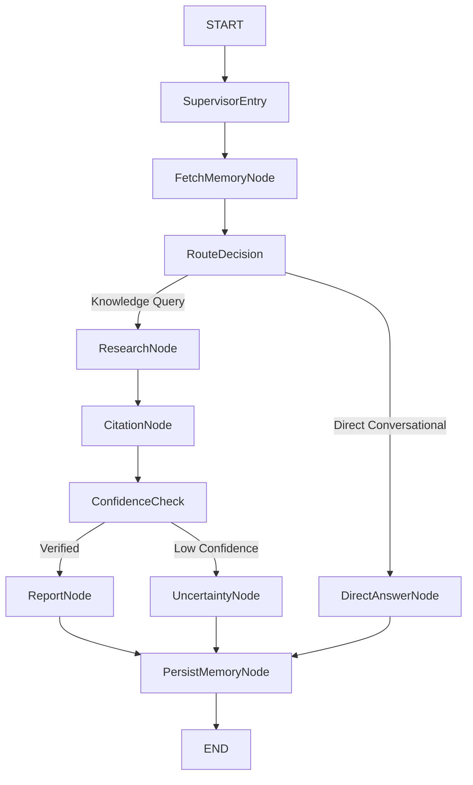

# ADR-0004: Canonical Memory Architecture & Tenancy Model

- **Status:** Accepted
- **Date:** 2026-09-12
- **Decision:** Adopt **Option D: Hybrid Unified Memory Model** (Ephemeral Thread State + Canonical `memory_entries` with Dual User/Workspace Visibility, Workspace-Level Tenancy, and Pre-Route Hydration)
- **Authors:** Contexta-AI Architecture Group (Principal Software Architect, Lead AI Engineer, Security Architect)
- **Governing Architecture:** `00_PROJECT_CONSTITUTION.md §5`, `05_PRODUCT_REQUIREMENTS.md §FR-MEM-*`, `08_AI_ARCHITECTURE.md §10`, `ADR-0001` (NestJS Modular Monolith), `ADR-0002` (Vector Tenancy Isolation), `ADR-0003` (Citation Entailment & Hallucination Guard)

---

## 1. Context

Contexta-AI is an enterprise multi-agent knowledge platform providing grounded conversational reasoning over organizational documents. A key requirement is continuity across user interactions: the system must recall user preferences, project conventions, and prior organizational decisions.

During the comprehensive documentation suite audit (`DOCUMENTATION_SUITE_REVIEW_REPORT.md §GAP-P1-01 & §Contradiction 2-3`), severe architectural contradictions were discovered across specifications, schemas, security policies, and current codebase implementations regarding how memory is owned, scoped, persisted, and retrieved:

1. **Database Specification Divergence (`09_DATABASE_DESIGN.md §6.12`):**
   - Defines a table named `memory_entries` with columns `(id, organization_id, user_id, scope, content, source_agent, reason, is_deleted, created_at)`.
   - Binds memory strictly to `organization_id`, with **no `workspace_id` column**.
   - Declares long-term memory to be strictly personal to the `user_id` even inside a shared workspace (§7 Table row 13).
2. **Security Architecture Specification (`11_SECURITY_ARCHITECTURE.md §7.3 & §9.4`):**
   - Scopes memory to `(workspace_id, user_id)` by default, explicitly identifying cross-user data leakage within a workspace as threat **T8** (Information Disclosure).
   - Proposes an opt-in `shared: true` flag for team-wide workspace memory.
   - Mentions user-level opt-out consent mechanisms for conversational memory extraction.
3. **API Specification (`10_API_SPECIFICATION.md §7.9`):**
   - Exposes memory under workspace endpoints: `GET /workspaces/{workspace_id}/memory` and `DELETE /workspaces/{workspace_id}/memory/{memory_id}`.
   - Declares: *"The Knowledge Workspace is the tenant-isolation and namespace boundary... A workspace owns its documents, threads, reports, and memory records"* (§6.3).
4. **Current Codebase Implementation (`packages/agents/src/memory-agent.ts` & `supabase/migrations/002_rls_policies_phase2.sql`):**
   - The migration enables RLS on `memory_entries` filtering by `workspace_id IN (SELECT workspace_id FROM workspace_members WHERE user_id = auth.uid()) AND user_id = auth.uid()`.
   - The code queries and inserts into `memory_entries` using columns `(workspace_id, user_id, fact, reason, source_agent)`—substituting **`workspace_id`** for `organization_id`, and **`fact`** for `content`.
5. **Agent Graph Topology Divergence (`08_AI_ARCHITECTURE.md §6` vs. `packages/agents/src/graph.ts`):**
   - The architecture specifies: `SupervisorEntry -> FetchMemory -> RouteDecision -> ResearchNode / DirectAnswer ... -> PersistMemory -> END`. Memory is intended to hydrate state *before* routing.
   - The compiled code in `packages/agents/src/graph.ts` completely omits the `FetchMemory` node; memory is written at `PersistMemory`, but is never retrieved to inform query execution.

These contradictions leave Contexta-AI with an undefined memory tenancy boundary, conflicting schema column definitions, and a disconnected agent graph loop.

---

## 2. Problem Statement

What is the canonical memory model for Contexta-AI, and how is memory owned, scoped, retrieved, persisted, and isolated within an enterprise tenancy hierarchy?

Specifically, the architecture must answer:
1. **Tenancy Boundary:** What is the authoritative tenancy boundary for persistent memory (`organization_id` vs. `workspace_id`)?
2. **Ownership & Scope:** How are personal user preferences distinguished from shared workspace operational knowledge?
3. **Data Model & Schema:** Should user and workspace memories reside in separate tables or a single polymorphic schema, and what is the canonical content field (`content` vs. `fact`)?
4. **Storage Tiering:** How are ephemeral conversation turns (short-term) separated from durable organizational facts (long-term)?
5. **Tenancy Isolation & RLS:** How does memory retrieval adhere to the four-tier defense-in-depth security model frozen in `ADR-0002`?
6. **Agent Graph Integration:** Where does memory reading and writing execute within the LangGraph multi-agent flow?
7. **Lifecycle & Governance:** How are memory deletion, user workspace offboarding, and data-subject erasure (`FR-MEM-4`) enforced?

---

## 3. Existing Architecture Evidence

The following reconciliation matrix details the divergent specifications across repository assets prior to this ADR:

| Concern | `09_DATABASE_DESIGN.md` | `08_AI_ARCHITECTURE.md` | `11_SECURITY_ARCHITECTURE.md` | `10_API_SPECIFICATION.md` | Current Code & Migrations |
|---|---|---|---|---|---|
| **Tenancy Key** | `organization_id` | `tenant_id` (abstract) | `workspace_id` | `workspace_id` | `workspace_id` |
| **User Key** | `user_id` (FK to users) | `user_id` | `user_id` | Implicit via JWT | `user_id` |
| **Data Field** | `content TEXT` | `content` | Unspecified | `entities, preferences` | `fact TEXT` |
| **Table Name** | `memory_entries` | `memory_entries` | `memory_records` | `memory_records` | `memory_entries` |
| **Scope Enums** | `short_term`, `long_term` | `short_term`, `long_term` | `private`, `shared: true` | `entities`, `preferences` | Inferred (`fact` string) |
| **RLS Policy** | Org-wide user isolation | Unspecified | `(workspace_id, user_id)` | Workspace-scoped | `(workspace_id, user_id)` |
| **Graph Flow** | N/A | `FetchMemory` pre-route | N/A | Pre-fetch in flow | Only `PersistMemory` at end |

---

## 4. Architectural Questions

1. **Does Contexta-AI require an `organization_id` tenancy boundary on persistent memory?**  
   No. In `ADR-0002`, the Knowledge Workspace was established as the authoritative retrieval, authorization, and data-isolation boundary. Scoping memory to `organization_id` would allow a user in Workspace $A$ (e.g., Legal) to have their private preferences or confidential notes leak into Workspace $B$ (e.g., Public Relations) within the same enterprise account. The architecture enforces workspace-scoped isolation at the database authorization and retrieval boundary.
2. **What is the canonical field name: `content` or `fact`?**  
   `content`. While `fact` accurately describes extracted propositional knowledge, memory in an enterprise assistant also encompasses stylistic preferences (*"Always format tables in Markdown"*), role descriptions (*"I am a financial analyst"*), and procedural constraints. `content TEXT NOT NULL` is the broader, standard enterprise abstraction, supplemented by a `memory_type` classifier.
3. **Should personal user memory and shared workspace memory be separate tables or a single table?**  
   A single canonical table `memory_entries` with an explicit `visibility` discriminator (`user_private` vs. `workspace_shared`). This avoids duplicate table management, simplifies RLS policies, and enables unified administrative auditing.
4. **How are ephemeral conversation history and durable long-term memory segregated?**  
   Conversation turns (short-term thread state) belong to the **Chat Thread / Session Store** (ephemeral, bounded by token/turn limits, stored in Redis/session state). Durable long-term memory belongs exclusively to the **PostgreSQL `memory_entries` store**. Ephemeral conversational turns must never be stored as rows in `memory_entries`.

---

## 5. Options Considered

### Option A — Separate `user_memories` and `workspace_memories` Tables
Maintains two completely distinct tables:
- `user_memories`: `(id, workspace_id, user_id, content, ...)`
- `workspace_memories`: `(id, workspace_id, content, ...)`
- **Pros:** Strict relational separation; prevents user memory from leaking via a missing SQL `WHERE` clause on workspace queries.
- **Cons:** Schema duplication; requires parallel CRUD APIs and repository layers; complex union queries when hydrating agent context; difficult to promote a personal preference to shared workspace context.

### Option B — Organization-Scoped Memory Hierarchy
Maintains `organization_id` as the top-level tenant key on `memory_entries`, with optional `workspace_id`.
- **Pros:** Allows a user's stylistic preferences to persist across all workspaces in an enterprise.
- **Cons:** Violates `ADR-0002` tenant isolation; creates cross-workspace context contamination; allows unauthorized inferencing across workspace boundaries (e.g., project names, internal codes); incompatible with strict RLS where users belong to only a subset of an organization's workspaces.

### Option C — Thread-Derived Dynamic Ingestion (No Dedicated Long-Term Store)
Eliminates explicit memory persistence; treats previous chat threads as searchable document versions ingested into the vector database.
- **Pros:** Single retrieval mechanism (uses document RAG for past chat).
- **Cons:** Extremely noisy retrieval; conversational chatter pollutes authoritative document search; no structured mechanism for explicit user instructions (*"Remember that our fiscal year starts in April"*); high latency and token cost.

### Option D — Hybrid Unified Memory Model (Two-Tier Storage with Dual Visibility) [CHOSEN]
- **Tier 1: Ephemeral Thread State (Short-Term):** Maintained in conversation session storage, bounded by sliding-window FIFO eviction (Constitution §5.5).
- **Tier 2: Canonical `memory_entries` (Long-Term):** A single normalized PostgreSQL table scoped to `workspace_id UUID NOT NULL` with explicit `visibility` (`user_private` vs. `workspace_shared`), governed by `ADR-0002` compliant RLS, populated via the Memory Agent, and hydrated before agent routing.
- **Pros:** Complete alignment with `ADR-0001` and `ADR-0002`; clean separation of ephemeral chat vs. durable facts; clear user data ownership (`FR-MEM-4`); intended to prevent cross-workspace memory retrieval when implemented according to the defined RLS and membership invariants.
- **Cons:** Requires a database migration to update `09_DATABASE_DESIGN.md` schema and reconcile existing API services.

---

## 6. Decision Matrix

| Evaluation Criterion | Weight | Option A: Separate Tables | Option B: Org-Scoped | Option C: Thread RAG | Option D: Hybrid Unified (Chosen) |
|---|:---:|:---:|:---:|:---:|:---:|
| **1. Tenancy Isolation & Security (ADR-0002)** | 25% | 9 | 2 | 6 | **10** |
| **2. Architectural Simplicity & Maintainability** | 15% | 6 | 5 | 7 | **9** |
| **3. Agent Integration & Hydration Latency** | 15% | 6 | 6 | 4 | **9** |
| **4. User Privacy & Data Deletion Mechanisms (FR-MEM-4)** | 15% | 8 | 4 | 5 | **10** |
| **5. Cross-Workspace Leakage Prevention (T8)** | 15% | 9 | 1 | 5 | **10** |
| **6. Extensibility for Semantic Embeddings** | 15% | 7 | 6 | 8 | **9** |
| **Weighted Total** | **100%** | **7.60 / 10** | **3.85 / 10** | **5.75 / 10** | **9.50 / 10** |

**Outcome:** **Option D (Hybrid Unified Memory Model)** is selected. It enforces workspace-scoped isolation at the database authorization/retrieval boundary, prevents cross-user leakage, and cleanly integrates with LangGraph execution.

---

## 7. Decision

Contexta-AI formally adopts **Option D: Hybrid Unified Memory Model** as the authoritative Memory Architecture.

1. **Canonical Tenancy Boundary:** `workspace_id` is the **exclusive tenant isolation key** for persistent memory. The column `organization_id` is formally deprecated and removed from the memory schema.
2. **Canonical Table Name & Content Field:** The persistent store is named **`memory_entries`**. The primary textual payload column is **`content TEXT NOT NULL`**. The legacy column name `fact` is deprecated.
3. **Storage Tiering:**
   - **Short-Term Memory:** Ephemeral, conversation-scoped turns managed in application/session cache with FIFO token-budget eviction.
   - **Long-Term Memory:** Persistent rows in PostgreSQL `memory_entries`, written exclusively via the Memory Agent with audit metadata.
4. **Visibility & Ownership Scopes:**
   - The canonical architectural representation is `visibility = 'user_private' | 'workspace_shared'`.
   - Any existing `shared: true` API or application terminology is legacy input semantics to be reconciled with `visibility`, not a second persisted field.
   - `workspace_id` defines the **owning scope and tenant isolation boundary**.
   - `user_id` represents the **creator / originating actor** for audit attribution and author permissions.
   - `user_private`: Scoped to `workspace_id`, accessible only by its creator (`user_id`).
   - `workspace_shared`: Scoped to `workspace_id`, accessible to all verified members of that workspace. Requires explicit affirmative promotion to `workspace_shared`, never an implicit default.
5. **Agent Graph Integration:**
   - **Decided here:** Persistent memory available to agent execution must be hydrated before routing when memory can materially affect routing or response behavior. `FetchMemoryNode` is the currently selected implementation shape.
   - **Follow-up reconciliation:** Exact LangGraph node topology and state transitions remain subject to the dedicated Agent Graph Freeze decision.
6. **Untrusted Data Invariant:**
   - No persisted memory entry has system-message authority. Stored memory is untrusted contextual data, is not permitted to override platform/system instructions, and must never be treated as raw executable instructions or system directives.

---

## 8. Canonical Data Model

### 8.1 Physical PostgreSQL Schema
```sql
-- Canonical memory_entries table
CREATE TABLE memory_entries (
    id UUID PRIMARY KEY DEFAULT gen_random_uuid(),
    workspace_id UUID NOT NULL REFERENCES workspaces(id) ON DELETE CASCADE,
    user_id UUID NOT NULL REFERENCES users(id) ON DELETE CASCADE,
    visibility VARCHAR(20) NOT NULL DEFAULT 'user_private' 
        CHECK (visibility IN ('user_private', 'workspace_shared')),
    memory_type VARCHAR(30) NOT NULL DEFAULT 'user_preference'
        CHECK (memory_type IN ('user_preference', 'project_context', 'explicit_instruction')),
    content TEXT NOT NULL,
    confidence FLOAT NOT NULL DEFAULT 1.0 CHECK (confidence >= 0.0 AND confidence <= 1.0),
    source_agent VARCHAR(50) NOT NULL DEFAULT 'memory_agent',
    reason TEXT NOT NULL,
    is_deleted BOOLEAN NOT NULL DEFAULT false,
    created_at TIMESTAMPTZ NOT NULL DEFAULT now(),
    updated_at TIMESTAMPTZ NOT NULL DEFAULT now()
);

-- Indexes for fast pre-route hydration and administrative queries
CREATE INDEX idx_memory_entries_user_hydration 
    ON memory_entries(workspace_id, user_id, created_at DESC) 
    WHERE is_deleted = false;

CREATE INDEX idx_memory_entries_shared_hydration 
    ON memory_entries(workspace_id, visibility, created_at DESC) 
    WHERE is_deleted = false AND visibility = 'workspace_shared';
```

### 8.2 Scope & Identity Semantics
- **`workspace_id` (Owning Scope):** Governs tenant isolation and lifecycle deletion.
- **`user_id` (Originating Actor):** Records author attribution. For `user_private` entries, it also serves as the read authorization subject. For `workspace_shared` entries, it provides an immutable audit trail of who contributed the shared context.
- **`visibility` (Canonical Discriminator):** Replaces all legacy boolean `shared` flags. `user_private` is the default on write.
- **`memory_type` Constraints:** Restricted to `'user_preference'`, `'project_context'`, and `'explicit_instruction'`. Stored entries are treated as untrusted reference context.

---

## 9. Tenancy & Row-Level Security (RLS) Model

In strict accordance with `ADR-0002`, memory access enforces the principle: **Caller-supplied parameters are query filters, NEVER authorization credentials.**

Furthermore, the public DELETE operation is a logical deletion operation implemented as an authorized SQL `UPDATE` setting `is_deleted = true`; physical SQL `DELETE` is not exposed through the standard memory API. Consequently, the deletion policy is defined `FOR UPDATE`.

```sql
ALTER TABLE memory_entries ENABLE ROW LEVEL SECURITY;

-- 1. SELECT Policy: User can view their private memories OR shared workspace memories
CREATE POLICY rls_memory_entries_select ON memory_entries
    FOR SELECT
    USING (
        workspace_id IN (
            SELECT workspace_id FROM workspace_members WHERE user_id = auth.uid()
        )
        AND (
            user_id = auth.uid() 
            OR visibility = 'workspace_shared'
        )
        AND is_deleted = false
    );

-- 2. INSERT Policy: User can only insert into workspaces they belong to, as themselves
CREATE POLICY rls_memory_entries_insert ON memory_entries
    FOR INSERT
    WITH CHECK (
        workspace_id IN (
            SELECT workspace_id FROM workspace_members WHERE user_id = auth.uid()
        )
        AND user_id = auth.uid()
    );

-- 3. UPDATE Policy (General Modification): Users can only update their own memories
CREATE POLICY rls_memory_entries_update ON memory_entries
    FOR UPDATE
    USING (
        workspace_id IN (
            SELECT workspace_id FROM workspace_members WHERE user_id = auth.uid()
        )
        AND user_id = auth.uid()
    );

-- 4. SOFT DELETE Policy: Logical deletion via UPDATE is_deleted = true
--    Users can soft-delete their own memories; Workspace Admins can soft-delete shared memories
CREATE POLICY rls_memory_entries_soft_delete ON memory_entries
    FOR UPDATE
    USING (
        workspace_id IN (
            SELECT workspace_id FROM workspace_members WHERE user_id = auth.uid()
        )
        AND (
            user_id = auth.uid()
            OR (
                visibility = 'workspace_shared' 
                AND EXISTS (
                    SELECT 1 FROM workspace_members 
                    WHERE workspace_id = memory_entries.workspace_id 
                      AND user_id = auth.uid() 
                      AND role IN ('admin', 'owner')
                )
            )
        )
    );
```

---

## 10. Memory Ownership & Visibility Scopes

Contexta-AI codifies three distinct operational scopes:

```
┌─────────────────────────────────────────────────────────────────────────────┐
│ 1. THREAD SCOPE (Ephemeral Short-Term Context)                              │
│  - Owning Scope: Current Conversation Thread Session                        │
│  - Originating Actor: Active conversation turn participants                 │
│  - Storage: Redis / LangGraph Session State Checkpoint                      │
│  - Visibility: Active conversation turn participants only                   │
│  - Lifecycle: Sliding-window FIFO eviction (max 5 non-system turns)         │
│  - Database: NOT persisted in memory_entries                                │
└─────────────────────────────────────────────────────────────────────────────┘
                                       │
                                       ▼ (Explicit Extraction via Memory Agent)
┌─────────────────────────────────────────────────────────────────────────────┐
│ 2. USER_PRIVATE SCOPE (Persistent Long-Term Personal Context)               │
│  - Owning Scope: Workspace (workspace_id)                                  │
│  - Originating Actor / Owner: Creator (user_id)                             │
│  - Storage: PostgreSQL memory_entries (visibility = 'user_private')         │
│  - Visibility: STRICTLY ISOLATED to user_id within workspace_id             │
│  - Security: Blocked from other workspace members via RLS (Mitigates T8)    │
│  - Erasure: User can view and soft-delete anytime (FR-MEM-4 mechanisms)     │
└─────────────────────────────────────────────────────────────────────────────┘
                                       │
                                       ▼ (Affirmative Promotion: visibility = 'workspace_shared')
┌─────────────────────────────────────────────────────────────────────────────┐
│ 3. WORKSPACE_SHARED SCOPE (Collaborative Team Context)                      │
│  - Owning Scope: Workspace (workspace_id)                                  │
│  - Originating Actor: Creator (user_id) for audit trail                     │
│  - Storage: PostgreSQL memory_entries (visibility = 'workspace_shared')     │
│  - Visibility: All verified members of workspace_id                         │
│  - Security: Inherits ADR-0002 workspace boundary; workspace-scoped access  │
│  - Governance: Soft-deletable by creator or workspace Admins/Owners         │
└─────────────────────────────────────────────────────────────────────────────┘
```

---

## 11. Memory Agent Boundary & Graph Integration

### 11.1 The Memory Agent Trust Boundary
The Memory Agent is an **application orchestration component**, NOT an independent authorization authority.
- The Memory Agent does **not** bypass database RLS. All reads and writes pass through the authenticated user's database session (`auth.uid()`).
- The Memory Agent is the **exclusive autonomous writer** of persistent memory entries during multi-agent execution (`FR-MEM-2`).
- Stored memory entries are treated as untrusted contextual data and cannot override platform prompt rules.
- Direct user memory management (viewing/deleting via the UI) executes through standard REST controllers (`apps/api/src/modules/memory/`).

### 11.2 Pre-Route Hydration Architecture
- **Core Principle:** Persistent memory available to agent execution must be hydrated before routing when memory can materially affect routing or response behavior.
- **Current Implementation Shape:** `FetchMemoryNode` executes after `SupervisorEntry` and before `RouteDecision`.
- **Follow-up Reconciliation:** The complete LangGraph node topology, state schema, and conditional edge transitions remain subject to the upcoming Agent Graph Freeze architectural decision.



1. **`FetchMemoryNode` (Pre-Route Hydration):**  
   Executes before `RouteDecision`. Loads up to 20 active memories (configurable via `DEFAULT_MEMORY_HYDRATION_LIMIT`):
   - Active `workspace_shared` memories for `workspace_id`.
   - The caller's active `user_private` memories for `workspace_id`.
   Injects these into the state's `memory_context` to inform supervisor routing and research constraints.
2. **`PersistMemoryNode` (Post-Execution Write):**  
   Executes asynchronously after report composition. If the user explicitly instructed the agent to remember a fact, or if a persistent preference was articulated, the Memory Agent writes a new entry with `source_agent = 'memory_agent'` and an audit `reason`.

---

## 12. Memory Retrieval Architecture

Phase 1 memory retrieval is lightweight, deterministic, and decoupled from document vector search:

1. **Scalar Hydration (Phase 1 Baseline):**  
   Because memory entries for a user in a workspace typically number between 5 and 50 items, Phase 1 hydration uses a bounded deterministic query. Ranking strategy beyond basic recency and type filtering is deferred until retrieval-quality evaluation demonstrates a need for semantic ranking:
   ```sql
   SELECT id, visibility, memory_type, content, reason, created_at
   FROM memory_entries
   WHERE workspace_id = :workspace_id
     AND (user_id = auth.uid() OR visibility = 'workspace_shared')
     AND is_deleted = false
   ORDER BY created_at DESC
   LIMIT 20;
   ```
   The Phase 1 target is $\text{p95} < 10\text{ms}$ for the scalar hydration query, subject to benchmarking.
2. **Context Formatting:**  
   Retrieved memories are formatted as structural reference constraints inside the agent prompt:
   ```
   [WORKSPACE CONTEXT & USER PREFERENCES]
   - (Private Preference): User prefers financial metrics in millions with 1 decimal place.
   - (Shared Project Context): Project Titan launch date target is Q4 2026.
   ```

---

## 13. Semantic Memory (Embeddings) Decision

- **Phase 1 Decision: Structured Scalar Retrieval Only (No Embeddings).**  
  Embedding long-term memory in Phase 1 introduces unnecessary indexing overhead, embedding cost, and synchronization latency for small entry sets ($< 100$ items per user). Bounded scalar lookup satisfies all Phase 1 requirements.
- **Subordination to ADR-0002:**  
  If semantic memory is evaluated in the future, memory embedding retrieval must apply the tenant predicate at the database retrieval boundary, with ANN filtering or iterative scanning treated as a retrieval-performance mechanism rather than the security boundary.
- **Future Evaluation Trigger:**  
  A future semantic-retrieval evaluation will be triggered when measured memory volume or retrieval quality makes scalar hydration insufficient. An initial benchmark trigger of approximately 500 workspace entries may be used as an engineering hypothesis, rather than a frozen architectural threshold.

---

## 14. Memory Lifecycle & Governance

Memory lifecycle operations are divided into distinct events with unambiguous security and retention semantics:

| Event | System Action & Security Semantics |
|---|---|
| **1. User Explicit Save** | Memory Agent inserts a row into `memory_entries` with `reason = 'explicit_user_instruction'`. Originating actor `user_id` and `workspace_id` recorded. |
| **2. User Deletes Private Memory (`FR-MEM-4`)** | Public API `DELETE /workspaces/:workspace_id/memory/:memory_id` executes as an authorized SQL `UPDATE memory_entries SET is_deleted = true WHERE id = :id`. Logical deletion immediately excludes the entry from all subsequent agent hydration and user reads. |
| **3. User Leaves Workspace** | The user's row in `workspace_members` is removed. Because all RLS policies enforce membership verification via `workspace_members`, all private and shared memories for that workspace become immediately inaccessible to that user. Private memory rows remain in the database associated with that workspace until addressed by account or workspace lifecycle actions. |
| **4. User Account Deletion** | Deletion or erasure of an entire user account requires a defined account-erasure policy, which is deferred to a separate identity and enterprise compliance specification. |
| **5. Workspace Deletion** | Foreign key `ON DELETE CASCADE` on `memory_entries.workspace_id` cascade-deletes all associated memory rows from the database. |
| **6. Contradictory Memories** | Contradictory memories must not be silently resolved solely by retrieval order. Conflict detection and replacement semantics require explicit provenance and policy; until implemented, conflicting memories should remain auditable rather than being destructively overwritten. (This aligns with the non-destructive approach established in ADR-0003 for conflicting evidence). |

---

## 15. API and Data Model Consequences

### 15.1 API Contracts (`10_API_SPECIFICATION.md §7.9`)
The memory endpoints are confirmed as workspace-scoped:
- `GET /v1/workspaces/{workspace_id}/memory`: Returns caller's private memories and workspace-shared memories. Supports query parameter `?visibility=user_private|workspace_shared`.
- `POST /v1/workspaces/{workspace_id}/memory`: Allows manual creation of memory entries.
- `DELETE /v1/workspaces/{workspace_id}/memory/{memory_id}`: Logical deletion (sets `is_deleted = true`). Physical SQL DELETE is not exposed.

### 15.2 Downstream Document Reconciliation Impact
The following documents are flagged for reconciliation during the baseline freeze:
- **`09_DATABASE_DESIGN.md §6.12`:** Replace schema with canonical `memory_entries` (`workspace_id`, `visibility`, `content`, `memory_type`). Remove `organization_id`, remove `system_directive`, and deprecate `fact`.
- **`08_AI_ARCHITECTURE.md §6`:** Reflect the pre-route hydration requirement (currently `FetchMemoryNode`).
- **`11_SECURITY_ARCHITECTURE.md §7.3`:** Affirm canonical RLS policy covering `visibility` discriminator and soft-delete `FOR UPDATE` mechanics.
- **`DOCUMENTATION_SUITE_REVIEW_REPORT.md`:** Mark **GAP-P1-01** and Contradictions 2 & 3 as formally resolved by ADR-0004.

---

## 16. Implementation Impact

The following implementation tasks are scheduled for the Phase 1 Database & Backend Milestones:
1. **Database Migration:** Create a migration replacing legacy memory structures with the canonical `memory_entries` schema and RLS policies.
2. **Backend Service (`apps/api`):** Refactor `MemoryService` and `MemoryController` to query `workspace_id`, `visibility`, and `content`, enforcing user/shared filtering and soft deletion via UPDATE.
3. **Agent Package (`packages/agents`):**
   - Update `packages/agents/src/memory-agent.ts` to select and insert `content` and `visibility`.
   - Wire pre-route memory hydration in the agent graph.
4. **Integration Tests:** Implement automated tests verifying that User A in Workspace 1 cannot view User B's private memories or User A's memories from Workspace 2.

---

## 17. Consequences

### Positive Consequences
- **Architectural Tenancy Uniformity:** Aligns memory completely with `ADR-0002` workspace isolation boundaries; intended to prevent cross-workspace memory retrieval when implemented according to defined RLS and membership invariants.
- **T8 Threat Mitigation:** Personal preferences remain private by default; shared memory requires explicit user intent.
- **Functional Pre-Route Context:** Pre-route hydration ensures memories actually influence routing and answer generation.
- **Data Subject Erasure Mechanisms:** Provides technical mechanisms supporting data deletion and potential data-subject erasure requirements (`FR-MEM-4`); legal and compliance requirements remain subject to a separate compliance specification.

### Negative Consequences / Trade-offs
- **Migration Required:** Existing code referencing `fact` and `workspace_memories` must be refactored to `memory_entries` and `content`.
- **No Global User Preferences:** A user must articulate a preference once per workspace rather than having it leak globally across an enterprise account.
- **Non-Destructive Conflict Accumulation:** Because contradictory memories are not destructively overwritten without explicit provenance, multiple conflicting entries may exist until audited or resolved by policy.

---

## 18. Risks and Mitigations

| Identified Risk | Severity | Mitigation Strategy |
|---|:---:|---|
| **Context Window Bloat from Stale Memories** | Medium | Limit pre-route hydration to a bounded set (`LIMIT 20`); implement Memory Agent deduplication passes during persistence. |
| **Inadvertent Exposure of Soft-Deleted Rows** | High | Enforce `is_deleted = false` directly within the database RLS policy, ensuring rows are excluded at the database authorization layer even if application queries omit the filter. |
| **Adversarial Injection via Stored Memory** | Medium | Persisted memories have no system-message authority; injected strictly as untrusted contextual data, never as executable instructions. |

---

## 19. Open Questions & Follow-up Decisions

1. **Semantic Clustering & Hierarchical Summarization:** If enterprise workspaces accumulate large volumes of shared memories, should Contexta-AI adopt automated hierarchical memory summarization? *(Deferred to Phase 3 roadmap)*.
2. **Compliance & Audit Override:** Defining administrative audit override capabilities or specific enterprise discovery access for compliance officers is deferred to the Phase 2 enterprise compliance specification.
3. **Agent Graph Topology Reconciliation:** The exact LangGraph node topology, state transitions, and edge definitions will be reconciled in the dedicated Agent Graph Freeze decision.

---

## 20. References

1. `00_PROJECT_CONSTITUTION.md` — Core Principles & Responsible AI (§5)
2. `05_PRODUCT_REQUIREMENTS.md` — Memory Functional Requirements (`FR-MEM-1` through `FR-MEM-4`)
3. `08_AI_ARCHITECTURE.md` — Agent Execution Graph (§6) & Memory Architecture (§10)
4. `09_DATABASE_DESIGN.md` — Relational Schema (§6.12)
5. `11_SECURITY_ARCHITECTURE.md` — Memory Agent Isolation & Threat T8 (§7.3, §9.4)
6. `ADR-0001-modular-monolith-framework.md` — NestJS Modular Monolith Architecture
7. `ADR-0002-vector-tenancy-isolation.md` — Hybrid Vector Tenancy Isolation Strategy
8. `ADR-0003-citation-entailment-hallucination-guard.md` — Citation Entailment Architecture
