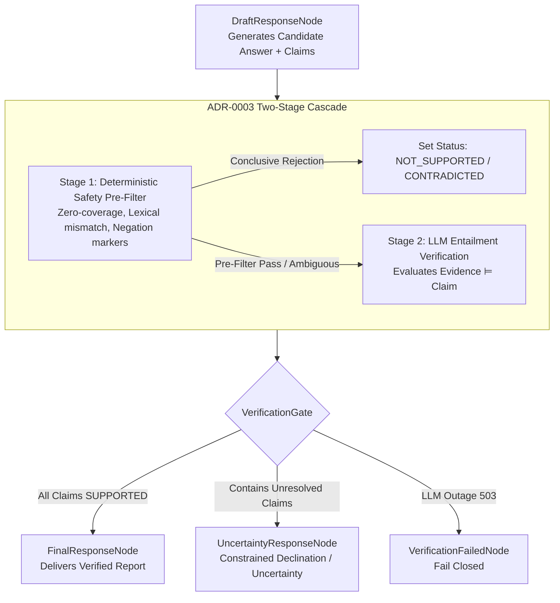

# ADR-0005: Agent Graph Architecture & Execution Flow

- **Status:** Accepted
- **Date:** 2026-09-12
- **Decision:** Adopt **Option E: Hybrid Supervisor + Deterministic Guard Graph** (Explicit State Contextualization, Runtime Protected-Context Validation, Pre-Route Memory Hydration, Conservative Direct-Answer Guard, Grounded Research-Draft-Verify Pipeline with ADR-0003 Two-Stage Gate, Non-Blocking Audited Persistence, and Fail-Closed Guardrails)
- **Authors:** Contexta-AI Architecture Group (Principal Software Architect, Lead AI Engineer, Security Architect)
- **Governing Architecture:** `00_PROJECT_CONSTITUTION.md §5`, `05_PRODUCT_REQUIREMENTS.md §FR-AGT-*`, `08_AI_ARCHITECTURE.md §5-7`, `ADR-0001` (NestJS Modular Monolith), `ADR-0002` (Vector Tenancy Isolation), `ADR-0003` (Citation Entailment & Hallucination Guard), `ADR-0004` (Canonical Memory Architecture & Tenancy Model)

---

## 1. Context

Contexta-AI is an enterprise multi-agent knowledge platform designed to provide verifiable, audit-compliant, and tenant-isolated reasoning over organizational documents. The core orchestrator of this capability is the agent execution graph built on LangGraph.

During the architecture-reconciliation phase, the system completed four foundational decisions:
- **ADR-0001:** Standardized on a **NestJS Modular Monolith** in `apps/api`, encapsulating domain packages such as `packages/agents`.
- **ADR-0002:** Established **Hybrid Vector Tenancy Isolation**, mandating that the database/RLS retrieval boundary is authoritative, and caller-supplied parameters are strictly query filters, not authorization credentials.
- **ADR-0003:** Established the **Two-Stage Cascade Citation Entailment Guard** (Stage 1 Deterministic Safety Pre-Filter + Stage 2 LLM Entailment evaluating $Evidence \models Claim$), requiring that no factual claim reaches the user without verification against tenant-authorized evidence, with fail-closed behavior on infrastructure outages.
- **ADR-0004:** Established the **Canonical Memory Architecture**, mandating workspace-scoped long-term memory in PostgreSQL `memory_entries` with dual visibility (`user_private` vs. `workspace_shared`), ephemeral conversation thread state, untrusted memory context, and pre-route memory hydration.

However, deep technical inspection of the repository (`DOCUMENTATION_SUITE_REVIEW_REPORT.md §Contradiction 3`, `packages/agents/src/graph.ts`, `packages/agents/src/state.ts`, and `apps/api/src/services/runs.service.ts`) reveals critical divergences, dead ends, and structural disconnects across the documented design and the working code:
1. **Disconnected Memory Loop:** `08_AI_ARCHITECTURE.md §6` and `ADR-0004` mandate pre-route memory hydration (`FetchMemoryNode`). In `packages/agents/src/graph.ts`, `FetchMemoryNode` is completely absent; memory is written at the end (`PersistMemory`), but never fetched to inform routing or answering.
2. **Missing Entailment Verification Cascade:** `packages/agents/src/citation-agent.ts` uses an uncalibrated single-prompt LLM scoring heuristic producing a boolean `verified` flag. It entirely lacks the Stage 1 deterministic pre-filter and 6-status classification mandated by `ADR-0003`.
3. **Response Mutation Without Re-Verification:** The existing `ReportNode` synthesizes new text *after* `CitationNode` without re-verifying that newly generated sentences do not introduce ungrounded claims.
4. **Trivial Supervisor Heuristic & Lack of Route Guards:** `packages/agents/src/supervisor-agent.ts` routes based solely on `query.toLowerCase().includes('hi')`. More critically, there is no deterministic guard preventing an LLM supervisor from mistakenly classifying an enterprise factual query as conversational and bypassing verification entirely.
5. **State Schema & Security Gaps:** `packages/agents/src/state.ts` lacks tenant identifiers, request tracing IDs, memory context annotations, structured verification results, and citation mapping schemas. Furthermore, storing raw auth tokens directly in graph state violates credential-isolation principles.

This ADR establishes the definitive, canonical agent graph topology, state schema, and operational lifecycle for Contexta-AI.

---

## 2. Problem Statement

What is the canonical execution graph for a secure, memory-aware, grounded, multi-agent Contexta-AI request?

Specifically, the architecture must answer:
1. **Entry & Context Initialization:** Where does graph execution begin, how are authenticated tenant parameters (`workspace_id`, `user_id`, `thread_id`, `user_query`, `roles`) established immutably, and how are credentials kept out of graph state?
2. **Memory Hydration Placement & Status:** Where and how is relevant workspace and user memory hydrated before routing decisions, and how are empty memories distinguished from RLS/database failures?
3. **Supervisor & Guarded Routing Semantics:** How does the supervisor route queries, and what conservative guard ensures an erroneous or injected conversational classification cannot bypass factual retrieval and verification?
4. **Research & Retrieval Ordering:** Where do hybrid search (dense vectors + PostgreSQL full-text search / sparse retrieval), evidence extraction, and source chunk binding execute within the tenant boundary of `ADR-0002`?
5. **Verification Boundary Integration:** How is `ADR-0003`'s Two-Stage Entailment Cascade embedded into the graph, ensuring that final user-facing claims cannot bypass verification?
6. **Failure & Uncertainty Handling:** How are `INSUFFICIENT_EVIDENCE`, `CONTRADICTED`, `CONFLICTING_EVIDENCE`, and infrastructure errors (`VERIFICATION_FAILED`) routed to deterministic fallback responses?
7. **Memory Persistence & Lifecycle:** When and how are explicit user preferences extracted and persisted non-blocking to user delivery without bypassing RLS?
8. **Streaming & Observability:** How do token/event streaming and execution tracing operate without leaking unverified factual claims, raw credentials, or sensitive tenant context?

---

## 3. Architectural Constraints

The graph design is governed by the four accepted and frozen ADRs:

1. **NestJS Modular Monolith Boundary (ADR-0001):** The agent graph is packaged in `packages/agents` and executed by `apps/api/src/modules/agents/` (or `runs.service.ts`). It must not run as an unmonitored external microservice or introduce independent network hops for internal state passing.
2. **Vector Tenancy Isolation (ADR-0002):** Caller-supplied `workspace_id` in graph state is a query-scoping parameter, never authorization. Retrieval nodes must execute under caller-authenticated database sessions with RLS enforced at the retrieval boundary. Vector similarity ranking is a retrieval mechanism, not a security boundary. Hybrid search combines dense vectors with PostgreSQL full-text/sparse search, not BM25.
3. **Citation Entailment & Hallucination Guard (ADR-0003):** 
   - Evaluation direction is strictly $Evidence \models Claim$.
   - Two-stage cascade: Stage 1 deterministic safety pre-filter + Stage 2 LLM entailment.
   - Six canonical statuses: `SUPPORTED`, `NOT_SUPPORTED`, `CONTRADICTED`, `CONFLICTING_EVIDENCE`, `INSUFFICIENT_EVIDENCE`, `VERIFICATION_FAILED`.
   - Stage 1 never produces `SUPPORTED`.
   - The exact claim presented to the user must be verified; response mutation requires re-verification.
   - Fail-closed on verification infrastructure failure.
4. **Canonical Memory Architecture (ADR-0004):**
   - Tenancy boundary is strictly `workspace_id`.
   - Long-term storage is unified in `memory_entries` (`visibility IN ('user_private', 'workspace_shared')`).
   - Thread state is ephemeral and never persisted to `memory_entries`.
   - Stored memory is untrusted contextual data with no system-message authority.
   - Pre-route hydration is mandatory.
   - Contradictory memories are non-destructive and auditable.

---

## 4. Existing Architecture Evidence

### 4.1 Specification vs. Implementation Divergence Matrix

| Dimension | `08_AI_ARCHITECTURE.md §6` | `packages/agents/src/graph.ts` | `packages/agents/retrieval_graph/` | Required Canonical Graph |
|---|---|---|---|---|
| **Graph Entry** | `SupervisorEntry` | `SupervisorEntry` | `checkQueryType` | `RequestContextNode` -> `FetchMemoryNode` |
| **Credential Handling** | Implicit | Stored in `auth_context` in state | Passed via config | Request-scoped session context; **NO tokens in state** |
| **Memory Hydration** | `FetchMemory` before `RouteDecision` | **Omitted completely** | None | `FetchMemoryNode` (Pre-Route with explicit status) |
| **Routing Mechanism** | Supervisor routing (abstract) | Regex `['hi', 'hello']` | LLM Structured Router (`z.enum`) | Structured Semantic Classifier + Conservative `DirectAnswerGuard` |
| **Retrieval Node** | `ResearchNode` | `ResearchNode` (Tool call) | `retrieveDocuments` | `ResearchNode` (Dense + PostgreSQL FTS via RLS) |
| **Drafting / Response** | `ReportNode` | `ReportNode` | `generateResponse` | `DraftResponseNode` -> `FinalResponseNode` |
| **Verification Node** | `CitationNode` (abstract) | Single LLM prompt (`verified: bool`) | None | `CitationVerificationNode` (ADR-0003 Cascade) |
| **Verification Gate** | Numeric `ConfidenceCheck` | Numeric `confidence_score >= 0.70` | None | Status Gate (`SUPPORTED` vs Unresolved vs Failure) |
| **Uncertainty Path** | `UncertaintyNode` | `UncertaintyNode` | None | `UncertaintyResponseNode` |
| **Direct Path** | `DirectAnswer` | Hardcoded string stub | `answerQueryDirectly` | `DirectAnswerGuard` -> `DirectAnswerNode` |
| **Memory Persistence** | `PersistMemory` | `persistMemory` (In critical path) | None | `MemoryExtraction` -> Background Non-blocking Persist |
| **State Annotation** | Missing tenant/request IDs | Incomplete `AgentStateAnnotation` | `MessagesAnnotation` | Comprehensive `AgentState` with runtime protected-context validation |

---

## 5. Architectural Questions

1. **How are authenticated credentials separated from LangGraph state?**  
   Bearer tokens, session secrets, and database connection credentials must **never** be stored in `AgentState`. Instead, authenticated database and API client instances are established outside graph state at the API request boundary and supplied to tool/repository execution through a request-scoped execution context (e.g. LangChain `RunnableConfig.configurable`). Graph state contains only trusted, non-secret identifiers (`request_id`, `workspace_id`, `user_id`, `thread_id`, `roles`).
2. **How is state immutability enforced against LLM or node mutation?**  
   TypeScript annotations alone do not prevent a buggy or compromised node from returning a modified `workspace_id`. The architecture mandates **runtime protected-context validation**: protected context fields permit exactly one trusted initialization by `RequestContextNode`. After initialization, any attempted update must equal the original value; divergent updates are rejected at runtime (`UNINITIALIZED → INITIAL VALUE`: allowed only by `RequestContextNode`; `INITIAL VALUE → SAME VALUE`: allowed; `INITIAL VALUE → DIFFERENT VALUE`: rejected). LLM-generated state updates cannot initialize or modify protected context fields.
3. **How is an LLM supervisor prevented from misclassifying factual queries as conversational?**  
   Because LLM outputs can be semantically flawed, a candidate route to `direct_conversational` must pass through a conservative **`DirectAnswerGuard`**. The guard is a safety mechanism, not an authorization authority or factuality oracle. Its governing invariant is fail-safe conservatism: if the guard is uncertain whether a request is safely non-factual, it **MUST route to `knowledge_query`**. False-positive retrieval is acceptable; false-negative direct answering of enterprise factual content is strictly prohibited.
4. **How are memory persistence and user response delivery decoupled?**  
   Memory persistence is non-blocking relative to user delivery. Once `FinalResponseNode`, `UncertaintyResponseNode`, or `DirectAnswerNode` produces the deliverable response, that response is immediately dispatched to the client. Memory extraction and persistence operate outside the critical response path, ensuring that a database write lock or network timeout on memory persistence never delays or aborts response delivery.

---

## 6. Options Considered

### Option A — Linear Pipeline (No Conditional Branching)
A strict sequential flow: `START -> HydrateMemory -> Retrieve -> Draft -> Verify -> Format -> Persist -> END`.
- **Pros:** Minimal complexity; trivial debugging; zero conditional routing edge failures.
- **Cons:** Extremely wasteful for simple conversational queries (runs vector retrieval and citation verification for "hello"); incapable of handling uncertainty responses differently from standard reports.

### Option B — Documented Star Supervisor Graph (`08_AI_ARCHITECTURE.md §6`)
Centralized supervisor routing to `ResearchNode` or `DirectAnswer`, passing to `CitationNode`, followed by a numeric `ConfidenceCheck` gate leading to `ReportNode` or `UncertaintyNode`, and converging at `PersistMemory`.
- **Pros:** Documented in initial architecture drafts.
- **Cons:** `CitationNode` is a black box that does not reflect ADR-0003's Two-Stage Cascade; numeric confidence conflates contradictory evidence with infrastructure failure; `ReportNode` generates text after verification without re-verifying; `DirectAnswer` creates an open verification bypass; `FetchMemory` was omitted in code.

### Option C — Hierarchical Multi-Subgraph Architecture
Top-level router delegating to independent compiled subgraphs: `ResearchSubgraph`, `VerificationSubgraph`, and `MemorySubgraph`.
- **Pros:** Modularity; isolated sub-state schemas.
- **Cons:** High operational and serialization overhead in LangGraph; complex distributed state synchronization; excessive cognitive and debugging overhead for Contexta-AI's current modular monolith architecture.

### Option D — Fully Event-Driven State Machine
Decouples agent nodes via message queues and durable resumable events.
- **Pros:** High durability across long multi-hour agent research tasks.
- **Cons:** Incompatible with sub-second streaming conversational UI requirements; massive infrastructure complexity; violates the "transform, don't rebuild" philosophy of Constitution §2.

### Option E — Hybrid Supervisor + Deterministic Guard Graph [CHOSEN]
A balanced topology that utilizes an LLM Supervisor where semantic understanding is necessary (intent classification, query routing), but enforces **deterministic, code-level guards** for security boundaries:
- `RequestContextNode` freezes immutable request context via runtime validation.
- `DirectAnswerGuard` acts as a conservative safety check preventing factual queries from escaping retrieval and verification.
- `CitationVerificationNode` executes ADR-0003's Two-Stage Cascade.
- `VerificationGate` directs execution deterministically based on claim verification status.
- Memory persistence executes non-blocking outside the critical user delivery path.
- **Pros:** Complete fidelity to ADR-0001 through ADR-0004; deterministic security and verification guarantees; fast conversational bypass for non-factual queries with guardrails; non-blocking memory persistence; credential-isolated state model.
- **Cons:** Requires refactoring `packages/agents/src/graph.ts` and updating state annotations.

---

## 7. Decision Matrix

| Evaluation Criterion | Weight | Option A: Linear | Option B: Doc Star | Option C: Subgraphs | Option D: State Machine | Option E: Hybrid Guard (Chosen) |
|---|:---:|:---:|:---:|:---:|:---:|:---:|
| **1. Verification Integrity (ADR-0003)** | 20% | 7 | 4 | 8 | 7 | **10** |
| **2. Tenancy & RLS Isolation (ADR-0002)** | 20% | 8 | 7 | 8 | 8 | **10** |
| **3. Memory Model Fidelity (ADR-0004)** | 15% | 7 | 4 | 7 | 6 | **10** |
| **4. Routing Flexibility & Bypass Prevention** | 15% | 3 | 5 | 7 | 7 | **9** |
| **5. Operational Simplicity & Maintainability**| 15% | 9 | 7 | 4 | 3 | **9** |
| **6. Observability & Credential Security** | 15% | 8 | 6 | 5 | 5 | **10** |
| **Weighted Total** | **100%** | **7.05 / 10** | **5.45 / 10** | **6.70 / 10** | **6.10 / 10** | **9.65 / 10** |

**Outcome:** **Option E (Hybrid Supervisor + Deterministic Guard Graph)** is selected. It provides complete enforcement of architectural constraints while avoiding unnecessary distributed systems complexity.

---

## 8. Decision

Contexta-AI formally adopts **Option E: Hybrid Supervisor + Deterministic Guard Graph** as the authoritative agent execution architecture.

### 8.1 Canonical Execution Topology
```
START
  │
  ▼
RequestContextNode (Establishes trusted execution context & validates runtime protected context)
  │
  ▼
FetchMemoryNode (Hydrates active workspace and user memory via RLS; sets hydration_status)
  │
  ▼
SupervisorNode (Semantic classification into RouteCandidate)
  │
  ▼
RouteGuard / DirectAnswerGuard (Conservative deterministic routing inspection)
  │
  ├───────────────────────────────────────────────────────┐
  ▼ (route = 'knowledge_query' OR Ambiguous)              ▼ (route = 'direct_conversational' AND Conclusively Safe)
ResearchNode (Hybrid dense vector + PostgreSQL FTS)      DirectAnswerNode (Non-factual chitchat / clarification)
  │                                                       │
  ▼                                                       │
DraftResponseNode (Generates draft with source bindings)  │
  │                                                       │
  ▼                                                       │
CitationVerificationNode (ADR-0003 Two-Stage Cascade)     │
  │                                                       │
  ▼                                                       │
VerificationGate (Algorithmic status evaluation)          │
  ├───────────────────────┬──────────────────────────┐    │
  ▼ (All claims SUPPORTED)▼ (Unresolved claims)      │    │
FinalResponseNode       UncertaintyResponseNode      │    │
  │                       │                          ▼ (Stage 2 Outage)
  │                       │                     VerificationFailedNode
  │                       │                          │
  └───────────────────────┼──────────────────────────┘
                          │
                          ├──────────────→ [Response Immediately Deliverable to User]
                          │
                          ▼
                    MemoryExtractionNode (Memory Agent extracts candidate preferences)
                          │
                          ▼
                    BackgroundPersistNode (Non-blocking write to memory_entries via RLS)
                          │
                          ▼
                         END
```

### 8.2 Architectural Principles Adopted
1. **Zero-Credentials in State & Categorized Trusted Context:** State contains no credentials or database clients. Trusted execution context is partitioned into Identity Scope (`workspace_id`, `user_id`, `thread_id`), Request Context (`request_id`, `user_query`), and Authorization Context (`roles`).
2. **Runtime Protected-Context Validation:** Protected fields permit exactly one trusted initialization by `RequestContextNode`. After initialization, any attempted update must equal the original value; divergent updates are rejected at runtime (`UNINITIALIZED → INITIAL VALUE`: allowed only by `RequestContextNode`; `INITIAL VALUE → SAME VALUE`: allowed; `INITIAL VALUE → DIFFERENT VALUE`: rejected). LLM-generated state updates cannot initialize or modify protected context fields.
3. **Conservative Direct-Answer Guard:** The LLM supervisor's candidate route is validated by `DirectAnswerGuard`. The guard is a conservative routing safety mechanism, NOT an authorization authority or factuality oracle. Its governing invariant is fail-safe conservatism: if the guard is uncertain whether a query is safely non-factual, it **MUST route to `knowledge_query`**. False-positive retrieval is acceptable; false-negative direct answering of enterprise factual content is strictly prohibited.
4. **Grounded Retrieval Flow:** `ResearchNode` performs hybrid dense vector + PostgreSQL full-text/sparse search within ADR-0002 RLS boundaries.
5. **Two-Stage Verification Gate:** `CitationVerificationNode` executes ADR-0003's Two-Stage Cascade. The `VerificationGate` routes to `FinalResponseNode` only when 100% of factual claims are `SUPPORTED`. Unresolved claims route to `UncertaintyResponseNode`; verifier outages fail closed to `VerificationFailedNode`.
6. **Decoupled Memory Persistence:** User response delivery is never blocked by memory write operations. Memory extraction and persistence execute post-response composition outside the critical user delivery path.

---

## 9. Canonical State Model

The graph state is defined using LangGraph's functional annotation schema. Chain-of-thought, raw system prompts, and unredacted credentials are strictly excluded from state.

### 9.1 Trusted Context Architecture & Lifecycle
Protected context fields follow a strict initialization and immutability lifecycle:
- **`UNINITIALIZED → INITIAL VALUE`**: Permitted strictly during the initial invocation of `RequestContextNode`.
- **`INITIAL VALUE → SAME VALUE`**: Permitted (idempotent state passing).
- **`INITIAL VALUE → DIFFERENT VALUE`**: Rejected at runtime with an execution violation.
- **LLM Output Rejection**: Downstream node and LLM-generated outputs are prohibited from initializing or modifying protected context fields.

The architectural requirement is **Runtime Protected-Context Validation**. In Phase 1 LangGraph execution, this is implemented via state reducers or execution wrappers that enforce this lifecycle:

```typescript
// Phase 1 Illustrative Implementation Pattern for Protected Context Validation
function protectedContextReducer<T>(field_name: string) {
  return (curr: T | undefined, next: T | undefined): T => {
    // 1. Initial assignment allowed (only during RequestContextNode initialization)
    if (curr === undefined) {
      if (next === undefined) {
        throw new Error(`Initialization Error: Protected context field '${field_name}' must be initialized with a defined value.`);
      }
      return next;
    }
    // 2. Idempotent propagation allowed
    if (next === undefined || curr === next) {
      return curr;
    }
    // 3. Array comparison for roles (idempotent set matching)
    if (Array.isArray(curr) && Array.isArray(next) && curr.length === next.length && curr.every((v, i) => v === next[i])) {
      return curr;
    }
    // 4. Any divergent update is actively rejected at runtime
    throw new Error(`Security Violation: Runtime rejected attempted mutation of protected field '${field_name}' from '${JSON.stringify(curr)}' to '${JSON.stringify(next)}'`);
  };
}

export interface SourceChunk {
  chunk_id: string;
  document_id: string;
  document_title: string;
  content: string;
  similarity_score: number;
}

export interface ExtractedClaim {
  claim_id: string;
  claim_text: string;
  cited_chunk_ids: string[];
}

export interface ClaimVerificationResult {
  claim_id: string;
  claim_text: string;
  status: 'SUPPORTED' | 'NOT_SUPPORTED' | 'CONTRADICTED' | 'CONFLICTING_EVIDENCE' | 'INSUFFICIENT_EVIDENCE' | 'VERIFICATION_FAILED';
  cited_chunk_ids: string[];
  entailment_confidence: number;
  stage1_passed: boolean;
  stage2_evaluated: boolean;
  failure_reason?: string;
}

export interface HydratedMemory {
  id: string;
  visibility: 'user_private' | 'workspace_shared';
  memory_type: 'user_preference' | 'project_context' | 'explicit_instruction';
  content: string;
  reason: string;
}

export const AgentStateAnnotation = Annotation.Root({
  // =========================================================================
  // 1. TRUSTED EXECUTION CONTEXT (Enforced via Runtime Protected Validation)
  // =========================================================================

  // 1a. Identity Scope (Immutable tenant & actor boundaries)
  workspace_id: Annotation<string>({ reducer: protectedContextReducer('workspace_id') }),
  user_id: Annotation<string>({ reducer: protectedContextReducer('user_id') }),
  thread_id: Annotation<string>({ reducer: protectedContextReducer('thread_id') }),

  // 1b. Request Context (Immutable canonical request & correlation)
  request_id: Annotation<string>({ reducer: protectedContextReducer('request_id') }),
  user_query: Annotation<string>({ reducer: protectedContextReducer('user_query') }),

  // 1c. Authorization Context (Trusted request-derived permissions; cannot be modified by LLMs)
  roles: Annotation<string[]>({ reducer: protectedContextReducer('roles'), default: () => [] }),

  // =========================================================================
  // 2. QUERY REFINEMENTS (Derived from user_query; canonical user_query is immutable)
  // =========================================================================
  normalized_query: Annotation<string>({ default: () => '' }),
  search_queries: Annotation<string[]>({ default: () => [] }),

  // =========================================================================
  // 3. HYDRATED MEMORY CONTEXT
  // =========================================================================
  hydrated_memories: Annotation<HydratedMemory[]>({
    reducer: (curr, next) => next,
    default: () => [],
  }),
  memory_hydration_status: Annotation<'available' | 'empty' | 'failed'>({
    reducer: (curr, next) => next,
    default: () => 'empty',
  }),

  // =========================================================================
  // 4. ROUTING METADATA
  // =========================================================================
  route: Annotation<'knowledge_query' | 'direct_conversational'>({
    reducer: (curr, next) => next,
  }),
  classification_reason: Annotation<string>({ default: () => '' }),

  // =========================================================================
  // 5. RETRIEVAL & EVIDENCE
  // =========================================================================
  retrieved_chunks: Annotation<SourceChunk[]>({
    reducer: (curr, next) => next,
    default: () => [],
  }),

  // =========================================================================
  // 6. DRAFT & CLAIMS
  // =========================================================================
  draft_response: Annotation<string>({ default: () => '' }),
  extracted_claims: Annotation<ExtractedClaim[]>({
    reducer: (curr, next) => next,
    default: () => [],
  }),

  // =========================================================================
  // 7. VERIFICATION RESULTS (ADR-0003)
  // =========================================================================
  verification_results: Annotation<ClaimVerificationResult[]>({
    reducer: (curr, next) => next,
    default: () => [],
  }),
  verification_summary: Annotation<{
    all_supported: boolean;
    has_contradictions: boolean;
    has_insufficient: boolean;
    has_failures: boolean;
  }>({
    reducer: (curr, next) => next,
    default: () => ({ all_supported: false, has_contradictions: false, has_insufficient: false, has_failures: false }),
  }),

  // =========================================================================
  // 8. FINAL USER DELIVERY
  // =========================================================================
  final_response: Annotation<string>({ default: () => '' }),
  final_status: Annotation<'completed' | 'uncertain' | 'verification_failed' | 'error'>({
    reducer: (curr, next) => next,
    default: () => 'completed',
  }),

  // =========================================================================
  // 9. MEMORY WRITEBACK CANDIDATE
  // =========================================================================
  candidate_memory: Annotation<{
    content: string;
    memory_type: 'user_preference' | 'project_context' | 'explicit_instruction';
    visibility: 'user_private' | 'workspace_shared';
    reason: string;
  } | null>({
    reducer: (curr, next) => next,
    default: () => null,
  }),
});
```

---

## 10. State Ownership & Mutability

To guarantee that tenant identity cannot be compromised and unverified data cannot be promoted, write permissions are strictly codified across trusted execution categories:

| State Field | Producer Node | Consumers | Mutability / Enforcement | Security Invariant |
|---|---|---|:---:|---|
| **Identity Scope:** `workspace_id`, `user_id`, `thread_id` | `RequestContextNode` | All nodes, API services | **RUNTIME PROTECTED** | Locked at initialization. Attempts to alter tenant/actor scope trigger runtime violation. |
| **Request Context:** `request_id`, `user_query` | `RequestContextNode` | All nodes, API services | **RUNTIME PROTECTED** | Locked at initialization. Canonical user request is immutable; reformulations must use derived fields. |
| **Authorization Context:** `roles` | `RequestContextNode` | Tool handlers, API services | **RUNTIME PROTECTED** | Request-derived authorization context. Cannot be produced, elevated, or modified by LLM nodes. |
| `normalized_query`, `search_queries` | `ResearchNode` | `ResearchNode` | Single-Write | Derived query representations; canonical `user_query` is never overwritten. |
| `hydrated_memories`, `memory_hydration_status` | `FetchMemoryNode` | `SupervisorNode`, `DraftResponseNode` | **IMMUTABLE** | Loaded from PostgreSQL via RLS; marked untrusted context. Distinguishes empty from failed. |
| `route`, `classification_reason` | `SupervisorNode`, `RouteGuard` | `RouteDecision` edge | Single-Write | Structured enum output; validated by conservative `DirectAnswerGuard`. |
| `retrieved_chunks` | `ResearchNode` | `DraftResponseNode`, `CitationVerificationNode` | Single-Write | Scoped to `workspace_id` at database query boundary via RLS. |
| `draft_response`, `extracted_claims` | `DraftResponseNode` | `CitationVerificationNode` | Single-Write | Draft is an unverified intermediate artifact; never returned to client. |
| `verification_results` | `CitationVerificationNode` | `VerificationGate`, `FinalResponseNode` | Single-Write | Algorithmic output of ADR-0003 cascade; cannot be edited by Report Agent. |
| `final_response`, `final_status` | `FinalResponseNode`, `UncertaintyResponseNode`, `VerificationFailedNode`, `DirectAnswerNode` | API Run Service, Client | Single-Write | User-visible output. Must be produced from verified claims, standard uncertainty text, or guarded non-factual conversational response. |
| `candidate_memory` | `MemoryExtractionNode` | `BackgroundPersistNode` | Single-Write | Explicit preferences extracted by Memory Agent for background persistence. |

---

## 11. Supervisor & Routing Architecture

### 11.1 Routing Intent Classification
The supervisor is an orchestration classifier, NOT an authorization authority. It uses a structured LLM call (`withStructuredOutput`) to propose a candidate route:

```typescript
const SupervisorOutputSchema = z.object({
  route: z.enum(['knowledge_query', 'direct_conversational']),
  classification_reason: z.string().max(200).describe('Brief structured classification rationale. Must NOT contain chain-of-thought or hidden reasoning traces.'),
  clarification_needed: z.boolean().default(false),
});
```

### 11.2 Deterministic Route & Conservative Direct-Answer Guard
To close the verification bypass risk where an LLM supervisor misclassifies an enterprise factual question as conversational chitchat, the graph executes `RouteGuard`:
1. **`knowledge_query` Candidate:** Immediately transitions to `ResearchNode`.
2. **`direct_conversational` Candidate:** Passes to `DirectAnswerGuard`.
   - **Architectural Scope & Limitation:** `DirectAnswerGuard` is a conservative routing safety guard, **NOT** an authorization authority and **NOT** a factuality oracle. Lexical scans, entity detectors, and internal terminology heuristics cannot guarantee the detection of every enterprise factual inquiry (e.g. *"What was the target for Q4?"* contains no distinctive company proper noun).
   - **Conservative Invariant:** Therefore, the guard's governing architectural invariant is **fail-safe conservatism**:
     $$\text{If classification is uncertain or ambiguous} \implies \text{Route to } \mathbf{knowledge\_query}$$
     - *False-Positive Retrieval (Routing conversational query to research):* Acceptable operational degradation (runs retrieval and returns empty/uncertainty or conversational fallback).
     - *False-Negative Direct Answering (Allowing enterprise factual claim to bypass retrieval and verification):* **Unacceptable failure.**
   - **Guard Evaluation Rules:**
     - Does `user_query` mention known workspace entities, document titles, or project codes?
     - Does `user_query` inquire about metrics, dates, operational status, or factual context?
     - Is there any semantic ambiguity in intent?
     - **Decision Rule:** If any factual intent or ambiguity exists, the guard **overrides the route to `knowledge_query`**. The query proceeds to `DirectAnswerNode` *only* when it is conclusively established as non-factual conversational interaction (e.g. greetings, pleasantries, procedural capabilities, or explicit user preference statements).
3. **Prompt Injection Defense:** User query and memory context are wrapped in structural delimiter tags (`<user_query>`, `<memory_context>`). The system prompt strictly prohibits instructions in `<user_query>` or `<memory_context>` from altering the classification schema.
4. **Fallback Rule:** If the supervisor times out, emits invalid JSON, or triggers a schema error, the graph **fails safely to `knowledge_query`** (retrieval path).

---

## 12. Memory Integration

### 12.1 Pre-Route Hydration (`FetchMemoryNode`)
- Executes immediately after `RequestContextNode`.
- Uses the authenticated execution context to query `memory_entries` for `workspace_id` where `user_id = auth.uid() OR visibility = 'workspace_shared'`, ordering by `created_at DESC` with `LIMIT 20`.
- **Status Classification:**
  - `available`: One or more active memory entries successfully retrieved.
  - `empty`: Query executed successfully; zero active memories exist for this user/workspace.
  - `failed`: Database timeout, connection error, or RLS denial occurred.
- **Security Invariant:** An authentication or RLS failure must **never** be silently converted to `empty`. If `memory_hydration_status === 'failed'`, an audit warning is recorded. If the failure stemmed from RLS authorization rejection, execution aborts to fail closed.
- Memories are structured strictly as untrusted contextual background:
  ```
  <workspace_memory>
  - [Preference]: User prefers financial data in USD with 1 decimal place.
  - [Context]: Project Apollo launch is planned for Q4 2026.
  </workspace_memory>
  ```

### 12.2 Post-Execution Persistence (`MemoryExtractionNode` & `BackgroundPersistNode`)
- **Extraction (`MemoryExtractionNode`):** Executes after the deliverable response is formed. The Memory Agent inspects `user_query` and `final_response` to identify whether the user articulated an explicit preference or project fact (*"Please remember that our fiscal year starts in April"*). If found, it outputs `candidate_memory`.
- **Persistence (`BackgroundPersistNode`):** Executes non-blocking outside the critical response path. If `candidate_memory` exists, the Memory Agent writes to PostgreSQL `memory_entries` via authorized SQL insert setting `visibility = 'user_private'` by default, recording `source_agent = 'memory_agent'` and audit `reason`.
- **Non-Blocking Invariant:** User delivery is never delayed or aborted due to background persistence errors. Persistence failures are recorded in `agent_run_steps`.

---

## 13. Retrieval & Research Flow

### 13.1 Research Execution (`ResearchNode`)
- **Query Formulation:** The Research Agent analyzes `user_query` alongside `hydrated_memories` to construct hybrid search queries:
  - Dense embedding vectors for semantic similarity.
  - PostgreSQL full-text search (FTS) / sparse retrieval queries for keyword matching (in strict accordance with ADR-0002; BM25 is not used).
- **RLS-Scoped Retrieval:** Invokes `hybrid_search` using the request-scoped database context passing `workspace_id`. The underlying database query enforces `ADR-0002` RLS boundaries (`workspace_id IN (SELECT workspace_id FROM workspace_members WHERE user_id = auth.uid())`).
- **Empty Retrieval Handling:** If zero documents are returned above the similarity threshold:
  - `retrieved_chunks` is set to `[]`.
  - The node skips drafting and transitions directly to `UncertaintyResponseNode` with status `INSUFFICIENT_EVIDENCE`. Parametric guessing is strictly prohibited.

---

## 14. Citation & Verification Integration (ADR-0003 Enforcement)

The graph embeds the **ADR-0003 Two-Stage Cascade** as a non-negotiable architectural gate between drafting and final delivery:



1. **`DraftResponseNode`:** Produces a structured draft containing candidate answer text and an array of `ExtractedClaim` items, each referencing specific `cited_chunk_ids`.
2. **`CitationVerificationNode`:**
   - **Stage 1 (Deterministic Safety Pre-Filter):** Fast code-level heuristic (zero-coverage check, strict lexical mismatch, numeric divergence, negation markers).
     - *Authority Boundary:* Stage 1 is a safety pre-filter, NOT a truth authority. It never produces `SUPPORTED`. A claim is directly rejected only where the deterministic rule is conclusive (e.g. strict numeric divergence); otherwise, the claim proceeds to Stage 2 for semantic evaluation.
   - **Stage 2 (LLM Entailment Verification):** Evaluates whether $Evidence \models Claim$. Emits one of six canonical statuses per claim.
3. **`VerificationGate` (Algorithmic Routing Edge):**
   - If 100% of claims are `SUPPORTED` $\rightarrow$ `FinalResponseNode`.
   - If any claim is `CONTRADICTED`, `CONFLICTING_EVIDENCE`, `INSUFFICIENT_EVIDENCE`, or `NOT_SUPPORTED` $\rightarrow$ `UncertaintyResponseNode`.
   - If Stage 2 experiences an infrastructure error (e.g. provider 503) $\rightarrow$ `VerificationFailedNode` (fail closed).
4. **Invariant:** The final response cannot present unverified factual claims. `FinalResponseNode` formats and delivers only claims that have survived the verification cascade.

---

## 15. Failure and Fallback Model

The architecture explicitly differentiates between **valid factual outcomes** (e.g. no evidence exists) and **infrastructure failures** (e.g. database timeout):

| Failure Mode | Failure Classification | Graph Action & Fallback Behavior | Final Status |
|---|---|---|---|
| **Supervisor Timeout / JSON Error** | Operational Degradation | Defaults route to `knowledge_query` (retrieval path) to prevent bypassing security. | Evaluated in flow |
| **Empty Retrieval (Zero Chunks)** | Valid Factual Outcome | Transitions directly to `UncertaintyResponseNode`: *"No supporting documents found in workspace."* | `uncertain` |
| **Claim Contradiction / Insufficient Evidence** | Valid Factual Outcome | `VerificationGate` routes to `UncertaintyResponseNode`: Declines claim or presents constrained uncertainty. | `uncertain` |
| **Stage 2 Verifier Outage (503 / Timeout)** | Infrastructure Failure | `VerificationGate` routes to `VerificationFailedNode`: Delivers safe generic declination (Fail Closed). | `verification_failed` |
| **Memory Hydration Read Failure (Non-Auth)** | Operational Degradation | Sets `memory_hydration_status = 'failed'`; logs warning; proceeds with empty context. | Evaluated in flow |
| **Memory Hydration RLS / Auth Denial** | Security Violation | Graph aborts immediately (Fail Closed); logs security incident. | `error` |
| **Memory Persistence Write Error** | Operational Degradation | Logged to `agent_run_steps`; does not block final response delivery. | `completed` |
| **Database Connection Failure** | Infrastructure Failure | Graph aborts; returns HTTP 500 / Agent Run Failed event. | `error` |

---

## 16. Retry and Idempotency

1. **Architectural Invariant:** Retriable execution must not duplicate externally observable side effects.
2. **Retryable Operations:** Transient HTTP 429/503 errors on LLM calls may execute a bounded retry with exponential backoff.
3. **Non-Retryable Failures:** Deterministic Stage 1 rejections, schema validation failures, and database RLS access rejections are non-retryable.
4. **Idempotency Strategy:**
   - Run execution is uniquely keyed by `request_id`.
   - Memory persistence uses idempotency hashing (`hash(workspace_id, user_id, memory_type, content)`) to ensure duplicate background writes are deduplicated at the storage layer.
   - Retrying an entire request must use a unique attempt identifier alongside `request_id` to prevent corrupting previous step logs.

---

## 17. Streaming Constraints

To comply with `ADR-0003`, Contexta-AI enforces a strict streaming policy:

1. **No Streaming of Unverified Factual Claims:** Token-by-token streaming directly from `DraftResponseNode` to the user client is **strictly prohibited**. Emitting unverified tokens creates an immediate hallucination and compliance exposure before the verification gate can intervene.
2. **Phase 1 Streaming Architecture:**
   - The graph emits **lifecycle progress events** during execution:
     - `{"event": "status", "phase": "fetching_memory"}`
     - `{"event": "status", "phase": "routing", "route": "knowledge_query"}`
     - `{"event": "status", "phase": "retrieving"}`
     - `{"event": "status", "phase": "verifying_citations"}`
   - **Knowledge-Query Stream:** Once the response passes the verification gate (`FinalResponseNode` or `UncertaintyResponseNode`), verified text is streamed to the user client.
   - **Direct-Conversational Stream:** `DirectAnswerNode` output is streamed **only after `DirectAnswerGuard` confirms** that the response remains strictly within the non-factual conversational boundary.
3. **Failure Mid-Stream:** If a failure occurs before final response emission, an error event is sent (`{"event": "error", "code": "VERIFICATION_FAILED"}`), and no partial draft is ever displayed.

---

## 18. Checkpointing & Resumability

1. **Phase 1 Execution Model:**
   - Graph execution uses in-memory state passing per request lifecycle.
   - `agent_runs` and `agent_run_steps` in PostgreSQL provide a **persistent execution audit trail**, NOT a durable graph checkpoint/resume mechanism. Step logs capture what occurred, but do not provide state replay.
2. **Phase 2 Resumability Roadmap (Deferred):**
   - Durable multi-day thread checkpointing (using `PostgresSaver` or Redis checkpointer) for human-in-the-loop review or multi-hour asynchronous agent tasks is formally deferred to Phase 2.
   - Phase 1 focuses strictly on synchronous / streaming single-request execution.

---

## 19. Observability & Audit Trails

1. **Correlation Tracking:** Every execution log, database trace, and LLM call must carry `request_id` and `workspace_id`.
2. **Node-Level Audit Logging:** Each node writes an entry into `agent_run_steps`:
   - `node_name`, `duration_ms`, `executed_at`, `status`.
3. **Data Leakage Prevention:**
   - Raw database authorization tokens, user passwords, and private session secrets must **never** be logged to `input_payload` or `output_payload`.
   - Private user memories (`user_private`) must not be logged in shared system-level traces.
   - Internal chain-of-thought scratchpads are strictly ephemeral and excluded from persistent logging.

---

## 20. Security Invariants

The canonical graph enforces ten mandatory architectural invariants:

1. **Protected Context Immutability & Lifecycle:** `workspace_id`, `user_id`, `thread_id`, `request_id`, `user_query`, and `roles` permit exactly one trusted initialization by `RequestContextNode`. After initialization, any divergent mutation attempted by a downstream node triggers a runtime exception.
2. **Authorization Boundary:** Caller-supplied `workspace_id` is a query-scoping parameter, never an authorization credential. Database RLS remains authoritative.
3. **Credential Isolation:** No bearer tokens or database secrets exist within LangGraph state.
4. **Memory Agent Boundary:** The Memory Agent is an application orchestration component, not an authorization authority; it reads and writes strictly through the caller's RLS session.
5. **Retrieval Tenancy:** Document retrieval in `ResearchNode` must strictly enforce ADR-0002 RLS boundaries. Vector similarity ranking is a retrieval mechanism, not a security boundary.
6. **Untrusted Memory:** Stored memories carry no system-message authority and are injected as untrusted reference context.
7. **No Verification Bypass:** No factual claim regarding enterprise workspace context can be presented to the user without passing through `CitationVerificationNode`.
8. **Direct Answer Guard Boundary:** `DirectAnswerNode` is constrained to non-factual conversational responses and guarded by `DirectAnswerGuard`. The guard is a conservative safety mechanism that must fail toward `knowledge_query` whenever ambiguity remains.
9. **Prompt Injection Resistance:** System prompts enforce strict separation between instructions and data blocks (`<user_query>`, `<memory_context>`, `<retrieved_evidence>`).
10. **Safe Streaming:** Unverified draft claims must never be streamed token-by-token to clients.

---

## 21. Human / Agent Boundary

1. **Human Inputs:** Human interaction enters the graph strictly via:
   - Initial `user_query` at `START`.
   - Explicit instructions to remember preferences or context.
   - Client-initiated cancellation or retry requests.
2. **Autonomous Execution:** Graph execution between `START` and `END` is fully autonomous. Phase 1 requires no manual human approval gates for standard retrieval, verification, or memory persistence.
3. **Human Correction:** If a user corrects an agent's statement in a subsequent turn (*"No, Project Apollo was delayed to 2027"*), the Memory Agent extracts the correction and records it as an auditable replacement entry, adhering to ADR-0004's non-destructive contradictory-memory policy.

---

## 22. Implementation Impact

The following implementation tasks are scheduled for the Phase 1 Agent & Backend Milestones:

1. **Agent State Refactor (`packages/agents/src/state.ts`):** Replace existing annotations with `AgentStateAnnotation` incorporating runtime protected-context validation across identity, request, and authorization contexts.
2. **Graph Topology Rebuild (`packages/agents/src/graph.ts`):**
   - Add `RequestContextNode` and wire `FetchMemoryNode` before routing.
   - Add conservative `DirectAnswerGuard` on the conversational branch.
   - Implement `DraftResponseNode` and wire it into `CitationVerificationNode`.
   - Implement `VerificationGate` conditional edge routing to `FinalResponseNode`, `UncertaintyResponseNode`, or `VerificationFailedNode`.
   - Wire `MemoryExtractionNode` and `BackgroundPersistNode` post-response.
3. **Supervisor Agent Upgrade (`packages/agents/src/supervisor-agent.ts`):** Replace the keyword heuristic with structured output intent classification using `classification_reason`.
4. **Citation Agent Two-Stage Implementation (`packages/agents/src/citation-agent.ts`):** Implement the ADR-0003 Stage 1 deterministic pre-filter and Stage 2 entailment verification.
5. **Memory Agent Wiring (`packages/agents/src/memory-agent.ts`):** Wire pre-route read and post-route write to canonical `memory_entries` schema.
6. **API Run Service Refactor (`apps/api/src/services/runs.service.ts`):** Update graph invocation to supply execution-scoped DB context outside state and handle event-based lifecycle streaming.
7. **Automated Graph Tests (`packages/agents/__tests__/`):** Add unit and integration tests verifying all conditional paths, gate routing, protected-context validation, and fail-closed behaviors.

---

## 23. Downstream Documentation Impact

The following documents are flagged for reconciliation during the baseline freeze:
- **`08_AI_ARCHITECTURE.md §5-7`:** Update graph diagram, node definitions, and state description to match ADR-0005.
- **`07_SYSTEM_ARCHITECTURE.md §6`:** Reflect the two-stage verification, conservative direct-answer guard, and pre-route memory hydration within the core agent pipeline.
- **`06_TECHNICAL_REQUIREMENTS.md §TR-AGT-*`:** Update technical requirements for agent graph state and verification gates.
- **`10_API_SPECIFICATION.md §7.4`:** Reconcile agent run execution events and streaming schema.
- **`14_TESTING_STRATEGY.md §6`:** Incorporate test suites for graph branching, uncertainty paths, protected-context validation, and verification fail-closed gates.
- **`DOCUMENTATION_SUITE_REVIEW_REPORT.md`:** Mark **Contradiction 3** as formally resolved by ADR-0005.

---

## 24. Consequences

### Positive Consequences
- **Architectural Harmony:** Unifies ADR-0001 (Monolith), ADR-0002 (Vector RLS), ADR-0003 (Entailment Guard), and ADR-0004 (Memory Model) into a single, fully coherent execution graph.
- **Verified-Claim Delivery:** Enterprise factual claims cannot reach the user without passing the ADR-0003 verification boundary against tenant-authorized evidence.
- **Credential Security:** Eliminates raw credentials from graph state, preventing accidental serialization or trace leakage.
- **Bypass Elimination:** Conservative `DirectAnswerGuard` prevents misclassified factual queries from escaping verification.
- **Non-Blocking Response Delivery:** Decouples user response dispatch from background memory persistence.
- **Auditability:** Complete step-by-step state and execution trace captured in `agent_run_steps`.

### Negative Consequences / Trade-offs
- **Latency Overhead:** Pre-route memory hydration (initial target $p95 < 10\text{ms}$) and Two-Stage verification add bounded latency before final answer delivery.
- **No Early Token Streaming:** Because factual claims must be verified before emission, users see lifecycle progress events rather than immediate token typing for knowledge queries.
- **Refactoring Required:** `packages/agents/src/graph.ts` and associated agents require substantial refactoring.

---

## 25. Risks and Mitigations

| Identified Risk | Severity | Mitigation Strategy |
|---|:---:|---|
| **Verification Gate Bottleneck / Latency** | Medium | Stage 1 deterministic pre-filter fast-fails ungrounded claims (target $<2\text{ms}$); Stage 2 LLM entailment is parallelized across claims. |
| **Supervisor Misrouting** | Medium | `DirectAnswerGuard` conservatively forces queries with enterprise entities or ambiguity to `knowledge_query`. |
| **Sensitive Data Exposure via State Logging** | High | `RequestContextNode` keeps auth credentials out of state; `agent_run_steps` logging excludes internal secrets and private memory payloads. |
| **Unbounded Memory Bloat in Graph State** | Medium | `FetchMemoryNode` enforces a strict query limit (`LIMIT 20`); sliding-window FIFO bounds short-term thread context. |

---

## 26. Open Questions & Follow-up Decisions

1. **Multi-Turn Research Loops:** Should the Research Agent be allowed to loop back for additional retrieval passes if the Citation Agent rejects all claims? *(Deferred to Phase 3 roadmap; Phase 1 enforces a single deterministic pass)*.
2. **Parallel Sub-Agent Execution:** In complex comparative queries across multiple documents, should multiple Research Agents execute concurrently? *(Deferred to Phase 3 roadmap)*.
3. **API Contract & Event Schema Reconciliation:** The exact SSE event schema for streaming graph lifecycle progress will be formally frozen in the upcoming **ADR-0006: API Contract & Streaming Specification Reconciliation**.

---

## 27. References

1. `00_PROJECT_CONSTITUTION.md` — Core Principles & Responsible AI (§5)
2. `05_PRODUCT_REQUIREMENTS.md` — Agent & Memory Requirements (`FR-AGT-*`, `FR-MEM-*`)
3. `08_AI_ARCHITECTURE.md` — Multi-Agent Architecture & Execution Graph (§5-7)
4. `09_DATABASE_DESIGN.md` — Schema & Migration Specifications
5. `11_SECURITY_ARCHITECTURE.md` — Tenancy Boundaries & Threat Model (§7-9)
6. `ADR-0001-modular-monolith-framework.md` — NestJS Modular Monolith Architecture
7. `ADR-0002-vector-tenancy-isolation.md` — Hybrid Vector Tenancy Isolation Strategy
8. `ADR-0003-citation-entailment-hallucination-guard.md` — Citation Entailment Architecture
9. `ADR-0004-canonical-memory-architecture-and-tenancy.md` — Canonical Memory Architecture
