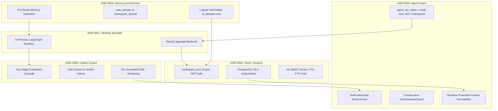
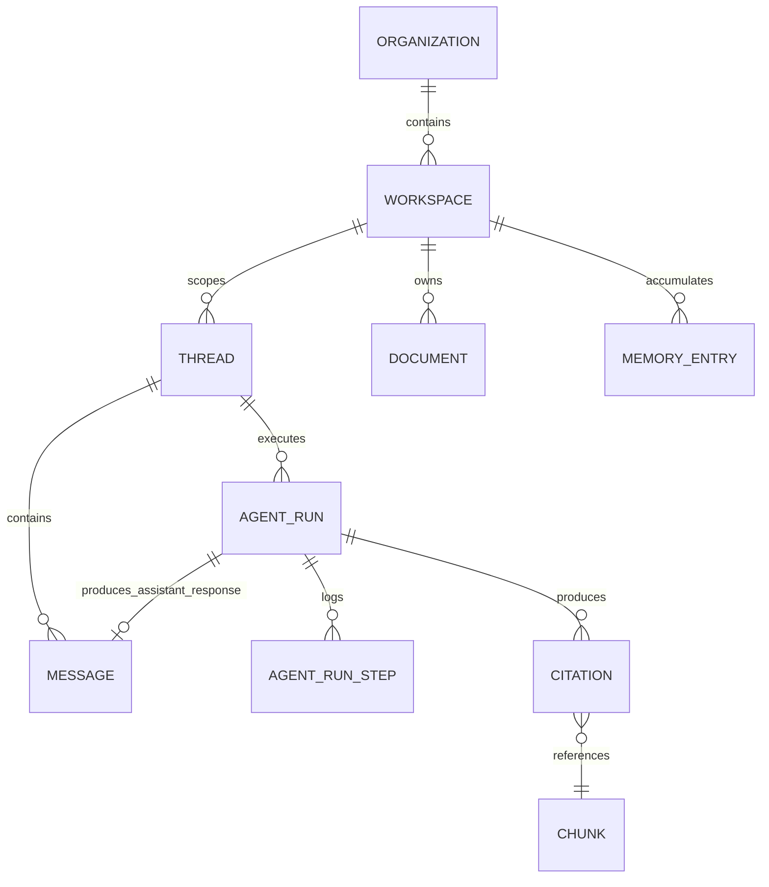
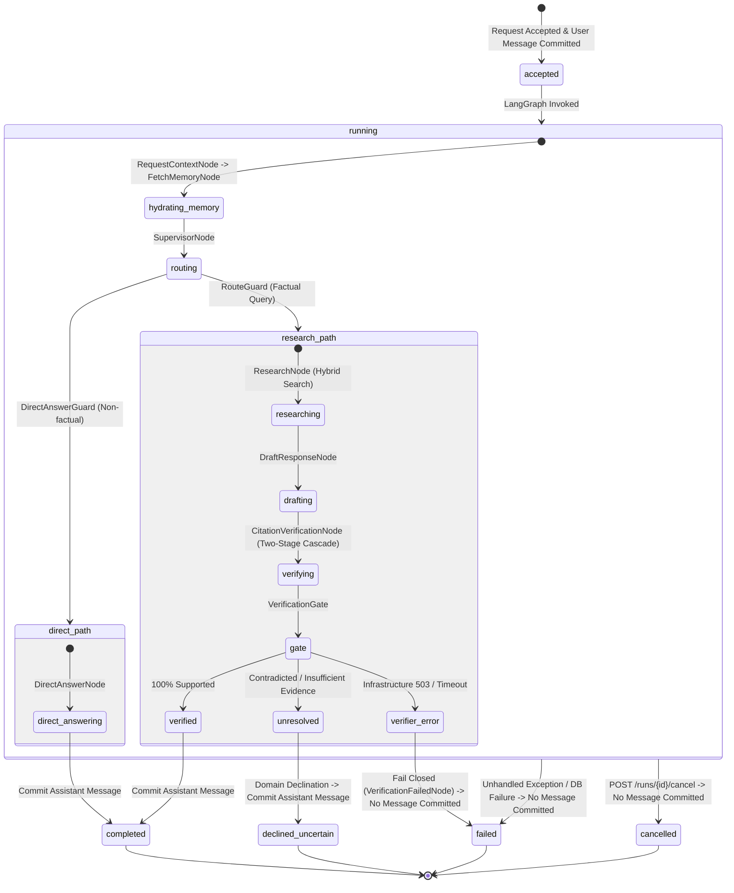
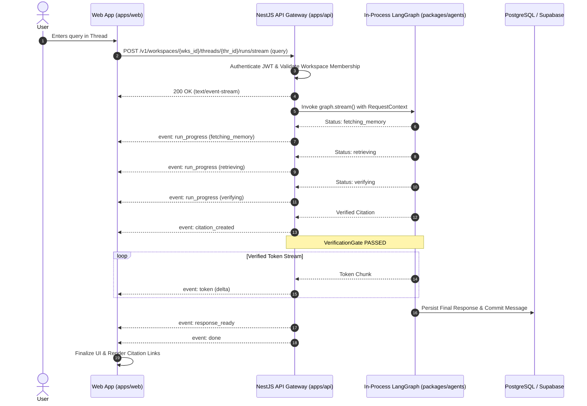
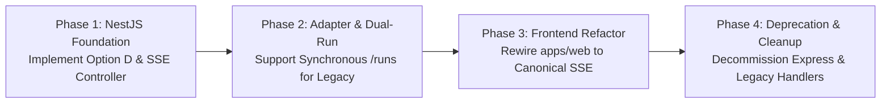

# ADR-0006: API Contract & Streaming Specification Reconciliation

- **Status:** Accepted
- **Date:** 2026-09-12
- **Decision:** Adopt **Option D: Workspace-Scoped Thread with First-Class Messages and Runs (Dual Resource Model)** as the canonical API architecture, backed by a deterministic Server-Sent Events (SSE) streaming contract over `POST /v1/workspaces/{workspace_id}/threads/{thread_id}/runs/stream`. Prohibit streaming unverified factual draft tokens prior to the ADR-0003 / ADR-0005 `VerificationGate`; enforce application-level authentication and role authorization alongside authoritative database Row-Level Security (RLS) under ADR-0002; maintain strict separation between execution audit traces (`agent_run_steps`) and durable checkpointing; and establish a phased migration path retiring the legacy synchronous Express `/runs` route in favor of the NestJS Modular Monolith.
- **Authors:** Contexta-AI Architecture Group (Principal Software Architect, Lead AI Engineer, Security Architect, Frontend Platform Architect)
- **Governing Architecture:** `00_PROJECT_CONSTITUTION.md §5`, `05_PRODUCT_REQUIREMENTS.md §FR-INT-*`, `06_TECHNICAL_REQUIREMENTS.md §TR-INT-*`, `07_SYSTEM_ARCHITECTURE.md §6`, `08_AI_ARCHITECTURE.md §5-7`, `09_DATABASE_DESIGN.md §5-7`, `10_API_SPECIFICATION.md`, `ADR-0001` (NestJS Modular Monolith), `ADR-0002` (Vector Tenancy Isolation), `ADR-0003` (Citation Entailment & Hallucination Guard), `ADR-0004` (Canonical Memory Architecture & Tenancy Model), `ADR-0005` (Agent Graph Architecture & Execution Flow).

---

## Decision Summary

1. **Canonical Resource Model (Option D):** Establish a hierarchical, tenant-scoped resource model:
   ```
   Workspace (/v1/workspaces/{workspace_id})
     └── Threads (/threads/{thread_id})
           ├── Messages (/messages) — Persistent conversation history (audit & rendering)
           └── Runs (/runs & /runs/stream) — Agent graph execution instances
   ```
   A conversation is modeled as a `Thread`. User and assistant contributions are modeled as immutable `Messages`. Execution of the multi-agent graph (LangGraph) is modeled as a first-class `Run`. A user submission initiates a `Run` within a `Thread`; upon successful completion, the verified answer is atomically committed to the thread history as an assistant `Message`.
2. **Canonical Streaming Endpoint:** Standardize real-time interaction on:
   `POST /v1/workspaces/{workspace_id}/threads/{thread_id}/runs/stream`
   using Server-Sent Events (`text/event-stream`).
3. **Safe Streaming Invariant (ADR-0003 / ADR-0005 Enforcement):** Token-by-token streaming of unverified draft content from `DraftResponseNode` is **strictly prohibited**. The stream emits typed lifecycle progress events (`run_started`, `run_progress`, `citation_created`). Incremental tokens are streamed **only after passing the applicable delivery boundary**: the deterministic `VerificationGate` (for factual knowledge queries) or the conservative `DirectAnswerGuard` (for non-factual conversational queries). DirectAnswerGuard is a conservative safety router, not a factuality verifier.
4. **Audit Trail vs. Durable Checkpoint Disambiguation:** Reconcile documented drift by affirming that `agent_runs` and `agent_run_steps` in PostgreSQL constitute an **immutable execution audit trail**, not a durable checkpoint/resume mechanism. The speculative endpoint `POST /runs/{run_id}/resume` documented in `10_API_SPECIFICATION.md` is **rejected** for Phase 1.
5. **Security & Tenancy Boundary (ADR-0002 & ADR-0005 Enforcement):** API authentication and role-based authorization are enforced at the application boundary. PostgreSQL RLS remains the authoritative database data-access and tenant-isolation boundary. A client-supplied `workspace_id` is only a requested resource scope and never establishes authorization by itself.
6. **Legacy Migration Strategy:** Migrate the current Express prototype (`apps/api/src/server.ts`, which returns synchronous JSON from `POST /v1/workspaces/:workspace_id/threads/:thread_id/runs` without SSE) to the NestJS Modular Monolith (`ADR-0001`) under the canonical contract, providing an internal compatibility adapter during the transition and completely decoupling frontend UI from obsolete template proxy routes (`/api/chat`, `/api/ingest`).

---

## Context

Contexta-AI is undergoing an architecture freeze across its foundational tiers. To date, five Architecture Decision Records have been ratified and frozen:
- **ADR-0001:** Modular Monolith Framework (`apps/api` standardized on NestJS; internal domain packages such as `packages/agents` invoked in-process).
- **ADR-0002:** Vector Tenancy Isolation (Hybrid defense-in-depth; database RLS authoritative; `workspace_id` is scoping, not authorization; dense vectors + PostgreSQL full-text search, not BM25).
- **ADR-0003:** Citation Entailment & Hallucination Guard (Two-Stage Cascade; evaluation direction $Evidence \models Claim$; six canonical statuses; fail-closed on verifier infrastructure failure).
- **ADR-0004:** Canonical Memory Architecture & Tenancy Model (Unified `memory_entries` table; `user_private` vs. `workspace_shared` visibility; pre-route hydration via `FetchMemoryNode`; logical soft-delete via `is_deleted = true`).
- **ADR-0005:** Agent Graph Architecture & Execution Flow (Hybrid Supervisor + Deterministic Guard Graph; runtime protected-context immutability; conservative `DirectAnswerGuard`; `VerificationGate`; non-blocking memory persistence).

However, an exhaustive audit of the repository reveals severe structural contradictions and interface drift among three competing surfaces:
1. **The Codebase Reality (`apps/api`):** A lightweight Express server exposing a flat/partially-hierarchical route `POST /v1/workspaces/:workspace_id/threads/:thread_id/runs`. It consumes `graph.stream()` internally to populate `agent_run_steps`, but buffers execution and returns a **synchronous JSON payload**. It exposes **zero SSE streaming endpoints**, uses hardcoded mock RBAC middleware, performs raw physical deletions on memory, and operates without `threads` or `messages` tables in the database.
2. **The Frontend Reality (`apps/web`):** A Next.js UI (`apps/web/app/page.tsx`) inherited from the `ai-pdf-chatbot-langchain` template. It attempts to call local Next.js route handlers `POST /api/chat` and `POST /api/ingest` (which no longer exist on disk), and expects legacy LangChain SSE event envelopes (`event: messages/partial` and `event: updates` containing `retrieveDocuments`). It has zero integration with `apps/api`.
3. **The Documented Intent (`docs/10_API_SPECIFICATION.md`):** Documents a message-centric REST API (`POST /workspaces/{workspace_id}/threads/{thread_id}/messages` and `/messages/stream`), token streaming of unverified assistant text prior to citation creation (violating ADR-0003), and speculative run-resumption endpoints (`POST /runs/{run_id}/resume`) that contradict ADR-0005's checkpointing reality. Furthermore, `docs/09_DATABASE_DESIGN.md` defines relational schemas for `agent_runs`, `agent_run_steps`, and `citations`, but completely omits physical tables for `threads` and `messages`.

This ADR reconciles these conflicting realities into a single, authoritative, enterprise-grade API and streaming contract.

---

## 1. Existing API Reality

### 1.1 Backend Implementation Inventory (`apps/api`)

The backend codebase currently lives in `apps/api` and is structured as an Express application listening on port 3001 (`apps/api/src/server.ts`). It has not yet been refactored into the NestJS Modular Monolith mandated by ADR-0001.

#### Table 1.1: Existing Backend Route Inventory

| Current Route | Method | Implemented Where | Purpose | Consumers | Status |
|---|---|---|---|---|---|
| `/v1/health` | `GET` | `routes/health.ts` | Health check endpoint returning `{ status: 'ok', timestamp }` | Monitoring / DevOps | Functional |
| `/v1/auth/login` | `POST` | `routes/auth.ts`, `controllers/auth.controller.ts` | Authentication stub | External / Auth UI | Stub |
| `/v1/auth/logout` | `POST` | `routes/auth.ts`, `controllers/auth.controller.ts` | Session revocation stub | External / Auth UI | Stub |
| `/v1/auth/admin-only` | `GET` | `routes/auth.ts`, `controllers/auth.controller.ts` | RBAC test route (`requireRole(['Org Admin', 'Workspace Admin'])`) | Internal test | Stub |
| `/v1/workspaces/:workspace_id/threads/:thread_id/runs` | `POST` | `routes/runs.ts`, `controllers/runs.controller.ts`, `services/runs.service.ts` | Executes LangGraph agent run for query; logs steps to DB; returns synchronous JSON | None (disconnected from web) | Prototype (No SSE) |
| `/v1/workspaces/:workspace_id/memory` | `GET` | `routes/memory.ts`, `controllers/memory.controller.ts`, `services/memory.service.ts` | Lists user memories from `memory_entries` table | None | Prototype |
| `/v1/workspaces/:workspace_id/memory/:memory_id` | `DELETE` | `routes/memory.ts`, `controllers/memory.controller.ts`, `services/memory.service.ts` | Deletes memory entry using direct SQL `DELETE` | None | Contradicts ADR-0004 |

### 1.2 Underlying Backend Mechanisms & Deficiencies

1. **Authentication & Identity:** Handled by `apps/api/src/middleware/rbac.ts` via `requireAuth`. If an `Authorization` header is present, it injects a static placeholder user:
   ```typescript
   req.user = { id: 'placeholder-user-id', roles: ['Viewer'], tenantId: 'placeholder-tenant-id' };
   ```
   No cryptographic JWT validation, JWKS verification, or Supabase Auth token exchange currently occurs.
2. **Workspace Scoping & Authorization:** In `runs.controller.ts`, the controller passes `workspace_id` from `req.params` directly to `runsService.executeRun`. In `runsService.ts`, it instantiates an untrusted Supabase client with `Bearer ${authContext.token}`. No application-level or middleware validation confirms whether `placeholder-user-id` actually belongs to `workspace_id`.
3. **Execution & Streaming Reality:** While `runsService.ts` executes `const stream = await graph.stream(initialState)` and iterates over chunks to log node execution times to `agent_run_steps`, the route **does not stream data to the HTTP caller**. Instead, it awaits completion of the entire LangGraph execution and responds with `res.json(result)`:
   ```json
   {
     "run_id": "8f14e45f-...",
     "thread_id": "thr-123",
     "workspace_id": "wks-abc",
     "final_answer": "...",
     "confidence_score": 0.94,
     "status": "completed"
   }
   ```
   **There is zero Server-Sent Events (SSE) or chunked HTTP streaming implemented in `apps/api` today.**
4. **Database Models & Tables:** Database migrations in `supabase/migrations/` (`001_rls_policies.sql`, `002_rls_policies_phase2.sql`) define tables and RLS policies for `documents`, `chunks`, `memory_entries`, `agent_runs`, `agent_run_steps`, and `citations`. **Crucially, no tables exist for `threads` or `messages`.**
5. **Memory Soft-Delete Violation:** `apps/api/src/services/memory.service.ts` invokes `.from('memory_entries').delete().eq('id', memoryId)`, executing a physical SQL `DELETE`. This directly contradicts ADR-0004, which mandates logical deletion via `is_deleted = true` for compliance and auditability.

---

## 2. Existing Documentation Intent

### 2.1 Specification in `docs/10_API_SPECIFICATION.md`

`docs/10_API_SPECIFICATION.md` (Draft v1.1) was authored as an enterprise transformation specification. It envisioned a message-oriented public interface:
- **Endpoints:**
  - `POST /v1/workspaces/{workspace_id}/threads/{thread_id}/messages` (Synchronous message send)
  - `POST /v1/workspaces/{workspace_id}/threads/{thread_id}/messages/stream` (SSE streaming chat)
  - `GET /v1/workspaces/{workspace_id}/threads/{thread_id}/runs/{run_id}` (Execution trace)
  - `POST /v1/workspaces/{workspace_id}/threads/{thread_id}/runs/{run_id}/cancel` (Run cancellation)
  - `POST /v1/workspaces/{workspace_id}/threads/{thread_id}/runs/{run_id}/resume` (Run resumption)
- **Documented SSE Event Stream:**
  ```
  event: run.started
  data: {"run_id":"run_01J8..."}

  event: agent.step
  data: {"agent":"supervisor","step_type":"route_decision","decision":"delegate_to_research_agent"}

  event: token
  data: {"delta":"Based on "}

  event: citation.created
  data: {"id":"cit_01J8A...","claim_text":"...","verification_status":"verified"}

  event: run.completed
  data: {"run_id":"run_01J8...","message_id":"msg_01J8...","usage":{...}}
  ```

### 2.2 Critical Contradictions in the Documentation

1. **Unverified Token Streaming Contradiction:** `docs/10_API_SPECIFICATION.md §9.1` shows `event: token` streaming incremental assistant text *simultaneously with or prior to* `event: citation.created`. This directly violates **ADR-0003 §10** and **ADR-0005 §17**, which state:
   > *"Token-by-token streaming directly from DraftResponseNode to the user client is strictly prohibited. Emitting unverified tokens creates an immediate hallucination and compliance exposure before the verification gate can intervene."*
2. **Resumption & Checkpointing Contradiction:** `10_API_SPECIFICATION.md §7.6` specifies `POST /runs/{run_id}/resume`, claiming the ability to resume a run terminated by concurrency/budget limits from its last completed step. However, **ADR-0005 §18** explicitly establishes that Phase 1 graph execution uses in-memory state passing, and `agent_run_steps` provides a persistent *execution audit trail*, NOT a durable checkpointer. Durable resumability is explicitly deferred to the Phase 2 roadmap.
3. **Database Schema Divergence:** While `10_API_SPECIFICATION.md §7.1` models `THREAD ||--o{ MESSAGE` and `THREAD ||--o{ AGENT_RUN`, `docs/09_DATABASE_DESIGN.md` completely omits table definitions for `threads` and `messages`, defining only `agent_runs`, `agent_run_steps`, and `citations`.

---

## 3. Frontend Contract Reality

### 3.1 Frontend Implementation Inventory (`apps/web`)

Inspection of `apps/web/app/page.tsx` reveals that the frontend is a direct descendant of the open-source template and is completely disconnected from `apps/api`.

#### Table 3.1: Frontend Client Call Audit

| Frontend File / Hook | Target Endpoint Called | Payload Sent | Expected Response Format | Status in Workspace |
|---|---|---|---|---|
| `apps/web/app/page.tsx:91` | `POST /api/chat` | `{ message: userMessage, threadId }` | SSE stream (`text/event-stream`) | Target route missing on disk (404) |
| `apps/web/app/page.tsx:227` | `POST /api/ingest` | `FormData` (`files`) | JSON `{ success: boolean, documentIds: string[] }` | Target route missing on disk (404) |
| `apps/web/__tests__/api/ingest/route.integration.test.ts` | `POST /api/ingest` | `FormData` (`file`) | JSON | Test skipped (`describe.skip`) due to missing route |

### 3.2 Frontend SSE Parsing Logic (`apps/web/app/page.tsx:120-178`)

The frontend contains an SSE reader parsing raw text chunks:
```typescript
if (event === 'messages/partial') {
  // Expects LangChain AIMessageChunk array: [{ type: 'ai', content: 'partial text' }]
  setMessages(prev => updateLastAssistantMessage(prev, partialContent));
} else if (event === 'updates') {
  // Expects LangGraph node update dictionary: { retrieveDocuments: { documents: [...] } }
  lastRetrievedDocsRef.current = data.retrieveDocuments.documents;
}
```
**Findings:**
- The frontend expects internal LangGraph development server event names (`messages/partial`, `updates`).
- It expects LangChain node names (`retrieveDocuments`) from the legacy `retrieval_graph`.
- It maintains conversation history purely in React component state (`const [messages, setMessages] = useState<Message[]>([])`). It has no capability to fetch thread history from a server.
- It supplies an ad-hoc `threadId` generated client-side via `crypto.randomUUID()`.

---

## 4. Frozen ADR Constraints

The API contract must be strictly derived from the established architectural invariants:



### Invariants Governing the API Contract

1. **NestJS Modular Monolith Boundary (ADR-0001):** Public APIs are exposed via NestJS controllers within `apps/api`. LangGraph is invoked in-process as an internal service.
2. **Authoritative Tenancy Boundary (ADR-0002 & ADR-0005):** API authentication and role-based authorization are enforced at the application boundary using trusted roles context. PostgreSQL RLS remains the authoritative database data-access and tenant-isolation boundary. A client-supplied `workspace_id` in a URL path is an administrative scoping parameter and never establishes authorization by itself.
3. **No Unverified Token Streaming (ADR-0003 & ADR-0005):** The API must never emit draft tokens for factual knowledge queries. Factual claims may stream incrementally **only after passing the `VerificationGate`**. Conversational pleasantries may stream **only after passing the conservative `DirectAnswerGuard`** (which serves as a conservative safety router, not a factuality verifier).
4. **Pre-Route Hydration & Ephemeral Threads (ADR-0004):** Conversation thread state is short-term and ephemeral to the LangGraph execution. Long-term memory is queried prior to supervisor routing. Public memory deletion operations must execute logical soft-deletion (`is_deleted = true`).
5. **Protected Context Immutability (ADR-0005):** Execution parameters (`request_id`, `workspace_id`, `user_id`, `thread_id`, `user_query`, `roles`) form protected context. They are initialized once at the API boundary and validated by `RequestContextNode`. Credentials (Bearer tokens, database secrets) **must never appear in graph state or SSE event payloads**.
6. **Execution Audit vs. Durable Checkpoint (ADR-0005):** `agent_runs` and `agent_run_steps` record immutable audit logs. They do not support state replay or mid-execution step resumption.

---

## 5. API/Architecture Drift Matrix

| Concern | Backend Reality (`apps/api`) | Frontend Expectation (`apps/web`) | Documented Intent (`docs/10_API_SPECIFICATION.md`) | Frozen Architecture (`ADR-0001–0005`) | Conflict Severity | Resolution Mandate |
|---|---|---|---|---|---|---|
| **Resource Hierarchy** | Flat/Nested: `/workspaces/:id/threads/:id/runs` | Ad-hoc `/api/chat` proxy with `threadId` | `/workspaces/{id}/threads/{id}/messages` and `/runs` | Workspace tenant scope; protected `thread_id` and `request_id` | **P1** | Adopt **Option D**: Workspace $\rightarrow$ Thread $\rightarrow$ Messages & Runs. |
| **Streaming Protocol** | **Synchronous JSON only** (`res.json()`); `graph.stream()` used for step logging | SSE expecting `messages/partial` & `updates` | SSE on `/messages/stream` emitting `token` and `agent.step` | SSE lifecycle events; **NO unverified draft token streaming** | **P0** | Standardize on SSE `POST /runs/stream`. Stream progress events, then verified tokens post-gate. |
| **Token Streaming Safety** | N/A (no streaming) | Streams raw tokens directly from LLM node | Streams tokens before/concurrent with citations | Strict prohibition of unverified factual draft streaming | **P0** | Enforce Verification Gate buffer. Disallow draft token emission. |
| **Database Persistence** | No `threads` or `messages` tables; writes `agent_runs` | In-memory React state only | Persistent threads & messages documented | Short-term thread state ephemeral to graph; audit in `agent_runs` | **P1** | Add physical `threads` and `messages` tables to schema to back conversation history. |
| **Run Resumption** | Not implemented | Not implemented | `POST /runs/{id}/resume` | Checkpoint/resume deferred to Phase 2; `agent_run_steps` is audit only | **P1** | Reject `/resume` endpoint. Mark run cancellation as abort-only. |
| **Authentication & RBAC** | Hardcoded mock `Viewer` payload in middleware | No auth headers sent | Bearer JWT required; RBAC roles defined | Authoritative DB RLS; JWT propagation; no tokens in state/SSE | **P0** | Implement real JWT verification guard in NestJS; pass auth context outside graph state. |
| **Memory Deletion** | Physical SQL `DELETE` | Not implemented | `DELETE /memory/{id}` | Logical soft-deletion (`is_deleted = true`) required | **P1** | Reconcile API endpoint to execute SQL `UPDATE is_deleted = true`. |
| **Search Substrate** | Not exposed via API | N/A | Documents BM25 keyword search | ADR-0002 rejects BM25; mandates PostgreSQL Full-Text Search | **P2** | Correct API search spec to dense vectors + PostgreSQL FTS. |

---

## 6. Resource Model

### 6.1 Entity Relationships & Lifecycle

To eliminate architectural ambiguity, Contexta-AI adopts **Option D: Workspace-Scoped Thread with First-Class Messages and Runs**.



### 6.2 Definitive Answers to Core Conceptual Questions

1. **What creates a thread?**  
   An explicit `POST /v1/workspaces/{workspace_id}/threads` call, or an implicit auto-creation when submitting the first message/run to a new `thread_id`.
2. **What creates a message?**  
   - A user message is created upon request acceptance when initiating a run.
   - An assistant message is created when an agent run successfully reaches a terminal state (`completed` or `declined_uncertain`) containing a deliverable response.
3. **What creates a run?**  
   An explicit invocation of `POST /v1/workspaces/{workspace_id}/threads/{thread_id}/runs` (synchronous) or `.../runs/stream` (SSE).
4. **Is a run one execution attempt or one logical user request?**  
   A run is **one execution attempt** of the multi-agent graph. If a client retries a request with the same `Idempotency-Key`, it attaches to the existing run; if it submits a new attempt, a new `run_id` is created.
5. **Can one message have multiple runs?**  
   Yes. A user message may be re-run (e.g. "Regenerate response"), producing a subsequent run associated with the same conversational turn.
6. **Can one run produce multiple messages?**  
   No. In Contexta-AI's conversational model, a run produces exactly one final assistant response message (or an uncertainty declination).
7. **What is the authoritative identifier for client correlation?**  
   The client correlation identifier is **`request_id`** (passed via `X-Request-Id` or generated at the API gateway).
8. **What identifier is used for agent execution correlation?**  
   **`run_id`** is the primary execution key across `agent_runs`, `agent_run_steps`, and `citations`.
9. **Which resources are persistent?**  
   `workspaces`, `threads`, `messages`, `memory_entries`, `documents`, and `citations` are persistent business entities.
10. **Which resources are execution/audit artifacts?**  
    `agent_runs` and `agent_run_steps` are immutable execution audit artifacts.
11. **Which resource owns the final response?**  
    The `AgentRun` produces the final response text and citation bindings. Once verified, it commits that text as the content of an assistant `Message` in the `Thread`.

### 6.3 Conversational Turn Lifecycle: Message ↔ Run Creation Semantics

A critical area of drift in earlier specifications was the ambiguity surrounding how messages and runs relate in the public API (e.g., whether clients must first create a message and subsequently trigger a run).

In Contexta-AI's canonical architecture, the contract is definitive: **there is no public `POST /threads/{thread_id}/messages` endpoint.**

Instead, `POST /v1/workspaces/{workspace_id}/threads/{thread_id}/runs` (and `/runs/stream`) represents the submission of one conversational turn and atomically drives the message-and-run persistence lifecycle:

```
Client Submission (query)
        │
        ├── 1. Persists User Message (role: 'user', content: query)
        │
        └── 2. Creates Agent Run (status: 'accepted' -> 'running')
                 │
                 ▼
            Agent Graph Execution (ADR-0005)
                 │
                 ├── [VerificationGate / DirectAnswerGuard Passed]
                 │        │
                 │        ▼
                 │   3a. Successful Final Response
                 │        │
                 │        ▼
                 │   4a. Persists Assistant Message (role: 'assistant', content, citations)
                 │       Run status -> 'completed' (or 'declined_uncertain')
                 │
                 └── [Verifier 503 / Infrastructure Error / Cancel]
                          │
                          ▼
                     3b. Execution Failure / Cancellation
                          │
                          ▼
                     4b. NO Assistant Message is Committed to Thread History
                         Run status -> 'failed' (or 'cancelled')
                         Error logged to agent_runs; user message remains unfulfilled turn
```

#### Core Invariants of the Turn Lifecycle:
1. **Who creates the user message?**  
   The run submission endpoint (`POST .../runs` or `POST .../runs/stream`) atomically creates and persists the user `Message` upon validating authentication, roles, and input schema.
2. **Who creates the run?**  
   The run submission endpoint creates the `AgentRun` linked to both `thread_id` and the newly persisted user `message_id`.
3. **When are assistant messages created?**  
   An assistant `Message` is created and committed to the thread history **only when the agent run successfully reaches an eligible terminal state** (`completed` or `declined_uncertain`).
4. **What happens if a run fails before an assistant response is produced?**  
   If an agent run fails due to an infrastructure outage (e.g., verifier 503, database timeout) or is aborted by cancellation, **no partial or corrupt assistant message is committed to thread history**. The failure details are recorded in `agent_runs` and returned to the caller. The user message remains recorded as the unfulfilled turn, allowing the client to retry or inspect the failure.
5. **Does one message correspond to one logical run submission?**  
   Yes. Under standard execution, one user message triggers one logical run submission. If a user subsequently requests to "regenerate" a response, a new `AgentRun` is instantiated against that existing user message turn.
6. **How do retries and idempotency prevent duplicate turns?**  
   When a client retries after a network timeout using the same `Idempotency-Key`, the endpoint deduplicates both message creation and run creation: it locates the existing user message and run, attaching to the active execution or returning the cached response, guaranteeing that duplicate user messages are never inserted into thread history.
7. **Role of `GET /threads/{thread_id}/messages`:**  
   `GET .../messages` is strictly a read-only endpoint that retrieves the chronological, audit-compliant conversation history for rendering in user interfaces.

---

## 7. Evaluated API Options

### Option A: Legacy Flat / Run-Centric API
- **Structure:** `POST /v1/runs` or `POST /v1/workspaces/{workspace_id}/runs`
- **Description:** Flattens interaction around the agent execution engine. Threads are treated as secondary metadata tags inside the run payload.
- **Evaluation:** Matches current `apps/api/src/services/runs.service.ts` logic closely. However, it completely fails REST conventions for conversation management, forces frontend clients to reconstruct conversation history from audit logs (`agent_runs`), and obscures thread lifecycle operations.

### Option B: Documented Message-Centric Hierarchy
- **Structure:** `POST /v1/workspaces/{workspace_id}/threads/{thread_id}/messages` and `.../messages/stream`
- **Description:** Hides agent execution entirely behind a traditional chat messaging facade. Runs exist only as internal implementation side effects.
- **Evaluation:** Elegant REST semantics for simple chatbots. However, it severely impairs enterprise visibility. Contexta-AI requires explicit inspection of agent routing, citation verification steps, cancellation, and execution budgets. Subsuming runs under messages makes run tracking, step inspection, and multi-agent observability awkward.

### Option C: Run-Centric Hierarchy Without Messages
- **Structure:** `POST /v1/workspaces/{workspace_id}/threads/{thread_id}/runs` and `.../runs/stream`
- **Description:** Models threads containing runs, where runs contain query and answer fields. Eliminates the `messages` resource entirely.
- **Evaluation:** Highly aligned with the database schema in `09_DATABASE_DESIGN.md`. However, it forces UI clients to treat audit records as conversation turns, making chat pagination, user comment attachments, and standard chat UI integrations brittle.

### Option D: Workspace $\rightarrow$ Thread with First-Class Messages and Runs [CHOSEN]
- **Structure:**
  - Conversations & History: `.../threads/{thread_id}/messages` (`GET`)
  - Execution & Streaming: `.../threads/{thread_id}/runs` and `.../runs/stream` (`POST`)
- **Description:** Decouples persistent conversation state (`Messages`) from execution orchestration (`Runs`). A user triggers execution by posting to `/runs` (or `/runs/stream`); the platform records the user message, executes the LangGraph run, and upon verification commits the assistant message.
- **Evaluation:** Perfectly reconciles the repository. Reuses `apps/api`'s existing `/runs` endpoint structure, fulfills `docs/10_API_SPECIFICATION.md`'s promise of thread/message history, directly models ADR-0005's LangGraph execution lifecycle, and provides clean separation between business data and execution audit logs.

### Option E: Hybrid Flat Event-Machine API
- **Structure:** `POST /v1/events` with WebSocket bidirectional state synchronization.
- **Description:** Replaces HTTP/SSE with a persistent bi-directional WebSocket connection managing agent events.
- **Evaluation:** Over-engineered for Phase 1 requirements. Violates ADR-0001 simplicity and introduces complex connection-state management across API gateway instances.

---

## 8. Decision Matrix

| Evaluation Criterion | Weight | Option A: Flat Runs | Option B: Messages-Only | Option C: Runs-Only | Option D: Dual Model (Chosen) | Option E: WebSockets |
|---|:---:|:---:|:---:|:---:|:---:|:---:|
| **1. REST Semantics & Clean Resource Model** | 10% | 4 | 9 | 6 | **9** | 5 |
| **2. Alignment with Existing DB Schema** | 10% | 7 | 4 | 9 | **8** | 4 |
| **3. Alignment with ADR-0005 Execution Flow** | 15% | 7 | 5 | 8 | **10** | 7 |
| **4. Frontend Usability & Chat Ergonomics** | 15% | 4 | 9 | 5 | **9** | 6 |
| **5. Tenancy & RLS Scoping (ADR-0002)** | 10% | 8 | 8 | 8 | **9** | 7 |
| **6. Observability & Step Auditing** | 10% | 8 | 4 | 9 | **10** | 6 |
| **7. Streaming Compatibility (SSE)** | 15% | 5 | 7 | 7 | **10** | 8 |
| **8. Idempotency & Concurrency Handling** | 10% | 6 | 6 | 7 | **9** | 5 |
| **9. Migration & Implementation Feasibility** | 15% | 7 | 5 | 7 | **8** | 3 |
| **Weighted Total** | **100%** | **5.90 / 10** | **6.60 / 10** | **7.05 / 10** | **8.95 / 10** | **5.55 / 10** |

---

## 9. Canonical REST Contract

All canonical endpoints are prefixed with `/v1` and scoped by `workspace_id`. Authentication is mandatory via `Authorization: Bearer <JWT>`.

```
====================================================================================================
CANONICAL ROUTE HIERARCHY
====================================================================================================

/v1/workspaces/{workspace_id}
  │
  ├── /threads
  │     ├── POST                          -> Create a new thread
  │     ├── GET                           -> List threads in workspace (paginated)
  │     │
  │     └── /{thread_id}
  │           ├── GET                     -> Retrieve thread metadata
  │           ├── DELETE                  -> Soft-delete thread and cascade
  │           │
  │           ├── /messages
  │           │     └── GET               -> List historical messages in thread
  │           │
  │           └── /runs
  │                 ├── POST              -> Execute run synchronously (buffers until complete)
  │                 ├── /stream (POST)    -> Execute run with SSE real-time stream
  │                 │
  │                 └── /{run_id}
  │                       ├── GET         -> Get run status, metadata, and final response
  │                       ├── /steps (GET)-> Get detailed execution audit trace (agent_run_steps)
  │                       └── /cancel (POST) -> Abort an in-progress run
  │
  ├── /memory
  │     ├── GET                           -> List active memories (user_private + workspace_shared)
  │     └── /{memory_id} (DELETE)         -> Logical soft-delete (sets is_deleted = true)
  │
  └── /documents
        ├── POST                          -> Upload document (multipart/form-data; 202 Accepted)
        ├── GET                           -> List documents in workspace
        └── /{document_id} (GET/DELETE)   -> Retrieve or delete document
```

---

## 10. Run Lifecycle

### 10.1 State Transition Model



### 10.2 Run State Taxonomy & Lifecycle Invariants

#### Canonical Run States:
- **`accepted`:** Request schema and authorization validated; user `Message` atomically committed to thread history; `AgentRun` initialized.
- **`running`:** Multi-agent graph actively executing in-process.
- **`completed` (Terminal):** VerificationGate passed (all claims supported) or DirectAnswerGuard passed (non-factual conversational); final verified answer committed as an assistant `Message`.
- **`declined_uncertain` (Terminal Domain Outcome):** Retrieval returned zero evidence, or claims were contradicted/unsupported; standardized domain declination committed as an assistant `Message`.
- **`failed` (Terminal Infrastructure Error):** Verifier infrastructure outage (503), database connection drop, or unhandled exception. Execution fails closed; **no assistant message is committed**.
- **`cancelled` (Terminal Client Abort):** Execution halted via `POST .../runs/{run_id}/cancel`; **no assistant message is committed**.

#### Explicit Distinction: Domain Outcomes vs. Infrastructure Failures vs. Transport Errors:
1. **HTTP/Transport & Authorization Failures (Pre-Run):**
   - Trigger: Invalid JSON schema (`400 VALIDATION_ERROR`), missing/expired token (`401 AUTHENTICATION_REQUIRED`), or workspace access denial (`403 AUTHORIZATION_DENIED`).
   - Behavior: Request rejected immediately at the application boundary. **Zero user messages and zero runs are created in the database.**
2. **Valid Domain Outcomes (`declined_uncertain`):**
   - Trigger: Valid user query where no supporting documents exist in the workspace, or where evidence contradicts the premise.
   - Behavior: This is a **successful execution yielding a domain uncertainty outcome**. HTTP status is `200 OK` (for sync) or terminal `response_ready` (for SSE); run state in `agent_runs` is `declined_uncertain`; and an authoritative declination message is committed to thread history.
3. **Infrastructure Failures (`failed` / Fail Closed):**
   - Trigger: Stage 2 Citation Verifier outage (503 / timeout), vector store degraded, or database network partition.
   - Behavior: Graph fails closed; run state transitions to `failed`; SSE emits `event: error` (`VERIFIER_UNAVAILABLE`); and **no assistant message is committed to thread history**, preserving thread integrity.

#### Execution Invariants:
1. **Synchronous vs. Asynchronous Semantics:**
   - `POST .../runs` buffers execution server-side and returns `200 OK` with the complete run record once reached a terminal state.
   - `POST .../runs/stream` opens an immediate `200 OK` SSE channel (`text/event-stream`) emitting incremental lifecycle and verified token events.
2. **Terminal State Immutability:** Once a run reaches `completed`, `declined_uncertain`, `failed`, or `cancelled`, its database record in `agent_runs` is frozen with `completed_at` and never transitions again.
3. **Cancellation Semantics:** `POST .../runs/{run_id}/cancel` signals the execution cancellation token. The in-process LangGraph loop terminates at the next node boundary, updates `agent_runs.status = 'cancelled'`, logs the cancellation to `agent_run_steps`, and closes any active SSE connection without committing an assistant message.
4. **Idempotency Invariant:** A submission carrying an `Idempotency-Key` header prevents duplicate runs. If an execution is currently `running` for that key, the server returns `409 Conflict` (for synchronous calls) or attaches to the existing execution trace.

---

## 11. Canonical SSE Contract

### 11.1 Connection Establishment

- **Endpoint:** `POST /v1/workspaces/{workspace_id}/threads/{thread_id}/runs/stream`
- **Request Headers:**
  - `Authorization: Bearer <JWT>` (Authoritative caller credentials)
  - `Accept: text/event-stream`
  - `Content-Type: application/json`
  - `X-Request-Id: <UUIDv7>` (Optional client correlation identifier)
  - `Idempotency-Key: <UUIDv4>` (Recommended)
- **Response Headers:**
  - `Content-Type: text/event-stream; charset=utf-8`
  - `Cache-Control: no-cache, no-transform`
  - `Connection: keep-alive`
  - `X-Accel-Buffering: no` (Disables proxy buffering in NGINX/Cloudflare)

### 11.2 Canonical SSE Envelope

Every event emitted on the wire adheres strictly to the standard SSE protocol format:
```
event: <event_name>
data: <json_payload>

```

The `json_payload` is strictly structured under a uniform, transport-appropriate event envelope:

```typescript
interface CanonicalSseEnvelope<T = any> {
  event: string;              // Mirrors SSE event name
  request_id: string;         // Root request correlation ID
  run_id: string;             // Active agent run ID
  thread_id: string;          // Scoping thread ID
  sequence: number;           // Monotonically increasing sequence (1, 2, 3...)
  timestamp: string;          // ISO 8601 UTC timestamp
  payload: T;                 // Event-specific data
}
```

> **Crucial Contract Separation:** The SSE event envelope is transport-specific and strictly separated from the REST JSON response envelope defined in Section 13. SSE data payloads are **never nested** inside the REST `{"data": ..., "meta": ..., "error": ...}` wrapper.

### 11.3 Frozen SSE Event Taxonomy

#### Table 11.3: Authoritative SSE Events

| Event Name | Emitted When | Payload Structure | Safety / Verification Boundary |
|---|---|---|---|
| `run_started` | Graph execution begins | `{ run_id, thread_id, model }` | Safe metadata |
| `run_progress` | Node transition in LangGraph | `{ phase, message }` (`phase`: `fetching_memory`, `routing`, `retrieving`, `verifying`) | Abstract progress; **NO raw internal reasoning or CoT** |
| `citation_created` | A claim passes ADR-0003 Stage 2 verification | `{ citation_id, claim_text, source_document_id, page_number, entailment_score }` | **Only emitted after claim verification succeeds** |
| `token` | Incremental final response token | `{ delta: string }` | **STRICT BOUNDARY:** Emitted ONLY after `VerificationGate` or `DirectAnswerGuard` |
| `response_ready` | Full final response synthesized | `{ content: string, citations: string[], status: 'completed' \| 'declined_uncertain' }` | Fully verified final content |
| `error` | Terminal execution or infrastructure failure | `{ code: string, message: string, retryable: boolean }` | Safe error message (no leaked stack traces) |
| `done` | Execution finished & stream closing | `{ run_id, duration_ms, usage: { input_tokens, output_tokens } }` | Terminal delimiter |

#### Branch Semantics for Incremental Token Streaming:
Token events (`event: token`) may contain only final-response content that has crossed the applicable delivery boundary:

1. **Knowledge Query Branch:**
   ```
   DraftResponseNode
          │ (Unverified draft text — STRICTLY BUFFERED, ZERO TOKENS STREAMED)
          ▼
   CitationVerificationNode (ADR-0003 Two-Stage Cascade: Stage 1 + Stage 2)
          │
          ▼
   VerificationGate
          │ (All claims SUPPORTED)
          ▼
   FinalResponseNode
          │
          ▼
   Token Streaming (event: token)
   ```
2. **Direct Conversational Branch:**
   ```
   SupervisorNode (Proposes candidate conversational route)
          │
          ▼
   DirectAnswerGuard (Evaluates conservative non-factual safety)
          │ (Conclusively non-factual: greetings, pleasantries, procedural capabilities)
          ▼
   DirectAnswerNode
          │
          ▼
   Token Streaming (event: token)
   ```

#### Mandatory DirectAnswerGuard Invariant:
**DirectAnswerGuard is NOT a factuality verifier.**  
Passing `DirectAnswerGuard` does **NOT** mean factual enterprise content has been independently verified. Its purpose is strictly conservative routing safety.
- **Fail-Safe Conservatism Rule:** If the guard is uncertain, ambiguous, or detects any inquiry regarding metrics, dates, entities, or enterprise operations:
  $$\text{Classification is uncertain or ambiguous} \implies \text{Route MUST fall back to } \mathbf{knowledge\_query}$$
- *False-Positive Retrieval:* Routing a conversational query to research is acceptable operational overhead.
- *False-Negative Direct Answering:* Allowing enterprise factual claims to bypass retrieval and verification is an **unacceptable compliance failure**.

#### Terminal Stream Error Representation:
If an unrecoverable execution failure occurs while the stream is active (e.g. verifier infrastructure outage 503, database write abort, or timeout), the server emits a terminal `error` event:
```
event: error
data: {"event":"error","request_id":"req_01J8...","run_id":"run_01J8...","thread_id":"thr_01J8...","sequence":5,"timestamp":"2026-09-12T10:00:02.100Z","payload":{"code":"VERIFIER_UNAVAILABLE","message":"Stage 2 Citation Verifier outage (Fail Closed)","retryable":false}}

```
Following the `error` event, the stream terminates immediately without emitting `done` and without committing an assistant message.

### 11.4 Example SSE Wire Trace

```http
HTTP/1.1 200 OK
Content-Type: text/event-stream; charset=utf-8
Cache-Control: no-cache, no-transform
Connection: keep-alive
X-Accel-Buffering: no

event: run_started
data: {"event":"run_started","request_id":"req_01J8X...","run_id":"run_01J8Y...","thread_id":"thr_01J8Z...","sequence":1,"timestamp":"2026-09-12T10:00:00.100Z","payload":{"run_id":"run_01J8Y...","thread_id":"thr_01J8Z..."}}

event: run_progress
data: {"event":"run_progress","request_id":"req_01J8X...","run_id":"run_01J8Y...","thread_id":"thr_01J8Z...","sequence":2,"timestamp":"2026-09-12T10:00:00.250Z","payload":{"phase":"fetching_memory","message":"Hydrating workspace context"}}

event: run_progress
data: {"event":"run_progress","request_id":"req_01J8X...","run_id":"run_01J8Y...","thread_id":"thr_01J8Z...","sequence":3,"timestamp":"2026-09-12T10:00:00.500Z","payload":{"phase":"retrieving","message":"Executing hybrid vector search"}}

event: run_progress
data: {"event":"run_progress","request_id":"req_01J8X...","run_id":"run_01J8Y...","thread_id":"thr_01J8Z...","sequence":4,"timestamp":"2026-09-12T10:00:01.800Z","payload":{"phase":"verifying","message":"Verifying claim citations against retrieved evidence"}}

event: citation_created
data: {"event":"citation_created","request_id":"req_01J8X...","run_id":"run_01J8Y...","thread_id":"thr_01J8Z...","sequence":5,"timestamp":"2026-09-12T10:00:02.400Z","payload":{"citation_id":"cit_01J8...","claim_text":"Federal agencies must complete migration by 2027.","source_document_id":"doc_01J...","page_number":14,"entailment_score":0.96}}

event: token
data: {"event":"token","request_id":"req_01J8X...","run_id":"run_01J8Y...","thread_id":"thr_01J8Z...","sequence":6,"timestamp":"2026-09-12T10:00:02.500Z","payload":{"delta":"Based on "}}

event: token
data: {"event":"token","request_id":"req_01J8X...","run_id":"run_01J8Y...","thread_id":"thr_01J8Z...","sequence":7,"timestamp":"2026-09-12T10:00:02.550Z","payload":{"delta":"NIST SP 1800-38 guidance, "}}

event: response_ready
data: {"event":"response_ready","request_id":"req_01J8X...","run_id":"run_01J8Y...","thread_id":"thr_01J8Z...","sequence":8,"timestamp":"2026-09-12T10:00:03.100Z","payload":{"content":"Based on NIST SP 1800-38 guidance, federal agencies must complete migration by 2027.","citations":["cit_01J8..."],"status":"completed"}}

event: done
data: {"event":"done","request_id":"req_01J8X...","run_id":"run_01J8Y...","thread_id":"thr_01J8Z...","sequence":9,"timestamp":"2026-09-12T10:00:03.150Z","payload":{"run_id":"run_01J8Y...","duration_ms":3050,"usage":{"input_tokens":1240,"output_tokens":85}}}
```

### 11.5 Disconnection & Reconnection Semantics

1. **Client Disconnect Mid-Stream:** If a browser closes or network drops during SSE streaming:
   - The server detects connection closure via `req.on('close')`.
   - In accordance with enterprise background execution standards, **the underlying agent run does not abort by default**; it continues execution to guarantee database integrity and completes persistence to `agent_runs` and `messages`.
   - If an explicit abort is desired, the client must issue `POST .../runs/{run_id}/cancel`.
2. **Reconnection Handling:**
   - SSE connections are ephemeral projections. Contexta-AI **does not support mid-stream state replay** over SSE in Phase 1 (no `Last-Event-ID` offset buffer).
   - If a client is disconnected, it must poll `GET /v1/workspaces/{workspace_id}/threads/{thread_id}/runs/{run_id}` or fetch `GET .../threads/{thread_id}/messages` once connectivity resumes.

### 11.6 Client Protocol: EventSource vs. Fetch API with ReadableStream

1. **Native Browser `EventSource` Limitations:** Standard HTML5 `EventSource` API inherently issues HTTP `GET` requests and provides no native mechanism for sending request bodies or custom HTTP request headers (such as `Authorization: Bearer <JWT>`).
2. **Anti-Pattern Rejection (No Query String Tokens):** Exposing authentication credentials via URL query parameters (e.g. `?token=...` or `?auth_token=...`) to accommodate native `EventSource` is **strictly prohibited**. Query parameters leak into browser history, web server access logs, reverse proxy logs, and `Referer` headers, violating enterprise compliance.
3. **Mandated Client Implementation:** Frontend and SDK consumers must consume the streaming endpoint using modern HTTP clients supporting `POST` with `ReadableStream` (e.g., standard browser `fetch()` consuming `response.body.getReader()`, or enterprise-tested client libraries such as `@microsoft/fetch-event-source`). This guarantees that the bearer token remains securely encapsulated in HTTP request headers.

---

## 12. Request / Response Contracts

### 12.1 Thread Management

#### Create Thread: `POST /v1/workspaces/{workspace_id}/threads`
- **Request Body:**
  ```json
  {
    "title": "NIST Compliance Inquiries",
    "metadata": { "department": "Security Architecture" }
  }
  ```
- **Response `201 Created`:**
  ```json
  {
    "data": {
      "id": "thr_01J8XQ7B2N4P5Q6R7S8T9U0V1W",
      "workspace_id": "wks_01J8XQ7B2N4P5Q6R7S8T9U0V1A",
      "title": "NIST Compliance Inquiries",
      "created_by": "usr_01J8X...",
      "created_at": "2026-09-12T10:15:00Z",
      "updated_at": "2026-09-12T10:15:00Z"
    },
    "meta": { "request_id": "req_01J8XR3...", "timestamp": "2026-09-12T10:15:00Z" },
    "error": null
  }
  ```

### 12.2 Run Initiation (Synchronous & Streaming)

#### Initiate Run: `POST /v1/workspaces/{workspace_id}/threads/{thread_id}/runs`
#### Stream Run: `POST /v1/workspaces/{workspace_id}/threads/{thread_id}/runs/stream`
- **Request Body:**
  ```json
  {
    "query": "What are the quantum-vulnerable system migration deadlines for federal agencies?",
    "parameters": {
      "search_mode": "hybrid",
      "top_k": 20
    }
  }
  ```
- **Synchronous Response `200 OK` (Buffered Execution):**
  ```json
  {
    "data": {
      "id": "run_01J8XR2...",
      "thread_id": "thr_01J8XQ7...",
      "workspace_id": "wks_01J8XQ7...",
      "status": "completed",
      "final_response": "Based on the ingested NIST SP 1800-38 guidance, federal agencies must complete inventory and migration planning by 2027.",
      "citations": [
        {
          "id": "cit_01J8A...",
          "claim_text": "Federal agencies must complete inventory and migration planning by 2027.",
          "source_document_id": "doc_01J7...",
          "page_number": 14,
          "entailment_score": 0.94,
          "verification_status": "SUPPORTED"
        }
      ],
      "started_at": "2026-09-12T10:17:00Z",
      "completed_at": "2026-09-12T10:17:03Z"
    },
    "meta": { "request_id": "req_01J8XR3...", "timestamp": "2026-09-12T10:17:03Z" },
    "error": null
  }
  ```

### 12.3 Message History Retrieval

#### List Messages: `GET /v1/workspaces/{workspace_id}/threads/{thread_id}/messages`
- **Query Parameters:** `?limit=20&cursor=msg_01J8...`
- **Response `200 OK`:**
  ```json
  {
    "data": [
      {
        "id": "msg_01J8A1...",
        "thread_id": "thr_01J8XQ7...",
        "role": "user",
        "content": "What are the quantum-vulnerable system migration deadlines for federal agencies?",
        "created_at": "2026-09-12T10:17:00Z"
      },
      {
        "id": "msg_01J8A2...",
        "thread_id": "thr_01J8XQ7...",
        "role": "assistant",
        "content": "Based on the ingested NIST SP 1800-38 guidance, federal agencies must complete inventory and migration planning by 2027.",
        "citations": ["cit_01J8A..."],
        "agent_run_id": "run_01J8XR2...",
        "created_at": "2026-09-12T10:17:03Z"
      }
    ],
    "meta": {
      "request_id": "req_01J8XR4...",
      "timestamp": "2026-09-12T10:18:00Z",
      "next_cursor": null,
      "has_more": false
    },
    "error": null
  }
  ```

---

## 13. REST JSON Response & Error Contracts

### 13.1 Standard REST JSON Envelopes

Synchronous REST API endpoints strictly adhere to a standardized JSON response envelope.

#### Success Envelope (REST JSON):
```json
{
  "data": { ... },
  "meta": {
    "request_id": "req_01J8XR3...",
    "timestamp": "2026-09-12T10:17:03Z"
  },
  "error": null
}
```

#### Error Envelope (REST JSON):
```json
{
  "data": null,
  "meta": {
    "request_id": "req_01J8XR5...",
    "timestamp": "2026-09-12T10:19:00Z"
  },
  "error": {
    "code": "VALIDATION_ERROR",
    "message": "The field 'query' must not be empty.",
    "field": "query",
    "details": null
  }
}
```

> **Transport Separation:** This REST JSON envelope governs synchronous HTTP request/response exchanges. It does **not** govern Server-Sent Events (SSE), which communicate via the dedicated event envelope defined in Section 11.2 (`CanonicalSseEnvelope`). Terminal streaming errors are emitted as typed `event: error` payloads on the event stream, rather than wrapping events in REST JSON envelopes.

### 13.2 Error Taxonomy & Status Mapping

#### Table 13.2: Canonical Error Mapping

| HTTP Status | `error.code` | Semantic Trigger | Exposure / Leakage Safety |
|---|---|---|---|
| `400` | `VALIDATION_ERROR` | Schema validation error (Zod/DTO) | Returns specific invalid field name |
| `401` | `AUTHENTICATION_REQUIRED` | Missing, malformed, or expired JWT | Generic auth failure message |
| `403` | `AUTHORIZATION_DENIED` | Valid JWT, but user lacks workspace membership | Masks tenant existence if resource unknown |
| `404` | `RESOURCE_NOT_FOUND` | Thread, run, or document does not exist | **Masks cross-tenant resources as 404** |
| `409` | `IDEMPOTENCY_CONFLICT` | Same `Idempotency-Key` reused with different payload | Invariant protection |
| `409` | `STATE_CONFLICT` | Mutation rejected due to concurrent run in thread | Explains active run conflict |
| `422` | `UNPROCESSABLE_ENTITY` | Query exceeds semantic limits or unparsable input | Business rule rejection |
| `429` | `RATE_LIMITED` | Token bucket limit exceeded | Emits standard `Retry-After` header |
| `500` | `INTERNAL_ERROR` | Unhandled code exception | **Masks internal stack traces and DB errors** |
| `502` | `UPSTREAM_PROVIDER_ERROR` | Upstream LLM provider outage or invalid payload | Masked vendor error |
| `503` | `VERIFIER_UNAVAILABLE` | Stage 2 Citation Verifier outage (Fail Closed) | Generic declination of unverified claim |
| `504` | `AGENT_RUN_TIMEOUT` | Agent execution exceeded maximum execution budget | Execution aborted cleanly |

---

## 14. Security & Tenancy

### 14.1 Workspace Binding & Multi-Tenancy Invariants

1. **Workspace ID as Query Scope, Not Authority (ADR-0002 & ADR-0005):** A client-supplied `workspace_id` in the URL identifies the requested resource scope. It **never establishes authorization by itself**. API authentication and role-based authorization are enforced at the application boundary using trusted roles context.
2. **Authoritative Database Data-Access Boundary:** PostgreSQL Row-Level Security (RLS) policies remain the authoritative database data-access and tenant-isolation boundary. All data queries (documents, chunks, embeddings, memory, threads, messages, runs) must execute with the caller's verified JWT context passed to PostgreSQL. Database RLS policies (`001_rls_policies.sql`, `002_rls_policies_phase2.sql`) verify that:
   ```sql
   workspace_id IN (
     SELECT workspace_id FROM workspace_members WHERE user_id = auth.uid()
   )
   ```
3. **Cross-Tenant Masking (Anti-Enumeration):** If a user attempts to access `/v1/workspaces/{wks_A}/threads/{thr_B}` where `thr_B` belongs to `wks_B`, the server returns `404 Not Found`, completely concealing the existence of resources across workspace boundaries.

### 14.2 Credential & Trace Redaction

1. **No Tokens in State or Wire:** The user's `auth_token` / bearer token, database connection strings, and API secrets are strictly forbidden from LangGraph state (`AgentState`) and SSE payloads. The bearer token is transported exclusively via the standard HTTP `Authorization: Bearer <JWT>` request header, validated at the API boundary, and handled through request-scoped dependency injection outside graph state.
2. **No Raw Reasoning / CoT Leakage:** Internal chain-of-thought scratchpads, prompt delimiters, and uncurated system prompts must never be streamed over SSE or returned in `agent_run_steps`.
3. **Private Memory Protection:** Entries with `visibility = 'user_private'` must never be served to other workspace members or exposed in shared execution traces.

---

## 15. Idempotency & Concurrency

1. **Conversational Turn Idempotency:** A client retry after a transport timeout MUST NOT silently create two user messages or two logical runs when the request represents the same idempotent submission. Mutating run submission requests (`POST .../runs`, `POST .../runs/stream`) and thread creation requests accept an `Idempotency-Key` header (UUIDv4).
2. **Atomic Message & Run Deduplication:** The `Idempotency-Key` atomically binds the incoming request to the conversational turn:
   - *Duplicate While Active:* If a submission arrives carrying an `Idempotency-Key` that is currently `running`, the server rejects concurrent duplicate execution (`409 Conflict`), or attaches the client to the existing active run stream. Zero duplicate user messages are committed.
   - *Duplicate After Completion:* If a submission arrives carrying an `Idempotency-Key` that has already reached a terminal state (`completed` or `declined_uncertain`), the server returns the previously synthesized response without re-executing the agent graph and without inserting duplicate message rows into thread history.
3. **Thread-Level Concurrency Invariant:** A single `Thread` permits exactly **one active running execution** at any given time. If a user attempts to submit a message while a run is already active in that thread under a different idempotency key, the server rejects the request with `409 Conflict` (`Active run in progress. Please wait for completion or cancel the active run.`).

---

## 16. Observability & Correlation

To ensure enterprise observability across the platform, correlation identifiers are strictly propagated across all execution layers:

```
[HTTP Request]              X-Request-Id: req_01J8X...
      │
      ▼
[NestJS Controller]         Initializes RequestContextNode
      │
      ├──> [agent_runs]     id: run_01J8Y..., correlation_id: req_01J8X...
      │
      ├──> [agent_run_steps] agent_run_id: run_01J8Y..., node_name: "ResearchNode"
      │
      ├──> [citations]      agent_run_id: run_01J8Y..., claim_text: "..."
      │
      └──> [SSE Stream]     data: {"request_id":"req_01J8X...","run_id":"run_01J8Y..."}
```

- Every log entry, OpenTelemetry span, database record, and SSE envelope includes `request_id`, `run_id`, and `workspace_id`.
- The user's JWT token and private credential keys are scrubbed before emitting log traces.

---

## 17. Frontend Integration Contract

Frontend applications (including `apps/web`) must adhere to the following sequence:



---

## 18. Legacy `/runs` Migration

### 18.1 Classification of Existing Surfaces

- **CURRENT IMPLEMENTATION:** Express server in `apps/api/src/server.ts` with synchronous `/v1/workspaces/:workspace_id/threads/:thread_id/runs` and mock RBAC.
- **LEGACY FRONTEND CLIENT:** Next.js `apps/web/app/page.tsx` calling non-existent `/api/chat` and parsing outdated LangChain SSE events.
- **CANONICAL CONTRACT:** NestJS Modular Monolith in `apps/api` exposing Option D endpoints with the unified SSE streaming protocol over `/runs/stream`.

### 18.2 Four-Phase Migration Plan



1. **Phase 1 — NestJS API Foundation:**
   - Scaffold the NestJS Modular Monolith (`ADR-0001`) in `apps/api`.
   - Implement `ThreadsController` and `RunsController` implementing Option D.
   - Implement the canonical SSE streamer (`RunsService.streamRun`).
2. **Phase 2 — Internal NestJS Compatibility Adapter for Legacy `/runs`:**
   - **Architectural Scope (ADR-0001 Alignment):** ADR-0001 already froze the NestJS Modular Monolith as the single backend application architecture. The legacy compatibility layer is **NOT a second independent Express backend** or separate runtime process in production.
   - **Mechanism:** Within the NestJS application, an internal compatibility route mapping (`POST /v1/workspaces/:workspace_id/threads/:thread_id/runs`) routes legacy synchronous requests directly to `RunsService.executeRun`, buffering the execution and returning the synchronous JSON envelope.
   - **Status:** This legacy adapter exists solely for temporary migration compatibility. It is **NOT a second canonical API**.
   - **Retirement Condition:** Once canonical clients have migrated to the canonical Option D contract and legacy compatibility is no longer required, the compatibility adapter routes are removed, and the prototype Express files (`apps/api/src/server.ts`, `apps/api/src/routes/*`) are completely decommissioned.
3. **Phase 3 — Frontend Modernization:**
   - Update `apps/web/app/page.tsx` to call the canonical SSE endpoint `POST /v1/workspaces/{workspace_id}/threads/{thread_id}/runs/stream`.
   - Update SSE line parsing to consume canonical events (`run_started`, `run_progress`, `citation_created`, `token`, `response_ready`, `done`).
   - Remove obsolete references to `/api/chat`, `/api/ingest`, `messages/partial`, and `updates`.
4. **Phase 4 — Deprecation & Decommissioning:**
   - Add HTTP header `Deprecation: true` and `Sunset: 2026-12-31` to legacy synchronous endpoints during the final transition window.
   - Completely remove the compatibility adapter and delete the legacy prototype Express files.

---

## 19. Failure & Edge-Case Matrix

| Scenario | HTTP / API Behavior | Run State (`agent_runs`) | SSE Behavior | Client Action |
|---|---|---|---|---|
| **Invalid Request Payload** | `400 Bad Request` with `VALIDATION_ERROR` | Not created | No stream opened | Correct payload schema |
| **Missing / Expired JWT** | `401 Unauthorized` with `AUTHENTICATION_REQUIRED` | Not created | No stream opened | Refresh token / re-authenticate |
| **Workspace Membership Denial** | `403 Forbidden` or masked `404 Not Found` | Not created | No stream opened | Verify workspace access |
| **Thread Not Found** | `404 Not Found` with `RESOURCE_NOT_FOUND` | Not created | No stream opened | Verify `thread_id` |
| **Concurrent Run in Thread** | `409 Conflict` with `STATE_CONFLICT` | Not created | No stream opened | Wait for active run to finish |
| **Duplicate Idempotency Key** | `409 Conflict` with `IDEMPOTENCY_CONFLICT` | No new run | No stream opened | Generate unique key |
| **Empty Retrieval (0 chunks)** | Returns uncertainty response in run | `declined_uncertain` | Emits progress, then `response_ready` with declination text | Display standard "No evidence found" notice |
| **Memory Hydration Read Error** | Logs warning; proceeds with empty context | `running` | Emits progress; execution continues | Transparent to client |
| **Memory Hydration RLS Denial** | `403 Forbidden` / Abort (Fail closed) | `failed` | Emits `error` event; closes stream | Check security permissions |
| **Stage 2 Verifier Outage (503)** | Delivers safe declination (Fail closed) | `failed` | Emits `error` (`VERIFIER_UNAVAILABLE`) | Display safe error; suggest retry |
| **DirectAnswerGuard Fallback** | Routes ambiguous query to research | Evaluated in flow | Progress updates reflect retrieval | Transparent to client |
| **Client Disconnects Mid-Stream** | Server detects socket close; run finishes in background | `completed` or `declined_uncertain` | Connection terminated | Query `GET .../runs/{run_id}` upon reconnect |
| **Server Crash Mid-Execution** | Connection drops abruptly | Remains `running` until timeout reaper marks `failed` | Connection dropped | Poll run status; retry after backoff |

---

## 20. Consequences

### Positive Consequences
- **Unification:** Reconciles the documented design, working backend, frontend client, and frozen ADRs into a single canonical contract.
- **Safety Compliance:** Eliminates the P0 compliance hazard of streaming unverified factual hallucinations by gating token emission behind the ADR-0003/ADR-0005 verification boundary.
- **Tenancy Integrity:** Re-affirms database RLS as authoritative, preventing authorization bypasses via manipulated URL parameters.
- **Developer Clarity:** Unambiguously distinguishes business entities (`Threads`, `Messages`) from execution audit traces (`Runs`, `Steps`).

### Negative Consequences
- **Migration Work:** Requires updating `apps/web/app/page.tsx` to adopt the canonical SSE parser and routing contracts.
- **Database Schema Addition:** Requires creating physical tables and migrations for `threads` and `messages`.

### Neutral Consequences
- Sync execution (`POST .../runs`) remains available alongside SSE (`POST .../runs/stream`) for programmatic/SDK consumers.

---

## 21. Implementation Impact

1. **Database Tier (`supabase/migrations`):**
   - Author a migration creating tables `threads` and `messages` with foreign keys to `workspaces` and `agent_runs`.
   - Define authoritative RLS policies on `threads` and `messages` enforcing workspace isolation.
2. **Backend Modular Monolith (`apps/api`):**
   - Implement NestJS `ThreadsModule` and `RunsModule` under `apps/api/src/modules/`.
   - Implement SSE controller using NestJS `@Sse()` decorator or Express response streaming writing canonical envelopes.
   - Refactor `MemoryService.deleteUserMemory` to execute logical soft-deletion (`is_deleted = true`).
3. **Frontend Application (`apps/web`):**
   - Refactor `apps/web/app/page.tsx` to connect to `POST /v1/workspaces/:workspace_id/threads/:thread_id/runs/stream`.
   - Implement typed SSE client handling canonical event taxonomy.

---

## 22. Downstream Documentation Impact

The following documents must be updated to align with ADR-0006:
- **`docs/10_API_SPECIFICATION.md`:** Update to reflect Option D routes, the canonical SSE event taxonomy, and removal of speculative `/resume` endpoints.
- **`docs/09_DATABASE_DESIGN.md`:** Add table specifications for `threads` and `messages`.
- **`docs/08_AI_ARCHITECTURE.md`:** Clarify that LangGraph output streams progress events before the Verification Gate and token streams after the gate.
- **`docs/12_UI_UX_DESIGN.md`:** Align chat stream lifecycle states with canonical SSE progress phases.

---

## 23. Open Questions

1. **Multi-Agent Human-in-the-Loop (Phase 2):** When long-running multi-day report generation is added in Phase 2, how should approval gates be represented in the Run lifecycle? *(Deferred to Phase 2 roadmap when durable checkpointers are introduced).*
2. **WebSocket Collaborative Streaming:** Should multi-user collaborative viewing of an active agent run be supported via WebSockets in Phase 2? *(Currently satisfied by single-consumer SSE; deferred).*

---

## 24. Acceptance Criteria

- [ ] ADR-0006 is established as the single canonical API and streaming contract.
- [ ] No factual draft content is streamed prior to `VerificationGate` or `DirectAnswerGuard`.
- [ ] The canonical SSE endpoint is standardized on `POST /v1/workspaces/{workspace_id}/threads/{thread_id}/runs/stream`.
- [ ] API authentication and role authorization are enforced at the application boundary, and database RLS is confirmed as the authoritative data-access boundary, with URL parameters acting solely as scoping context.
- [ ] `threads` and `messages` are modeled as persistent resources distinct from `agent_runs` audit records.
- [ ] Memory deletion is confirmed as logical soft-deletion (`is_deleted = true`).
- [ ] The legacy Express `/runs` endpoint is mapped to a deprecation and migration path into the NestJS Modular Monolith.
- [ ] Working tree remains completely clean of code, database, or documentation modifications outside ADR-0006.
