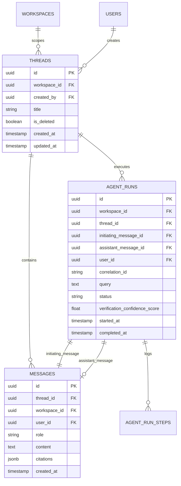
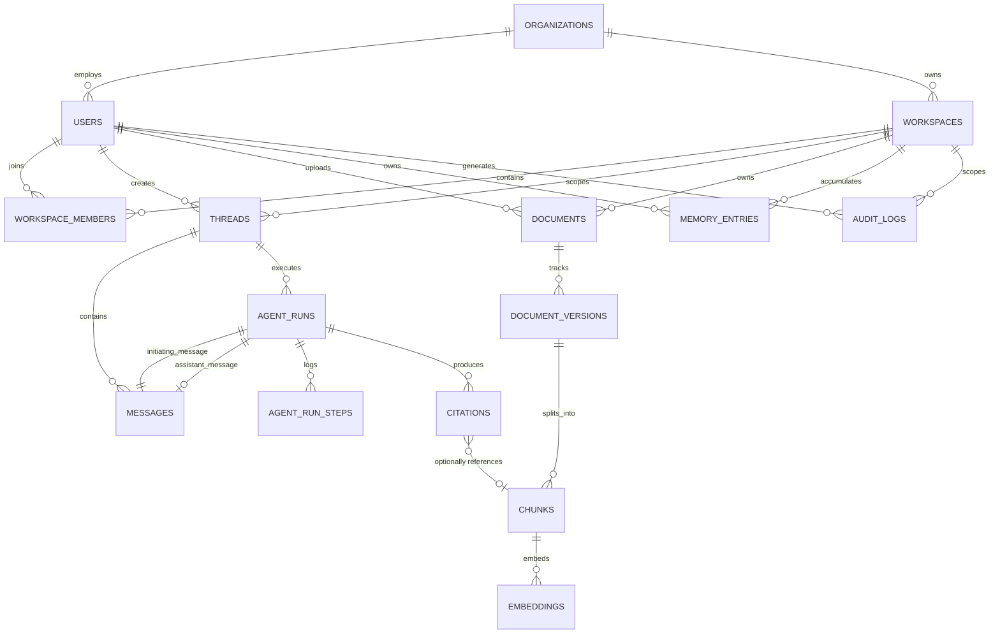

# ADR-0007: Database Schema & Persistence Architecture Reconciliation

- **Status:** Accepted
- **Date:** 2026-09-12
- **Decision:** Adopt **Option C: ADR-Driven Reconciled Relational Persistence Architecture** as the canonical database schema and persistence model for Contexta-AI. Reconcile all physical migrations, application persistence assumptions, and technical documentation with frozen ADR-0001 through ADR-0006. Standardize on `workspace_id` as the authoritative tenant boundary; establish a clean, non-circular document-versioning lineage (`documents` $\rightarrow$ `document_versions` with partial unique index `is_current` $\rightarrow$ `chunks` $\rightarrow$ `embeddings`); enforce physical denormalization of `workspace_id` onto chunks and embeddings under ADR-0002; implement first-class persistent `threads` and `messages` alongside execution audit traces (`agent_runs`, `agent_run_steps`) under ADR-0006; enforce unified `memory_entries` under ADR-0004 with immutable tenant/actor keys and soft-deletion (`is_deleted = true`); delegate authentication credentials exclusively to Supabase Auth (`auth.users`) without password duplication; and mandate PostgreSQL Row-Level Security (RLS) as the authoritative database-level data-access boundary.
- **Authors:** Contexta-AI Architecture Group (Principal Software Architect, Lead Database Architect, Security Architect, Lead AI Engineer)
- **Governing Architecture:** `00_PROJECT_CONSTITUTION.md §5, §13`, `05_PRODUCT_REQUIREMENTS.md §FR-DAT-*`, `06_TECHNICAL_REQUIREMENTS.md §TR-DAT-*`, `07_SYSTEM_ARCHITECTURE.md §6`, `08_AI_ARCHITECTURE.md §5-7`, `09_DATABASE_DESIGN.md`, `10_API_SPECIFICATION.md`, `ADR-0001` (NestJS Modular Monolith), `ADR-0002` (Vector Tenancy Isolation), `ADR-0003` (Citation Entailment & Hallucination Guard), `ADR-0004` (Canonical Memory Architecture & Tenancy Model), `ADR-0005` (Agent Graph Architecture & Execution Flow), `ADR-0006` (API Contract & Streaming Specification Reconciliation).

---

## Decision Summary

1. **Authoritative Tenancy Key:** `workspace_id` is the canonical, non-negotiable tenant isolation boundary across all knowledge, conversational, memory, vector, and execution tables. `organization_id` is strictly an administrative/billing grouping hierarchy and never replaces `workspace_id` for data access or RLS.
2. **Identity & Authentication Architecture:** Supabase Auth (`auth.users`) is authoritative for identity, credentials, password hashing, and session tokens. The public application `users` table acts purely as an application profile and organization reference (`id` FK to `auth.users.id`). Credential fields (such as `hashed_password`) are **strictly prohibited** from the application database.
3. **Conversational Persistence Architecture (ADR-0006 Integration):** Introduce physical relational tables for `threads` and `messages`. A turn submission (`POST /runs`) atomically inserts a user `Message` and an `AgentRun`. An assistant `Message` is committed **only when the run reaches an eligible terminal response** (`completed` or `declined_uncertain`). Failed or cancelled runs commit zero assistant messages to thread history.
4. **Resolution of Document Circular Foreign Key:** Eliminate the circular foreign-key dependency between `documents.current_version_id` and `document_versions.document_id`. The canonical schema models a strict unidirectional hierarchy: `documents` $\rightarrow$ `document_versions` $\rightarrow$ `chunks` $\rightarrow$ `embeddings`. Active version resolution is enforced via `is_current BOOLEAN` on `document_versions` with a partial unique index (`UNIQUE (document_id) WHERE is_current = true`).
5. **Vector & Hybrid Search Tenancy (ADR-0002 Integration):** Physically denormalize `workspace_id` onto `chunks` and `embeddings`. Vector similarity and PostgreSQL Full-Text Search (FTS) queries must enforce tenant isolation at the database retrieval boundary via RLS (`workspace_id IN (SELECT workspace_id FROM workspace_members WHERE user_id = auth.uid())`). BM25 is rejected.
6. **Canonical Memory Model (ADR-0004 Integration):** Standardize exclusively on `memory_entries` with columns `workspace_id`, `user_id`, `visibility` (`user_private` | `workspace_shared`), `memory_type`, `content` (text), `confidence`, `source_agent`, `reason`, and `is_deleted`. The legacy field name `fact` and legacy scoping `organization_id` are permanently retired. Public deletion operations execute logical soft-deletion (`is_deleted = true`).
7. **Audit Trail vs. Durable Checkpoint Disambiguation (ADR-0005 Integration):** `agent_runs` and `agent_run_steps` constitute an append-oriented immutable execution audit trail. They do not support durable state replay or mid-execution step resumption.
8. **Tenant Ownership Immutability:** Tenant-scoping columns (`workspace_id`, `user_id`, `organization_id`) are immutable once written. Database triggers and RLS `WITH CHECK` clauses prevent tampering via SQL `UPDATE`.

---

## Context

Contexta-AI has ratified and frozen six Architecture Decision Records establishing its foundational tiers:
- **ADR-0001:** Modular Monolith Framework (`apps/api` standardized on NestJS; in-process agent execution).
- **ADR-0002:** Vector Tenancy Isolation (PostgreSQL RLS authoritative database boundary; `workspace_id` is scoping, not authorization; dense vectors + PostgreSQL FTS).
- **ADR-0003:** Citation Entailment & Hallucination Guard (Two-Stage Cascade; evidence entails claim; fail closed; six canonical statuses).
- **ADR-0004:** Canonical Memory Architecture & Tenancy Model (Unified `memory_entries`; dual visibility; pre-route hydration; logical soft-delete).
- **ADR-0005:** Agent Graph Architecture & Execution Flow (Hybrid Supervisor + Guard Graph; immutable protected context; conservative `DirectAnswerGuard`; `VerificationGate`; non-blocking persistence; audit trail $\neq$ checkpoint).
- **ADR-0006:** API Contract & Streaming Specification Reconciliation (Option D: Workspace $\rightarrow$ Thread with first-class Messages and Runs; safe SSE streaming).

However, an exhaustive audit of the actual PostgreSQL database tier reveals severe divergences, circular constraints, and implementation gaps across three competing surfaces:
1. **The Migration Reality (`supabase/migrations/`):** Contains only two partial files (`001_rls_policies.sql`, `002_rls_policies_phase2.sql`) enabling RLS and defining preliminary policies for `documents`, `chunks`, `memory_entries`, `agent_runs`, `agent_run_steps`, and `citations`. Physical DDL creating these tables is absent from migrations; `threads` and `messages` tables **do not exist**; and `chunks`/`embeddings` lack denormalized `workspace_id` columns.
2. **The Codebase Reality (`apps/api`, `packages/`):** Code components read and write using divergent schemas. `packages/agents/src/memory-agent.ts` queries and inserts into `memory_entries` using `fact` rather than `content`; `packages/retrieval/src/index.ts` queries a legacy flat `documents` table via LangChain's `match_documents` RPC; and `apps/api/src/services/runs.service.ts` writes directly to `agent_runs` and `agent_run_steps` without a backing `threads` relation.
3. **The Documented Intent (`docs/09_DATABASE_DESIGN.md`):** Documents a 13-table schema, but contains critical design flaws: a circular foreign-key dependency between `documents` and `document_versions`; a contradictory `users.hashed_password` column in §5 ERD despite §6.2 specifying Supabase Auth; `memory_entries` scoped by `organization_id` and `scope IN ('short_term', 'long_term')` (contradicting ADR-0004); and a complete omission of physical tables for `threads` and `messages` (contradicting ADR-0006).

This ADR resolves every database contradiction and establishes the authoritative canonical persistence architecture for Contexta-AI.

---

## 1. Current Database Reality

### 1.1 Physical Migration Inventory (`supabase/migrations/`)

The repository currently contains exactly two SQL migration files. Neither file contains table creation DDL (`CREATE TABLE`); both assume tables already exist in Supabase and apply RLS configuration.

#### Table 1.1: Migration State Inventory

| Migration File | Tables Altered / Referenced | Operations Applied | Deficiencies & Architectural Contradictions |
|---|---|---|---|
| `001_rls_policies.sql` | `documents`, `document_versions`, `chunks`, `embeddings` | `ALTER TABLE ... ENABLE ROW LEVEL SECURITY`<br/>Defines `workspace_isolation_select_documents`<br/>Defines `workspace_isolation_select_chunks` | 1. No physical table creation DDL.<br/>2. `chunks` policy joins `document_versions` and `documents` because `workspace_id` is missing on `chunks` (violates ADR-0002 physical denormalization).<br/>3. No policies defined for `embeddings`.<br/>4. No policies defined for `INSERT`, `UPDATE`, or `DELETE`. |
| `002_rls_policies_phase2.sql` | `memory_entries`, `agent_runs`, `agent_run_steps`, `citations` | `ALTER TABLE ... ENABLE ROW LEVEL SECURITY`<br/>Defines `workspace_isolation_*` for SELECT, INSERT, UPDATE, DELETE | 1. Assumes tables exist.<br/>2. `memory_entries` delete policy permits raw SQL `DELETE` (violates ADR-0004 logical soft-deletion).<br/>3. `citations` RLS joins `agent_runs` to verify workspace isolation.<br/>4. Completely omits `threads` and `messages`. |

---

## 2. Current Application Persistence Assumptions

### 2.1 Code Component Audit

#### Table 2.1: Code Persistence Assumptions vs. Architectural Reality

| Code Component | Table Referenced | Columns Assumed | Operations Performed | Conflict / Defect Analysis |
|---|---|---|---|---|
| `packages/agents/src/memory-agent.ts:54` | `memory_entries` | `workspace_id`, `user_id`, `fact`, `reason`, `created_at` | `SELECT` | Assumes column `fact` instead of canonical `content` (violates ADR-0004). Assumes `workspace_id`, conflicting with documentation's `organization_id`. |
| `packages/agents/src/memory-agent.ts:84` | `memory_entries` | `workspace_id`, `user_id`, `fact`, `reason`, `source_agent` | `INSERT` | Writes to `fact` instead of `content`. Does not populate `visibility` (`user_private` vs. `workspace_shared`) or `memory_type`. |
| `apps/api/src/services/memory.service.ts:9` | `memory_entries` | `*` (filtered by `workspace_id`, `user_id`) | `SELECT` | Selects all columns; expects user-isolated rows. |
| `apps/api/src/services/memory.service.ts:23` | `memory_entries` | `id`, `workspace_id`, `user_id` | `DELETE` | Executes physical SQL `DELETE` (`.delete().eq(...)`), violating ADR-0004 soft-deletion requirement. |
| `apps/api/src/services/runs.service.ts:14` | `agent_runs` | `id`, `workspace_id`, `user_id`, `correlation_id`, `query`, `status`, `started_at` | `INSERT` | Omits `thread_id` and `initiating_message_id` foreign keys mandated by ADR-0006. |
| `apps/api/src/services/runs.service.ts:48` | `agent_run_steps` | `id`, `agent_run_id`, `agent_name`, `node_name`, `input_payload`, `output_payload`, `duration_ms`, `executed_at` | `INSERT` | Matches step auditing model. Stored payload requires redaction validation. |
| `apps/api/src/services/runs.service.ts:68` | `agent_runs` | `status`, `confidence_score`, `completed_at` | `UPDATE` | Updates terminal status directly without locking or concurrency controls. |
| `packages/retrieval/src/index.ts:39` | `documents` | `content`, `embedding` via `match_documents` RPC | `SELECT` (RPC) | Uses legacy LangChain template single-table design where `documents` holds embeddings and text directly, bypassing `document_versions`, `chunks`, and `embeddings`. |
| `packages/retrieval/src/index.ts:82` | `documents` | `content`, `id` | `SELECT` | `getChunkById` treats `documents.id` as a chunk ID, demonstrating legacy template collapse. |

---

## 3. Existing Documentation Intent

### 3.1 Documented Schema in `docs/09_DATABASE_DESIGN.md`

`docs/09_DATABASE_DESIGN.md` specifies 13 tables:
`organizations`, `users`, `workspaces`, `workspace_members`, `documents`, `document_versions`, `chunks`, `embeddings`, `agent_runs`, `agent_run_steps`, `citations`, `memory_entries`, and `audit_logs`.

### 3.2 Critical Contradictions in the Documentation

1. **Circular Foreign Key (`documents` $\leftrightarrow$ `document_versions`):**  
   - `documents.current_version_id` points to `document_versions.id` (§6.5).
   - `document_versions.document_id` points to `documents.id` (§6.6).
   - This creates an unresolvable insertion deadlock unless foreign key constraints are made deferrable or columns are left nullable, introducing relational fragility.
2. **Missing Conversation Tables (`threads`, `messages`):**  
   - `docs/09_DATABASE_DESIGN.md` completely omits `threads` and `messages`.
   - In contrast, `docs/10_API_SPECIFICATION.md` §7.1 and `ADR-0006` mandate persistent, workspace-scoped conversation history backed by first-class `threads` and `messages`.
3. **Contradictory Credential Storage in `users`:**  
   - The ERD in §5 shows `users.hashed_password VARCHAR`.
   - The table specification in §6.2 explicitly notes that `users` extends `auth.users`, credentials are owned by Supabase Auth, and `hashed_password` must **never** be stored in the application database.
4. **Memory Schema Contradictions (`memory_entries`):**  
   - `docs/09_DATABASE_DESIGN.md` §6.12 models `organization_id` (not `workspace_id`) and `scope IN ('short_term', 'long_term')`.
   - `ADR-0004` explicitly established that `workspace_id` is the tenant boundary, thread state is ephemeral (never in `memory_entries`), and visibility is `user_private` vs. `workspace_shared`.
5. **Missing Vector Denormalization (ADR-0002 Violation):**  
   - `chunks` and `embeddings` tables in `docs/09_DATABASE_DESIGN.md` omit `workspace_id`.
   - ADR-0002 explicitly mandates physical denormalization of `workspace_id` onto `chunks` and `embeddings` to enable high-performance, tenant-isolated vector filtering at the database boundary.
6. **Citation Verification Status Collapse:**  
   - `docs/09_DATABASE_DESIGN.md` §6.11 models `verified BOOLEAN` and `match_confidence FLOAT`.
   - ADR-0003 and ADR-0005 mandate a 6-status entailment classification (`SUPPORTED`, `NOT_SUPPORTED`, `CONTRADICTED`, `CONFLICTING_EVIDENCE`, `INSUFFICIENT_EVIDENCE`, `VERIFICATION_FAILED`) and structured claim provenance.

---

## 4. Frozen ADR Constraints

The canonical persistence architecture must strictly satisfy the frozen ADR baseline:

```mermaid
graph TD
    subgraph ADR0001 [ADR-0001: Modular Monolith]
        NestDB[Database Access Encapsulated in NestJS Modules]
        NoDBMicroservice[No Separate Persistence Microservice]
    end

    subgraph ADR0002 [ADR-0002: Vector Tenancy]
        WorkspaceTenant[workspace_id is Canonical Tenant Boundary]
        AuthoritativeRLS[PostgreSQL RLS Authoritative at DB Layer]
        DenormChunks[Denormalize workspace_id to Chunks & Embeddings]
        PGFTS[Dense Vectors + PostgreSQL Full-Text Search; NO BM25]
    end

    subgraph ADR0003 [ADR-0003: Citation Guard]
        EntailmentStatuses[6 Canonical Verification Statuses]
        ClaimEvidenceLink[Evidence Entails Claim Provenance]
        NoCoT[Strictly NO Chain-of-Thought Persistence]
    end

    subgraph ADR0004 [ADR-0004: Memory Model]
        UnifiedMemory[Unified memory_entries Table]
        MemoryCols[workspace_id, user_id, visibility, content, is_deleted]
        SoftDelete[Public Deletion = is_deleted=true]
        UntrustedMem[Stored Memory Injected as Untrusted Context]
    end

    subgraph ADR0005 [ADR-0005: Agent Graph]
        AuditTrail[agent_run_steps = Audit Trail, NOT Checkpoint]
        RunStates[accepted, running, completed, declined_uncertain, failed, cancelled]
        NonBlockingMem[Non-Blocking Memory Persistence]
    end

    subgraph ADR0006 [ADR-0006: API & Streaming]
        OptionD[Workspace -> Thread -> Messages & Runs]
        TurnLifecycle[Turn Submission: User Message + Run -> Assistant Message]
        NoAssistantOnFail[No Assistant Message Committed on Run Failure]
    end

    NestDB --> WorkspaceTenant
    AuthoritativeRLS --> DenormChunks
    ClaimEvidenceLink --> EntailmentStatuses
    UnifiedMemory --> MemoryCols
    MemoryCols --> SoftDelete
    AuditTrail --> RunStates
    OptionD --> TurnLifecycle
    TurnLifecycle --> NoAssistantOnFail
```



---

## 5. Reconciliation / Conflict Matrix

| Dimension | Migration Reality (`001/002.sql`) | Application Code (`apps/api`, `packages/`) | Documented Intent (`09_DATABASE_DESIGN.md`) | Frozen Architecture (`ADR-0001–0006`) | Severity | Canonical Resolution Mandate |
|---|---|---|---|---|---|---|
| **Primary Tenancy Boundary** | Partially references `workspace_id` in RLS policies | Assumes `workspace_id` across services | Mixed: `organizations` on memory, `workspaces` on documents | `workspace_id` is the canonical tenant isolation boundary | **P0** | Standardize `workspace_id` across all knowledge, memory, run, and conversational tables. |
| **Conversational Persistence** | **Omitted completely** | Ad-hoc `thread_id` in API routes; no persistence | **Omitted completely** | First-class `threads` and `messages` tables (ADR-0006) | **P0** | Create physical `threads` and `messages` tables linked to `workspaces` and `agent_runs`. |
| **Document Version Circular FK** | Not defined | N/A | Circular FK: `documents.current_version_id` $\leftrightarrow$ `document_versions.document_id` | Clean 1-way hierarchy required; zero circular constraints | **P1** | Eliminate `current_version_id` from `documents`. Use `is_current BOOLEAN` on `document_versions` with partial unique index. |
| **Vector Retrieval Tenancy** | `chunks` joins `document_versions` and `documents` in RLS | Queries flat `documents` table directly | `chunks` and `embeddings` lack `workspace_id` | Physical denormalization of `workspace_id` onto chunks and embeddings (ADR-0002) | **P0** | Add `workspace_id` directly to `chunks` and `embeddings` with FK and index. |
| **Memory Content Column** | Not defined | Queries/inserts `fact` in `memory-agent.ts` | Documents `content` | Canonical field is `content` (ADR-0004) | **P1** | Standardize column as `content TEXT NOT NULL`. Provide migration mapping `fact` $\rightarrow$ `content`. |
| **Memory Visibility & Scope** | Not defined | Untyped; assumes user-private only | `scope IN ('short_term', 'long_term')` | `visibility IN ('user_private', 'workspace_shared')` (ADR-0004) | **P1** | Adopt `visibility` column. Exclude short-term conversation state from `memory_entries`. |
| **Memory Deletion Policy** | Permits raw SQL `DELETE` in RLS policy | Executes `.delete()` in `memory.service.ts` | Soft deletion mentioned | Public delete MUST execute logical soft-deletion (`is_deleted = true`) | **P1** | Public delete operation updates `is_deleted = true`. RLS filters out `is_deleted = true`. |
| **Authentication & Users** | Not defined | Uses mock user payload | §5 ERD has `hashed_password`; §6.2 specifies Supabase Auth | Supabase Auth authoritative; no credentials in app DB | **P1** | `users` table references `auth.users(id)`; strictly zero password or credential columns. |
| **Citation Verification Schema** | Boolean `verified` in RLS | Boolean `verified` in citation agent | Boolean `verified`, float `match_confidence` | 6-status entailment classification enum (ADR-0003) | **P1** | Adopt `verification_status` enum matching ADR-0003. |
| **Agent Step Auditing vs. Checkpoint** | `agent_run_steps` exists in RLS | Inserts node execution traces | Inserts step logs | Append-only audit trail; NOT durable checkpoint (ADR-0005) | **P2** | Maintain `agent_run_steps` as immutable audit log. Clarify absence of checkpoint replay. |

---

## 6. Canonical Entity Model

The canonical Contexta-AI persistence model comprises exactly **15 relational entities**, grouped into five functional domains:

```
====================================================================================================
CANONICAL PERSISTENCE DOMAINS (15 ENTITIES)
====================================================================================================

1. Identity & Tenancy Domain
   ├── organizations               (Enterprise business & billing hierarchy)
   ├── users                       (Public application user profiles; extends auth.users)
   ├── workspaces                  (Authoritative tenant isolation & knowledge boundary)
   └── workspace_members           (User-to-workspace membership and RBAC role binding)

2. Conversational Domain (ADR-0006)
   ├── threads                     (Persistent, workspace-scoped multi-turn conversations)
   └── messages                    (Immutable conversational turns; user inputs & assistant outputs)

3. Execution & Audit Domain (ADR-0005)
   ├── agent_runs                  (First-class execution records of agent graph runs)
   ├── agent_run_steps             (Immutable, append-oriented execution step audit trail)
   └── audit_logs                  (Append-oriented system access and administrative audit trail)

4. Knowledge & Vector Domain (ADR-0002)
   ├── documents                   (Document metadata and administrative ownership)
   ├── document_versions           (Immutable ingested revisions; tracks active version)
   ├── chunks                      (Textual chunks with denormalized workspace_id)
   └── embeddings                  (Dense vector embeddings with denormalized workspace_id)

5. Verification & Memory Domain (ADR-0003, ADR-0004)
   ├── citations                   (Structured claim entailment records & chunk bindings)
   └── memory_entries              (Long-term workspace-scoped facts & preferences; soft-deleted)
```

---

## 7. Identity, Workspace & Organization Model

### 7.1 Separation of Identity Provider and Application Profile

- **Supabase Auth (`auth.users`) is Authoritative:** Passwords, password hashing algorithms (bcrypt/argon2), OAuth tokens, MFA secrets, and email verification tokens reside exclusively within the Supabase-managed `auth.users` schema.
- **Application Profile (`public.users`):** The public `users` table extends `auth.users` via foreign key `id REFERENCES auth.users(id) ON DELETE CASCADE`. It stores profile metadata (`email`, `full_name`, `avatar_url`, `is_active`) and organization linkage. It **never duplicates credentials**.

### 7.2 Organization vs. Workspace Hierarchy

- **`organizations` (Enterprise Account Scope):** Represents the legal entity, customer account, subscription tier, and billing container. An organization owns users and workspaces.
- **`workspaces` (Authoritative Tenant & Security Boundary):** Represents an isolated knowledge domain (e.g. "Q3 Regulatory Filings", "Internal Engineering Docs"). **All data access, vector similarity searches, memory hydration, and RLS policies are strictly scoped by `workspace_id`.**
- **Invariance Rule:** A user accesses workspace resources **only** if an explicit row exists in `workspace_members` linking their `user_id` to the target `workspace_id`.

```sql
-- DDL: organizations, users, workspaces, workspace_members
CREATE TABLE organizations (
    id UUID PRIMARY KEY DEFAULT gen_random_uuid(),
    name VARCHAR(255) NOT NULL,
    created_at TIMESTAMPTZ NOT NULL DEFAULT now(),
    updated_at TIMESTAMPTZ NOT NULL DEFAULT now()
);

CREATE TABLE users (
    id UUID PRIMARY KEY REFERENCES auth.users(id) ON DELETE CASCADE,
    organization_id UUID NOT NULL REFERENCES organizations(id) ON DELETE RESTRICT,
    email VARCHAR(320) NOT NULL UNIQUE,
    full_name VARCHAR(255),
    avatar_url TEXT,
    is_active BOOLEAN NOT NULL DEFAULT true,
    created_at TIMESTAMPTZ NOT NULL DEFAULT now(),
    updated_at TIMESTAMPTZ NOT NULL DEFAULT now()
);

CREATE TABLE workspaces (
    id UUID PRIMARY KEY DEFAULT gen_random_uuid(),
    organization_id UUID NOT NULL REFERENCES organizations(id) ON DELETE RESTRICT,
    name VARCHAR(255) NOT NULL,
    description TEXT,
    retention_policy VARCHAR(50) NOT NULL DEFAULT 'standard',
    created_at TIMESTAMPTZ NOT NULL DEFAULT now(),
    updated_at TIMESTAMPTZ NOT NULL DEFAULT now()
);

CREATE TABLE workspace_members (
    id UUID PRIMARY KEY DEFAULT gen_random_uuid(),
    workspace_id UUID NOT NULL REFERENCES workspaces(id) ON DELETE CASCADE,
    user_id UUID NOT NULL REFERENCES users(id) ON DELETE CASCADE,
    role VARCHAR(30) NOT NULL CHECK (role IN ('viewer', 'contributor', 'workspace_admin', 'org_admin')),
    joined_at TIMESTAMPTZ NOT NULL DEFAULT now(),
    UNIQUE (workspace_id, user_id)
);
```

---

## 8. Thread / Message / Run Model

To fulfill ADR-0006 without relational cycles, the conversational tier models threads, messages, and runs as first-class entities with strictly acyclic directional foreign keys originating from `agent_runs` to `messages`:



### 8.1 Relational Semantics & Lifecycle Rules

1. **Strictly Acyclic Foreign Keys:**
   - `messages.thread_id` $\rightarrow$ `threads.id` (MANDATORY).
   - `agent_runs.thread_id` $\rightarrow$ `threads.id` (MANDATORY).
   - `agent_runs.initiating_message_id` $\rightarrow$ `messages.id` (MANDATORY: references the user message that initiated the run).
   - `agent_runs.assistant_message_id` $\rightarrow$ `messages.id` (NULLABLE: populated when an eligible terminal assistant response is committed; NULL on accepted/running/failed/cancelled runs).
   - `messages` carries **no foreign key** back to `agent_runs`. Both references originate from `agent_runs` pointing to `messages`. There is zero circular dependency and zero need for deferred foreign-key constraint hacks.
2. **Turn Submission Persistence Atomicity:**
   For a valid conversational turn submission (`POST .../runs` or `POST .../runs/stream`):
   - **Step 1 (Submission):** Atomically insert row into `messages` (`role = 'user'`, `content = query`) and insert row into `agent_runs` (`status = 'accepted'`, `initiating_message_id = message.id`, `assistant_message_id = NULL`). The user message itself does not require an `agent_run_id`; the run references the message through `initiating_message_id`.
   - **Step 2 (Execution):** LangGraph executes in-process. `agent_run_steps` are appended asynchronously.
   - **Step 3 (Terminal Success / Declined):** When the run reaches an eligible terminal response (`completed` or `declined_uncertain`), atomically insert row into `messages` (`role = 'assistant'`, `content = final_response`, `citations = [...]`) and update `agent_runs` (`status = 'completed'`, `assistant_message_id = assistant_message.id`, `completed_at = now()`, `verification_confidence_score = score`).
   - **Step 3 (Terminal Failure / Cancellation):** When a run fails or is cancelled, update `agent_runs` (`status = 'failed'` or `'cancelled'`, `completed_at = now()`). **Zero assistant message rows are inserted**, and `assistant_message_id` remains `NULL`.
3. **Verification Confidence Semantics:**
   `agent_runs.verification_confidence_score` represents the calibrated entailment confidence score produced by the `VerificationGate` under ADR-0003. It is strictly distinguished from LLM token probabilities, agent routing heuristics, or UI confidence displays. If a run takes the direct answer path (no retrieval verification performed), `verification_confidence_score` is `NULL`.

```sql
-- DDL: threads, messages, agent_runs
CREATE TABLE threads (
    id UUID PRIMARY KEY DEFAULT gen_random_uuid(),
    workspace_id UUID NOT NULL REFERENCES workspaces(id) ON DELETE CASCADE,
    created_by UUID NOT NULL REFERENCES users(id) ON DELETE RESTRICT,
    title VARCHAR(500) NOT NULL DEFAULT 'New Conversation',
    is_deleted BOOLEAN NOT NULL DEFAULT false,
    created_at TIMESTAMPTZ NOT NULL DEFAULT now(),
    updated_at TIMESTAMPTZ NOT NULL DEFAULT now()
);

CREATE TABLE messages (
    id UUID PRIMARY KEY DEFAULT gen_random_uuid(),
    thread_id UUID NOT NULL REFERENCES threads(id) ON DELETE CASCADE,
    workspace_id UUID NOT NULL REFERENCES workspaces(id) ON DELETE CASCADE,
    user_id UUID REFERENCES users(id) ON DELETE SET NULL, -- Nullable for assistant/system messages
    role VARCHAR(20) NOT NULL CHECK (role IN ('user', 'assistant', 'system')),
    content TEXT NOT NULL,
    citations JSONB DEFAULT '[]'::jsonb,
    created_at TIMESTAMPTZ NOT NULL DEFAULT now()
);

CREATE TABLE agent_runs (
    id UUID PRIMARY KEY DEFAULT gen_random_uuid(),
    workspace_id UUID NOT NULL REFERENCES workspaces(id) ON DELETE CASCADE,
    thread_id UUID NOT NULL REFERENCES threads(id) ON DELETE CASCADE,
    initiating_message_id UUID NOT NULL REFERENCES messages(id) ON DELETE CASCADE,
    assistant_message_id UUID REFERENCES messages(id) ON DELETE SET NULL, -- Null until eligible completion
    user_id UUID NOT NULL REFERENCES users(id) ON DELETE RESTRICT,
    correlation_id VARCHAR(64) NOT NULL,
    query TEXT NOT NULL,
    status VARCHAR(30) NOT NULL CHECK (status IN ('accepted', 'running', 'completed', 'declined_uncertain', 'failed', 'cancelled')),
    verification_confidence_score FLOAT, -- Calibrated VerificationGate score; NULL if unverified
    started_at TIMESTAMPTZ NOT NULL DEFAULT now(),
    completed_at TIMESTAMPTZ
);
```

---

## 9. Document / Version / Chunk Model

### 9.1 Elimination of Circular Foreign Key

The documented circular dependency between `documents.current_version_id` and `document_versions.document_id` is eliminated.

#### Evaluated Architectural Options:
- **Option A (Preserve Circular FK):** `documents.current_version_id` nullable FK to `document_versions.id`. Rejected due to insertion deadlocks, deferrable constraint overhead, and cascading delete cycles.
- **Option B (Strict Hierarchy with Partial Unique Index) [CHOSEN]:**
  `documents` $\longrightarrow$ `document_versions` $\longrightarrow$ `chunks` $\longrightarrow$ `embeddings`
  - `document_versions` has columns: `id`, `document_id`, `version_number`, `status`, `is_current`, `is_superseded`.
  - Enforce exactly one active version via a PostgreSQL partial unique index:
    ```sql
    CREATE UNIQUE INDEX uq_document_versions_current 
    ON document_versions (document_id) 
    WHERE is_current = true;
    ```
  - Eliminates all foreign-key cycles while guaranteeing $O(1)$ indexed lookup of the active document version.
- **Option C (Separate Current Versions Table):** Introduces unnecessary relational overhead for a 1:1 pointer.

```sql
-- DDL: documents, document_versions, chunks, embeddings
CREATE TABLE documents (
    id UUID PRIMARY KEY DEFAULT gen_random_uuid(),
    workspace_id UUID NOT NULL REFERENCES workspaces(id) ON DELETE CASCADE,
    uploaded_by UUID NOT NULL REFERENCES users(id) ON DELETE RESTRICT,
    title VARCHAR(500) NOT NULL,
    source_type VARCHAR(50) NOT NULL,
    s3_object_key VARCHAR(1024) NOT NULL,
    is_deleted BOOLEAN NOT NULL DEFAULT false,
    created_at TIMESTAMPTZ NOT NULL DEFAULT now(),
    updated_at TIMESTAMPTZ NOT NULL DEFAULT now()
);

CREATE TABLE document_versions (
    id UUID PRIMARY KEY DEFAULT gen_random_uuid(),
    document_id UUID NOT NULL REFERENCES documents(id) ON DELETE CASCADE,
    workspace_id UUID NOT NULL REFERENCES workspaces(id) ON DELETE CASCADE,
    version_number INT NOT NULL,
    status VARCHAR(30) NOT NULL CHECK (status IN ('pending', 'processing', 'ready', 'failed')),
    is_current BOOLEAN NOT NULL DEFAULT false,
    is_superseded BOOLEAN NOT NULL DEFAULT false,
    ingested_at TIMESTAMPTZ,
    created_at TIMESTAMPTZ NOT NULL DEFAULT now(),
    UNIQUE (document_id, version_number)
);

CREATE UNIQUE INDEX uq_document_versions_current 
ON document_versions (document_id) 
WHERE is_current = true;

CREATE TABLE chunks (
    id UUID PRIMARY KEY DEFAULT gen_random_uuid(),
    document_version_id UUID NOT NULL REFERENCES document_versions(id) ON DELETE CASCADE,
    workspace_id UUID NOT NULL REFERENCES workspaces(id) ON DELETE CASCADE, -- ADR-0002 Denormalization
    chunk_offset INT NOT NULL,
    content TEXT NOT NULL,
    token_count INT NOT NULL,
    tsv_content TSVECTOR GENERATED ALWAYS AS (to_tsvector('english', content)) STORED,
    created_at TIMESTAMPTZ NOT NULL DEFAULT now()
);

CREATE TABLE embeddings (
    id UUID PRIMARY KEY DEFAULT gen_random_uuid(),
    chunk_id UUID NOT NULL REFERENCES chunks(id) ON DELETE CASCADE,
    workspace_id UUID NOT NULL REFERENCES workspaces(id) ON DELETE CASCADE, -- ADR-0002 Denormalization
    embedding_vector VECTOR(1536) NOT NULL, -- Phase-1 implementation baseline (text-embedding-3-small)
    model_name VARCHAR(100) NOT NULL DEFAULT 'text-embedding-3-small',
    created_at TIMESTAMPTZ NOT NULL DEFAULT now()
);
```

---

## 10. Vector & Retrieval Persistence

### 10.1 ADR-0002 Physical Denormalization Invariant

ADR-0002 mandates that vector similarity ranking is a retrieval mechanism, **not an authorization boundary**. To prevent cross-tenant vector leakage and eliminate expensive 3-table joins (`chunks` $\rightarrow$ `document_versions` $\rightarrow$ `documents`) during vector nearest-neighbor searches:
1. **Denormalized `workspace_id`:** Present directly on both `chunks` and `embeddings` with foreign keys referencing `workspaces(id) ON DELETE CASCADE`.
2. **Authoritative RLS Filtering:** Every query to `chunks` or `embeddings` includes an RLS policy condition:
   ```sql
   workspace_id IN (
     SELECT workspace_id FROM workspace_members WHERE user_id = auth.uid()
   )
   ```
3. **Database Consistency Trigger:** A database trigger ensures that `chunks.workspace_id` and `embeddings.workspace_id` strictly match `document_versions.workspace_id` on INSERT:
   ```sql
   CREATE OR REPLACE FUNCTION enforce_chunk_workspace_integrity()
   RETURNS TRIGGER AS $$
   BEGIN
     IF NEW.workspace_id <> (SELECT workspace_id FROM document_versions WHERE id = NEW.document_version_id) THEN
       RAISE EXCEPTION 'Tenancy integrity violation: chunk workspace_id does not match document_version';
     END IF;
     RETURN NEW;
   END;
   $$ LANGUAGE plpgsql;

   CREATE TRIGGER trg_chunk_workspace_integrity
   BEFORE INSERT OR UPDATE ON chunks
   FOR EACH ROW EXECUTE FUNCTION enforce_chunk_workspace_integrity();
   ```
4. **PostgreSQL Full-Text Search (FTS):** In accordance with ADR-0002, hybrid search uses PostgreSQL FTS (`tsv_content TSVECTOR` indexed with GIN) alongside `pgvector`. **BM25 is rejected.**
5. **Vector Dimension Implementation Baseline:** `VECTOR(1536)` is adopted as the **Phase-1 implementation baseline**, strictly aligned with the currently selected `text-embedding-3-small` embedding model. This is an implementation baseline, not an immutable permanent architectural constraint; multi-model and dynamic vector dimension configurations remain deferred to Phase 2.

---

## 11. Canonical Memory Persistence

### 11.1 ADR-0004 Schema Reconciliation & Legacy Model Retirement

During the architectural audit, two competing memory persistence topologies were evaluated:
1. **Split Memory Tables (`user_memories` and `workspace_memories`):** A fragmented schema where personal preferences and workspace facts live in physically distinct tables. This approach was rejected as it duplicates foreign-key relations, complicates cross-visibility retrieval, and violates the unified memory contract frozen in ADR-0004.
2. **Unified `memory_entries` Model (Canonical):** A single tenant-isolated relational table with explicit visibility partitioning (`user_private` vs. `workspace_shared`).

The canonical memory schema is unified in `memory_entries`, eliminating all documented contradictions:
- **Tenancy:** Scoped by `workspace_id` (NOT `organization_id`).
- **Actor:** Linked to `user_id` (`auth.users.id`).
- **Visibility:** `visibility VARCHAR(30) CHECK (visibility IN ('user_private', 'workspace_shared'))`.
- **Memory Type:** `memory_type VARCHAR(50) CHECK (memory_type IN ('user_preference', 'project_context', 'explicit_instruction'))`.
- **Content:** `content TEXT NOT NULL` (replaces legacy `fact`).
- **Provenance & Explainability:** `source_agent VARCHAR(50) NOT NULL DEFAULT 'memory_agent'` and `reason TEXT NOT NULL` constitute the **minimum canonical provenance fields** required under ADR-0004 for agentic transparency and auditability.
- **Deletion:** Logical soft-deletion via `is_deleted BOOLEAN NOT NULL DEFAULT false`.

```sql
-- DDL: memory_entries
CREATE TABLE memory_entries (
    id UUID PRIMARY KEY DEFAULT gen_random_uuid(),
    workspace_id UUID NOT NULL REFERENCES workspaces(id) ON DELETE CASCADE,
    user_id UUID NOT NULL REFERENCES users(id) ON DELETE CASCADE,
    visibility VARCHAR(30) NOT NULL CHECK (visibility IN ('user_private', 'workspace_shared')),
    memory_type VARCHAR(50) NOT NULL CHECK (memory_type IN ('user_preference', 'project_context', 'explicit_instruction')),
    content TEXT NOT NULL,
    confidence FLOAT NOT NULL DEFAULT 1.0,
    source_agent VARCHAR(50) NOT NULL DEFAULT 'memory_agent',
    reason TEXT NOT NULL,
    is_deleted BOOLEAN NOT NULL DEFAULT false,
    created_at TIMESTAMPTZ NOT NULL DEFAULT now(),
    updated_at TIMESTAMPTZ NOT NULL DEFAULT now()
);
```

### 11.2 Soft-Deletion vs. Hard Deletion Invariant

In accordance with ADR-0004:
- The public API `DELETE /memory/{memory_id}` endpoint executes an authorized SQL `UPDATE` setting `is_deleted = true`.
- RLS `SELECT` policies enforce `is_deleted = false` so soft-deleted memories are immediately invisible to agent graph hydration (`FetchMemoryNode`).
- Physical SQL `DELETE` is prohibited from standard API execution paths.

---

## 12. Citation & Verification Persistence

### 12.1 ADR-0003 Entailment Schema Integration

To support the invariant $Evidence \models Claim$ and preserve full auditability:
- Replaces legacy boolean `verified` with the **six canonical entailment statuses** ratified in ADR-0003: `SUPPORTED`, `NOT_SUPPORTED`, `CONTRADICTED`, `CONFLICTING_EVIDENCE`, `INSUFFICIENT_EVIDENCE`, and `VERIFICATION_FAILED`.
- Links claims to source evidence chunks and initiating agent runs.
- Strictly excludes raw chain-of-thought scratchpads.

```sql
-- DDL: citations
CREATE TABLE citations (
    id UUID PRIMARY KEY DEFAULT gen_random_uuid(),
    agent_run_id UUID NOT NULL REFERENCES agent_runs(id) ON DELETE CASCADE,
    workspace_id UUID NOT NULL REFERENCES workspaces(id) ON DELETE CASCADE,
    chunk_id UUID REFERENCES chunks(id) ON DELETE SET NULL, -- Nullable if claim was unsupported
    claim_text TEXT NOT NULL,
    verification_status VARCHAR(40) NOT NULL CHECK (
        verification_status IN (
            'SUPPORTED',
            'NOT_SUPPORTED',
            'CONTRADICTED',
            'CONFLICTING_EVIDENCE',
            'INSUFFICIENT_EVIDENCE',
            'VERIFICATION_FAILED'
        )
    ),
    stage1_passed BOOLEAN NOT NULL,
    stage2_entailment_score FLOAT,
    page_number INT,
    char_span INT[], -- Array of [start_char, end_char]
    created_at TIMESTAMPTZ NOT NULL DEFAULT now()
);
```

### 12.2 Citation Cardinality and Claim-to-Evidence Model

1. **Evaluation Record Unit:** Each row in `citations` represents a single claim-to-evidence evaluation record produced by the `VerificationGate`.
2. **Nullable Chunk Reference (`chunk_id IS NULL`):** For verification outcomes where no supporting evidence chunk exists (`NOT_SUPPORTED`, `INSUFFICIENT_EVIDENCE`, `VERIFICATION_FAILED`), `chunk_id` is explicitly `NULL`.
3. **Multi-Evidence and Conflicting Evidence Support:** When an individual claim is supported by multiple distinct chunks or contradicts multiple chunks (e.g. `CONFLICTING_EVIDENCE`), multiple citation rows are inserted sharing the same `agent_run_id` and `claim_text`, each binding to a distinct `chunk_id`. In the relational ERD, the cardinality is `CITATIONS }o--o| CHUNKS : "optionally references"`.

---

## 13. Agent Run & Audit Persistence

### 13.1 Step Auditing vs. Checkpoint Storage

- **`agent_runs`:** The root execution record tracking run parameters, correlation IDs, timestamps, terminal state (`accepted`, `running`, `completed`, `declined_uncertain`, `failed`, `cancelled`), and calibrated verifier confidence (`verification_confidence_score`).
- **`agent_run_steps`:** Append-oriented execution audit trail recording each node's execution duration, input/output summaries, and status.
- **Durable Checkpoint Boundary (ADR-0005):** `agent_run_steps` is an **execution audit trace**, NOT a durable checkpoint for state replay or resume. Full thread serialization (e.g. `PostgresSaver`) is deferred to Phase 2.
- **`audit_logs`:** Append-oriented system access and administrative audit trail recording security events, authentication changes, and workspace lifecycle events.

```sql
-- DDL: agent_run_steps, audit_logs
CREATE TABLE agent_run_steps (
    id UUID PRIMARY KEY DEFAULT gen_random_uuid(),
    agent_run_id UUID NOT NULL REFERENCES agent_runs(id) ON DELETE CASCADE,
    workspace_id UUID NOT NULL REFERENCES workspaces(id) ON DELETE CASCADE,
    agent_name VARCHAR(50) NOT NULL,
    node_name VARCHAR(50) NOT NULL,
    input_payload JSONB NOT NULL DEFAULT '{}'::jsonb,
    output_payload JSONB NOT NULL DEFAULT '{}'::jsonb,
    duration_ms INT NOT NULL,
    executed_at TIMESTAMPTZ NOT NULL DEFAULT now()
);

CREATE TABLE audit_logs (
    id UUID PRIMARY KEY DEFAULT gen_random_uuid(),
    workspace_id UUID REFERENCES workspaces(id) ON DELETE SET NULL, -- Nullable post-workspace deletion
    actor_user_id UUID NOT NULL REFERENCES users(id) ON DELETE RESTRICT,
    action_type VARCHAR(50) NOT NULL,
    metadata JSONB NOT NULL DEFAULT '{}'::jsonb,
    occurred_at TIMESTAMPTZ NOT NULL DEFAULT now()
);
```

---

## 14. Tenancy & Immutability

### 14.1 Differentiated Column Immutability Rules

To prevent privilege escalation, IDOR, or cross-workspace data leakage while allowing legitimate organizational administration:

1. **Security-Critical Tenant Boundary (`workspace_id`):** Strictly immutable across all workspace-scoped entities (`workspaces`, `workspace_members`, `threads`, `messages`, `agent_runs`, `documents`, `document_versions`, `chunks`, `embeddings`, `citations`, `memory_entries`). Once a row is written, **ordinary SQL updates can never alter `workspace_id`**.
2. **Actor Provenance (`user_id`, `uploaded_by`, `created_by`):** Strictly immutable where they record the originating creator or actor identity.
3. **Administrative Hierarchy (`organization_id`):** On `workspaces` and `users`, `organization_id` represents an administrative grouping and billing container. It is protected against ordinary tenant user modification, but is administratively reassignable by platform super-administrators during authorized organizational restructuring or enterprise tenant migrations.

### 14.2 Enforcement via Database Triggers

```sql
CREATE OR REPLACE FUNCTION prevent_tenant_key_mutation()
RETURNS TRIGGER AS $$
BEGIN
  IF (OLD.workspace_id IS DISTINCT FROM NEW.workspace_id) THEN
    RAISE EXCEPTION 'Security violation: workspace_id is strictly immutable.';
  END IF;
  RETURN NEW;
END;
$$ LANGUAGE plpgsql;

CREATE TRIGGER trg_protect_memory_workspace
BEFORE UPDATE ON memory_entries
FOR EACH ROW EXECUTE FUNCTION prevent_tenant_key_mutation();

CREATE TRIGGER trg_protect_threads_workspace
BEFORE UPDATE ON threads
FOR EACH ROW EXECUTE FUNCTION prevent_tenant_key_mutation();

CREATE TRIGGER trg_protect_messages_workspace
BEFORE UPDATE ON messages
FOR EACH ROW EXECUTE FUNCTION prevent_tenant_key_mutation();

CREATE TRIGGER trg_protect_runs_workspace
BEFORE UPDATE ON agent_runs
FOR EACH ROW EXECUTE FUNCTION prevent_tenant_key_mutation();
```

---

## 15. RLS Architecture

Every table holding workspace- or user-scoped data has RLS enabled by default (`ALTER TABLE ... ENABLE ROW LEVEL SECURITY`). RLS serves as the **authoritative database data-access boundary**, working in defense-in-depth with application-level RBAC guards.

#### Table 15.1: Authoritative RLS Policy Matrix (15 Tables)

| Table | SELECT Policy | INSERT Policy | UPDATE Policy | DELETE Policy |
|---|---|---|---|---|
| `organizations` | Member of organization (`auth.uid() IN (SELECT id FROM users WHERE organization_id = organizations.id)`) | Platform super-admin / Provisioning service | Org admin | Platform super-admin |
| `users` | Authenticated user in same organization / workspace | Authenticated user (self profile matching `auth.uid()`) | Self (`id = auth.uid()`) or Org admin | Self or Org admin (soft / cascade trigger) |
| `workspaces` | Member of workspace | Org admin only | Workspace admin / Org admin | Org admin only |
| `workspace_members` | Member of workspace | Workspace admin / Org admin | Workspace admin / Org admin | Workspace admin / Org admin |
| `threads` | Member of workspace (`is_deleted = false`) | Member of workspace | Thread creator or Admin | Logical delete only (`is_deleted = true`) |
| `messages` | Member of workspace | Authenticated member | Disallowed (Immutable turns) | Disallowed (Audit retention) |
| `agent_runs` | Member of workspace | Authenticated member | System runtime service | Disallowed |
| `agent_run_steps` | Member of workspace | System runtime service | Disallowed (Append-only) | Disallowed |
| `documents` | Member of workspace (`is_deleted = false`) | Contributor / Admin | Uploader / Admin | Logical delete only (`is_deleted = true`) |
| `document_versions` | Member of workspace | Contributor / Admin | System ingestion pipeline | Disallowed if referenced |
| `chunks` | Member of workspace via denormalized `workspace_id` | System ingestion pipeline | Disallowed (Immutable) | Cascades from document version |
| `embeddings` | Member of workspace via denormalized `workspace_id` | System ingestion pipeline | Disallowed (Immutable) | Cascades from chunk |
| `citations` | Member of workspace | System runtime service | Disallowed (Immutable) | Cascades from agent run |
| `memory_entries` | Member of workspace AND (`user_id = auth.uid()` OR `visibility = 'workspace_shared'`) AND `is_deleted = false` | Member of workspace AND `user_id = auth.uid()` | `user_id = auth.uid()` (e.g. setting `is_deleted = true`) | Disallowed via public API (Soft delete only) |
| `audit_logs` | Workspace admin / Org admin (active workspace); Org admin exclusively (orphaned logs where `workspace_id IS NULL`) | Authenticated application role | Disallowed (Append-only) | Disallowed |

### 15.2 Canonical RLS Policy Definitions (`USING` and `WITH CHECK`)

PostgreSQL RLS differentiates existing row visibility (`USING`) from new or updated row constraints (`WITH CHECK`). All mutating operations must validate tenant isolation on insertion and modification:

```sql
-- RLS Policy: memory_entries SELECT
CREATE POLICY p_memory_entries_select ON memory_entries
FOR SELECT TO authenticated
USING (
  workspace_id IN (SELECT workspace_id FROM workspace_members WHERE user_id = auth.uid())
  AND (user_id = auth.uid() OR visibility = 'workspace_shared')
  AND is_deleted = false
);

-- RLS Policy: memory_entries INSERT (WITH CHECK enforces tenant & actor ownership)
CREATE POLICY p_memory_entries_insert ON memory_entries
FOR INSERT TO authenticated
WITH CHECK (
  workspace_id IN (SELECT workspace_id FROM workspace_members WHERE user_id = auth.uid())
  AND user_id = auth.uid()
);

-- RLS Policy: memory_entries UPDATE (USING restricts target row, WITH CHECK restricts updated row)
CREATE POLICY p_memory_entries_update ON memory_entries
FOR UPDATE TO authenticated
USING (
  workspace_id IN (SELECT workspace_id FROM workspace_members WHERE user_id = auth.uid())
  AND user_id = auth.uid()
)
WITH CHECK (
  workspace_id IN (SELECT workspace_id FROM workspace_members WHERE user_id = auth.uid())
  AND user_id = auth.uid()
);

-- RLS Policy: audit_logs SELECT (handles both active workspaces and post-deletion orphaned logs)
CREATE POLICY p_audit_logs_select ON audit_logs
FOR SELECT TO authenticated
USING (
  (workspace_id IS NOT NULL AND workspace_id IN (
    SELECT workspace_id FROM workspace_members WHERE user_id = auth.uid() AND role IN ('workspace_admin', 'org_admin')
  ))
  OR
  (workspace_id IS NULL AND auth.uid() IN (
    SELECT u.id FROM users u WHERE u.id = auth.uid() AND u.role = 'org_admin'
  ))
);
```

---

## 16. Foreign Keys & Deletion Policy

#### Table 16.1: Cascade and Deletion Policy Matrix

| Parent Table | Child Table | Relationship | On Delete Rule | Architectural Rationale |
|---|---|---|---|---|
| `workspaces` | `workspace_members` | 1 : N | `CASCADE` | Workspace decommissioning purges membership bindings. |
| `workspaces` | `documents` | 1 : N | `CASCADE` | Purges workspace knowledge assets. |
| `workspaces` | `threads` | 1 : N | `CASCADE` | Purges workspace conversations. |
| `workspaces` | `memory_entries` | 1 : N | `CASCADE` | Purges workspace memories. |
| `workspaces` | `audit_logs` | 1 : N | `SET NULL` | **Preserves compliance audit trail** even if workspace is deleted. |
| `users` | `workspace_members` | 1 : N | `CASCADE` | User offboarding cleans up workspace roles. |
| `users` | `threads` | 1 : N | `RESTRICT` | Cannot hard-delete user account while active threads reference them. |
| `users` | `memory_entries` | 1 : N | `CASCADE` | User deletion cascades to personal memories. |
| `documents` | `document_versions` | 1 : N | `CASCADE` | Deleting document purges all revisions. |
| `document_versions` | `chunks` | 1 : N | `CASCADE` | Deleting version purges parsed chunks. |
| `chunks` | `embeddings` | 1 : N | `CASCADE` | Deleting chunk purges associated vector embeddings. |
| `threads` | `messages` | 1 : N | `CASCADE` | Deleting thread cascades to message turns. |
| `threads` | `agent_runs` | 1 : N | `CASCADE` | Deleting thread cascades to execution runs. |
| `agent_runs` | `agent_run_steps` | 1 : N | `CASCADE` | Deleting run cascades to execution steps. |
| `agent_runs` | `citations` | 1 : N | `CASCADE` | Deleting run cascades to produced citations. |
| `chunks` | `citations` | 1 : N | `SET NULL` | **Preserves claim verification audit** even if source chunk is purged. |

---

## 17. Indexing & Performance

UUID primary keys are canonical across all tables (`DEFAULT gen_random_uuid()`). Identifier generation strategy is an implementation detail that must provide collision-safe UUID generation. UUIDv7 may be adopted if supported by the deployment/runtime baseline to enhance B-tree index locality on high-volume append operations (`agent_run_steps`, `messages`, `audit_logs`), but is an operational optimization rather than an ADR-level prerequisite.

#### Table 17.1: Authoritative Indexing Specifications

| Target Table | Index Name | Type | Indexed Columns / Predicate | Target Purpose |
|---|---|---|---|---|
| `workspace_members` | `idx_wm_user_ws` | B-tree | `(user_id, workspace_id)` | Fast RLS membership subquery resolution |
| `threads` | `idx_threads_ws_created` | B-tree | `(workspace_id, created_at DESC)` | Chronological thread listing |
| `messages` | `idx_messages_thread_created` | B-tree | `(thread_id, created_at ASC)` | Sequential chat history pagination |
| `agent_runs` | `idx_runs_thread_created` | B-tree | `(thread_id, started_at DESC)` | Active run lookup and run history |
| `agent_run_steps` | `idx_steps_run_executed` | B-tree | `(agent_run_id, executed_at ASC)` | Chronological execution trace rendering |
| `documents` | `idx_documents_ws_created` | B-tree | `(workspace_id, created_at DESC)` | Document library listing |
| `document_versions` | `uq_doc_versions_current` | Partial B-tree | `(document_id) WHERE is_current = true` | $O(1)$ active version lookup; prevents duplicates |
| `chunks` | `idx_chunks_ws_version` | B-tree | `(workspace_id, document_version_id)` | Scoped chunk retrieval |
| `chunks` | `idx_chunks_tsv` | GIN | `tsv_content` | High-performance PostgreSQL Full-Text Search |
| `embeddings` | `idx_embeddings_ws_vector` | HNSW / IVFFlat | `embedding_vector vector_cosine_ops` | Nearest-neighbor vector similarity retrieval |
| `citations` | `idx_citations_run` | B-tree | `(agent_run_id)` | Citation resolution per agent run |
| `memory_entries` | `idx_memory_ws_user_vis` | B-tree | `(workspace_id, user_id, visibility) WHERE is_deleted = false` | Sub-50ms pre-route memory hydration |

---

## 18. Transaction & Consistency Boundaries

The persistence architecture defines six critical transactional boundaries:

1. **Conversational Turn Submission (`POST /runs`):**  
   `BEGIN TRANSACTION` $\rightarrow$ Validate authentication & workspace membership $\rightarrow$ Insert `messages` (user turn, `role = 'user'`) $\rightarrow$ Insert `agent_runs` (`status = 'accepted'`, `initiating_message_id = message.id`, `assistant_message_id = NULL`) $\rightarrow$ `COMMIT`. For a valid conversational turn submission, creation of the user message and its initiating agent run is atomic. The user message itself does not require an `agent_run_id`; the run references the message through `initiating_message_id`.
2. **Assistant Turn Commitment:**  
   `BEGIN TRANSACTION` $\rightarrow$ Lock `agent_runs` row $\rightarrow$ Insert `messages` (assistant turn with citations, `role = 'assistant'`) $\rightarrow$ Update `agent_runs` (`status = 'completed'` or `'declined_uncertain'`, `assistant_message_id = assistant_message.id`, `completed_at = now()`, `verification_confidence_score = score`) $\rightarrow$ `COMMIT`. Failed or cancelled runs update `agent_runs` (`status = 'failed'` or `'cancelled'`, `completed_at = now()`) with zero assistant messages committed.
3. **Document Ingestion Version Switch:**  
   `BEGIN TRANSACTION` $\rightarrow$ Mark previous active version `is_current = false, is_superseded = true` $\rightarrow$ Insert/Update new version `is_current = true, is_superseded = false` $\rightarrow$ Insert `chunks` $\rightarrow$ Insert `embeddings` $\rightarrow$ `COMMIT`. Partial unique index guarantees that zero windows exist with duplicate active versions.
4. **Memory Extraction & Persistence (Non-Blocking):**  
   Executes outside the user-delivery critical path. `BEGIN TRANSACTION` $\rightarrow$ Insert `memory_entries` $\rightarrow$ Deduplicate via content hash $\rightarrow$ `COMMIT`.
5. **Memory Logical Soft-Delete:**  
   Atomic `UPDATE memory_entries SET is_deleted = true, updated_at = now() WHERE id = $1 AND workspace_id = $2 AND user_id = $3`.
6. **Document Deletion:**  
   Atomic `UPDATE documents SET is_deleted = true, updated_at = now()` $\rightarrow$ Invalidate active version $\rightarrow$ Asynchronous cascade cleanup.

---

## 19. Data Lifecycle

The database architecture establishes clear technical mechanisms supporting data retention and deletion lifecycles:
- **User Departure from Workspace:** Deleting a row from `workspace_members` immediately revokes all data access via RLS. Historical messages, runs, and workspace-shared memories created by the user remain intact for institutional continuity.
- **User Account Deletion:** Triggers `users ON DELETE CASCADE` on personal memories (`user_private`) and membership rows. Historical conversational turns preserve auditability via `messages.user_id SET NULL`.
- **Workspace Deletion:** Cascades deletion across all documents, versions, chunks, embeddings, threads, messages, and memories. System audit logs retain `workspace_id` as a historical foreign key setting `ON DELETE SET NULL`. Orphaned audit records (`workspace_id IS NULL`) remain accessible exclusively to Organization Administrators for compliance auditing.
- **Compliance Boundary:** These lifecycle rules define database-level relational mechanisms; formal compliance interpretations (GDPR, CCPA, SOC 2) are governed by organizational policy.

---

## 20. Migration Dependency Order

Because the conversational tier is strictly acyclic (`threads` $\rightarrow$ `messages` $\rightarrow$ `agent_runs`), database migrations execute in a clean, strictly linear topological dependency order without cyclic constraints or deferred foreign-key hacks:

```
Step 01: Extensions (pgcrypto or uuid-ossp, pgvector)
   │
Step 02: auth.users (Supabase Auth baseline)
   │
Step 03: organizations
   │
Step 04: users (public schema profile extending auth.users)
   │
Step 05: workspaces
   │
Step 06: workspace_members
   │
Step 07: documents
   │
Step 08: document_versions (with uq_document_versions_current partial index)
   │
Step 09: chunks (with denormalized workspace_id & TSVECTOR)
   │
Step 10: embeddings (with denormalized workspace_id & pgvector)
   │
Step 11: threads
   │
Step 12: messages (clean turn creation without agent_run_id backlink)
   │
Step 13: agent_runs (referencing threads.id, initiating_message_id, assistant_message_id)
   │
Step 14: agent_run_steps (referencing agent_runs.id)
   │
Step 15: citations (referencing agent_runs.id and optional chunks.id)
   │
Step 16: memory_entries (with workspace_id, visibility, content, soft-delete)
   │
Step 17: audit_logs (append-oriented audit trail with post-deletion retention)
   │
Step 18: RLS Enablement & Policies (default-deny on all 15 tables)
   │
Step 19: Immutability Triggers & Workspace Denormalization Integrity Triggers
```

---

## 21. Evaluated Options

### Option A: Preserve Current Migration State
- Keep existing `001_rls_policies.sql` and `002_rls_policies_phase2.sql` without changes.
- **Evaluation:** Rejected. Missing `threads`, `messages`, and physical DDL; vector retrieval violates ADR-0002; memory violates ADR-0004.

### Option B: Documentation-First Persistence Model (`docs/09_DATABASE_DESIGN.md`)
- Implement `docs/09_DATABASE_DESIGN.md` as written.
- **Evaluation:** Rejected. Preserves the circular foreign key between `documents` and `document_versions`; retains `hashed_password` in ERD; omits `threads` and `messages`; violates ADR-0002 vector denormalization.

### Option C: ADR-Driven Reconciled Persistence Model [CHOSEN]
- Synthesize actual migrations, code requirements, and frozen ADR-0001 through ADR-0006 into a reconciled 15-table relational architecture.
- **Evaluation:** Adopted. Eliminates circular FKs; standardizes `workspace_id`; integrates persistent threads/messages without relational cycles; enforces ADR-0002 vector denormalization and ADR-0004 memory model; decouples Supabase Auth credentials from application users.

### Option D: Hybrid Legacy-Table Compatibility Model
- Maintain legacy flat `documents` table alongside new normalized vector tables indefinitely.
- **Evaluation:** Rejected. Creates competing sources of truth, doubling vector storage costs and introducing synchronization vulnerabilities.

---

## 22. Decision Matrix

| Evaluation Criterion | Weight | Option A: As-Is | Option B: Doc-First | Option C: Reconciled ADR (Chosen) | Option D: Hybrid Legacy |
|---|:---:|:---:|:---:|:---:|:---:|
| **1. ADR-0001–0006 Consistency** | 20% | 3 | 4 | **10** | 5 |
| **2. Tenant Isolation & RLS Integrity (ADR-0002)** | 20% | 4 | 5 | **10** | 6 |
| **3. Relational Integrity (Zero Circular FKs)** | 15% | 2 | 3 | **10** | 5 |
| **4. Conversational Model Support (ADR-0006)** | 15% | 1 | 2 | **10** | 4 |
| **5. Memory Architecture Fidelity (ADR-0004)** | 10% | 4 | 3 | **10** | 5 |
| **6. Migration Feasibility & Clean Order** | 10% | 5 | 5 | **9** | 4 |
| **7. Operational Simplicity & Maintenance** | 10% | 4 | 4 | **9** | 3 |
| **Weighted Total** | **100%** | **3.20 / 10** | **3.80 / 10** | **9.80 / 10** | **5.05 / 10** |

---

## 23. Canonical ERD



---

## 24. Consequences

### Positive Consequences
- **Complete Architectural Alignment:** Resolves all documented contradictions between physical migrations, application code, and documentation against ADR-0001 through ADR-0006.
- **Elimination of Relational Cycles:** Replaces circular foreign keys with clean, strictly acyclic relationships (unidirectional document lineage and `agent_runs` $\rightarrow$ `messages` directional pointers).
- **Deterministic Tenancy:** Eliminates vector leakage risk by physically denormalizing `workspace_id` to chunks and embeddings with database trigger verification.
- **Enterprise Conversational History:** Unlocks persistent chat history and audit compliance via dedicated `threads` and `messages` tables.

### Negative Consequences
- **Migration Effort:** Requires authoring and executing comprehensive DDL migrations across the database tier.
- **Application Code Updates:** `packages/agents/src/memory-agent.ts` and `apps/api/src/services/runs.service.ts` must be updated to align with canonical column names.

### Neutral Consequences
- UUID generation uses standard PostgreSQL `gen_random_uuid()` by default; UUIDv7 may be adopted as an implementation optimization without altering the canonical architecture.

---

## 25. Implementation Impact

#### MUST CHANGE (Blocking for Database Convergence):
1. Author physical DDL migrations implementing the 19-step dependency order.
2. Add `threads` and `messages` tables with RLS policies and indexes.
3. Denormalize `workspace_id` onto `chunks` and `embeddings` with integrity triggers.
4. Refactor `packages/agents/src/memory-agent.ts` to query and insert `content` instead of `fact`.
5. Refactor `apps/api/src/services/runs.service.ts` to link `agent_runs` to `thread_id`, `initiating_message_id`, and `assistant_message_id`.
6. Refactor `packages/retrieval/src/index.ts` to query `chunks` and `embeddings` instead of flat `documents`.

#### SHOULD CHANGE (Operational Hardening):
1. Evaluate and configure optional UUIDv7 generator for primary key indexing optimization.
2. Implement immutability triggers on `workspace_id` across all tenant-scoped tables.

#### OPTIONAL / FUTURE (Phase 2):
1. Introduce Redis or PostgreSQL durable checkpointers (`PostgresSaver`) for multi-day human-in-the-loop agent resumption.

---

## 26. Downstream Documentation Impact

The following documents must be updated to align with ADR-0007:
- **`docs/09_DATABASE_DESIGN.md`:** Complete overhaul: replace ERD with canonical 15-entity ERD; remove `hashed_password`; eliminate circular FKs in documents and conversations; add `threads` and `messages`; update `memory_entries` schema.
- **`docs/06_TECHNICAL_REQUIREMENTS.md`:** Update data requirement references (`TR-DAT-*`) to reflect canonical tables and denormalized vector isolation.
- **`docs/08_AI_ARCHITECTURE.md`:** Align agent memory and citation storage descriptions with canonical columns (`content`, 6-status verification).
- **`docs/10_API_SPECIFICATION.md`:** Align entity schemas with canonical database columns.

---

## 27. Open Questions

1. **Vector Dimension Multi-Model Support:** Standardized on `VECTOR(1536)` as the Phase-1 implementation baseline matching the active `text-embedding-3-small` model; dynamic dimension configurations remain deferred to Phase 2.

---

## 28. Acceptance Criteria

- [ ] ADR-0007 is established as the single canonical persistence and database architecture for Contexta-AI.
- [ ] `workspace_id` is ratified as the authoritative tenant isolation boundary across all data tables.
- [ ] Physical relational tables for `threads` and `messages` are defined to support ADR-0006.
- [ ] Conversational persistence graph is strictly acyclic (`threads` $\rightarrow$ `messages` and `agent_runs` referencing `initiating_message_id` and `assistant_message_id`).
- [ ] The circular foreign-key dependency between `documents` and `document_versions` is completely eliminated.
- [ ] Physical denormalization of `workspace_id` onto `chunks` and `embeddings` is codified under ADR-0002.
- [ ] Canonical memory persistence is unified in `memory_entries` using `content`, dual visibility, and soft-delete (`is_deleted = true`).
- [ ] Supabase Auth (`auth.users`) is confirmed as the sole credential store; no password credentials exist in the application database.
- [ ] Authoritative RLS default-deny policies are specified for all 15 entities.
- [ ] A 19-step topological migration dependency order is established.
- [ ] Working tree remains completely clean of code, database, or documentation modifications outside ADR-0007.
