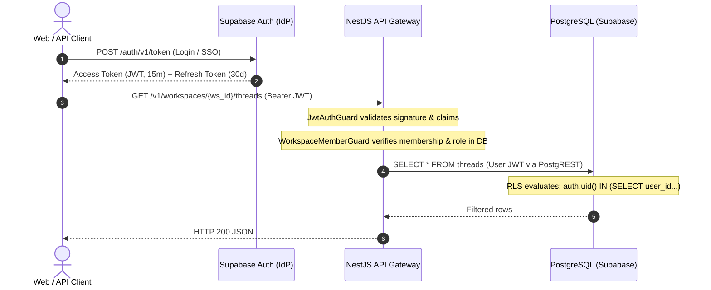
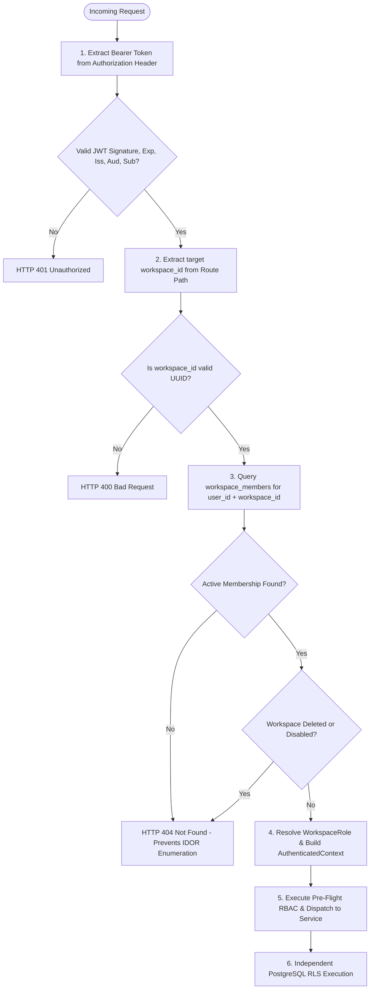
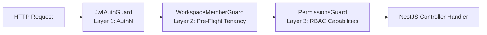
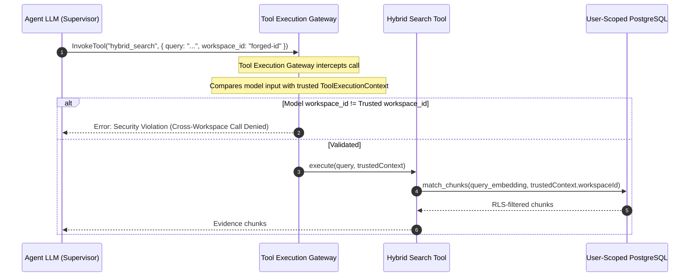

# ADR-0008: Identity, Authentication, Authorization, and RBAC Architecture

- **Status:** Accepted
- **Date:** 2026-09-12
- **Decision:** Adopt **Option C: Defense-in-Depth Hybrid Identity and Layered Authorization Architecture** as the canonical security model for Contexta-AI. Authoritative identity and authentication credentials reside exclusively in Supabase Auth (`auth.users`), mirrored to application user profiles (`public.users`). The verified JWT subject (`sub`) is the canonical authenticated human-user identity for Phase 1. `public.users.organization_id` is the canonical Phase-1 application organization relationship; JWT organization claims are not required for Phase-1 authorization and must not override the database relationship. Caller-supplied `workspace_id` in URL paths, request bodies, or headers is strictly a resource-scoping parameter and never an authorization credential; workspace membership and RBAC roles (`viewer`, `contributor`, `workspace_admin`, `org_admin`) are authoritative via `public.workspace_members`. Roles are discrete capability bundles and are NOT ordinal numeric levels (evaluations such as `role >= contributor` are prohibited). Pre-flight application membership validation (`WorkspaceMemberGuard`) and fine-grained capability checks (`PermissionsGuard`) in NestJS operate as defense-in-depth and do not replace database Row-Level Security (RLS). Ordinary tenant-scoped database queries, vector retrieval, and tool executions MUST propagate the authenticated user's session to PostgreSQL via the user-scoped Supabase client (`SECURITY INVOKER`), preserving RLS as the authoritative database data-access boundary. Defaulting to `SUPABASE_SERVICE_ROLE_KEY` for standard tenant queries is strictly prohibited. Background processing does not automatically justify service-role access, and asynchronous workers must never persist or replay raw user bearer tokens; workers execute against durable, server-derived job execution envelopes. Multi-agent orchestration graphs and tool execution layers inherit authority via an immutable, server-derived `ToolExecutionContext` without exposing raw bearer tokens, database credentials, or service keys to LLMs or graph state.
- **Authors:** Contexta-AI Architecture Group (Principal Security Architect, Lead AI Engineer, Lead Database Architect, Principal Software Architect)
- **Governing Architecture:** `00_PROJECT_CONSTITUTION.md §5, §13`, `05_PRODUCT_REQUIREMENTS.md §FR-WS-*, §FR-SEC-*`, `06_TECHNICAL_REQUIREMENTS.md §TR-SEC-*`, `07_SYSTEM_ARCHITECTURE.md §6`, `08_AI_ARCHITECTURE.md §5-7`, `09_DATABASE_DESIGN.md §6`, `10_API_SPECIFICATION.md §7`, `11_SECURITY_ARCHITECTURE.md §5-7`, `14_TESTING_STRATEGY.md §7-8`, `ADR-0001` (NestJS Modular Monolith), `ADR-0002` (Vector Tenancy Isolation), `ADR-0003` (Citation Entailment & Hallucination Guard), `ADR-0004` (Canonical Memory Architecture & Tenancy Model), `ADR-0005` (Agent Graph Architecture & Execution Flow), `ADR-0006` (API Contract & Streaming Specification Reconciliation), `ADR-0007` (Database Schema & Persistence Reconciliation).

---

## Decision Summary

1. **Authoritative Identity Provider & Subject Identity:** Supabase Auth (`auth.users`) is the authoritative identity provider, credential validator, and session token issuer for Contexta-AI. The verified JWT subject (`sub`) is the canonical authenticated human-user identity for Phase 1. Application-layer `public.users` extends `auth.users.id` with profile metadata and organization references (`public.users.organization_id`); application database tables strictly prohibit password hashes or credentials. No client-supplied or unverified JWT claims are trusted for tenancy or organization scoping.
2. **Layered Authorization Defense-in-Depth:**
   - **Layer 1 (Authentication):** NestJS `JwtAuthGuard` performs local cryptographic validation of incoming Bearer JWTs using the verification mechanism configured for the deployment (validating signature, `exp`, `nbf`/`iat`, `iss`, `aud`, and `sub`), establishing verified human caller identity (`user_id`).
   - **Layer 2 (Pre-Flight Tenant Membership):** NestJS `WorkspaceMemberGuard` resolves the active workspace by validating that `user_id` holds an active record in `public.workspace_members` for the requested `workspace_id`. Client-provided `workspace_id` is purely a resource-scoping parameter. Passing `WorkspaceMemberGuard` is a pre-flight application check and does NOT replace database RLS.
   - **Layer 3 (Application RBAC):** NestJS `PermissionsGuard` and `@RequirePermissions()` enforce granular capability checks based on four canonical lowercase snake_case roles (`viewer`, `contributor`, `workspace_admin`, `org_admin`). Roles are discrete capability bundles, not ordinal numeric ranks. Application RBAC prevents unauthorized business action execution but does NOT replace database RLS.
   - **Layer 4 (Tool Execution Gateway):** Agent tools receive a server-derived `ToolExecutionContext`. LLMs and agent nodes are not security principals; tool arguments containing tenant/user identifiers are strictly validated against trusted server context and fail closed upon mismatch.
   - **Layer 5 (Authoritative Database RLS):** PostgreSQL Row-Level Security (`SECURITY INVOKER`) enforces tenant isolation at the SQL query boundary via `workspace_id IN (SELECT workspace_id FROM workspace_members WHERE user_id = auth.uid())`. RLS protects against application bugs, missed filters, and cross-tenant object manipulation.
3. **Canonical Phase-1 Database Identity Propagation:** For all ordinary tenant requests, vector retrieval, and agent executions, the authenticated user's JWT is propagated to the Supabase PostgREST layer, ensuring PostgreSQL evaluates `auth.uid()` as the calling user under `SECURITY INVOKER`. A service-role identity that bypasses RLS MUST NOT be the default request database identity. Direct PostgreSQL identity injection via manual configuration parameters (`set_config`) is removed from the Phase-1 baseline and demoted to a future, separately reviewed adapter design.
4. **Privileged / Service Operations & Background Worker Boundary:** The `SUPABASE_SERVICE_ROLE_KEY` bypasses RLS and is strictly quarantined. Asynchronous background workers must **never** persist or replay user bearer tokens. Workers execute via durable, server-derived job execution envelopes (`actor_user_id`, `workspace_id`, `resource_id`, `operation`, `correlation_id`). The authorized job envelope is a conceptual execution envelope; its physical persistence mechanism is owned by the future ingestion/worker architecture and does NOT introduce a 16th canonical relational entity under ADR-0007. Background processing does not automatically justify `service_role` access. An explicit `workspace_id` in a privileged execution envelope is a trusted execution constraint, NOT an authorization credential and NOT a substitute for RLS. Any worker operation requiring elevated privileges is classified as an explicit **Privileged Service Operation** requiring trusted service identity, declared target workspace, allowlisted operation, least-privilege boundary, and mandatory structured logging in `audit_logs`.
5. **Programmatic Service Accounts Deferred:** Programmatic API keys and `service_account` roles are explicitly deferred from Phase 1 to a future dedicated ADR. The Phase-1 canonical persistence model remains strictly at the 15 relational entities frozen in ADR-0007.
6. **Agentic Authority Containment:** LLMs and agent nodes hold zero independent security authority. Raw authentication tokens are excluded from mutable LangGraph state (ADR-0005). Tools execute under caller-delegated authority; privileged credentials never enter model prompts, graph state, or tool schemas.
7. **Precise HTTP Failure Semantics:**
   - `HTTP 401 Unauthorized`: Missing, expired, malformed, or cryptographically invalid authentication token.
   - `HTTP 403 Forbidden`: Authenticated caller is known and the requested resource exists within an authorized visibility boundary, but the caller lacks the required role capability.
   - `HTTP 404 Not Found`: Resource does not exist OR resource existence must be hidden to prevent cross-tenant enumeration (e.g. unknown workspace or workspace where caller holds no membership).

---

## Context

Contexta-AI has ratified and frozen seven foundational Architecture Decision Records:
- **ADR-0001:** Standardized backend on a NestJS Modular Monolith with in-process agent execution.
- **ADR-0002:** Enforced PostgreSQL RLS as the authoritative database isolation boundary for vector search (`workspace_id` scoping, dense + PostgreSQL FTS, `SECURITY INVOKER`).
- **ADR-0003:** Established the Two-Stage Cascade citation verifier, operating only on pre-authorized evidence packages.
- **ADR-0004:** Unified memory in `memory_entries` with dual visibility (`user_private` vs. `workspace_shared`) and soft deletion.
- **ADR-0005:** Formalized LangGraph multi-agent execution flow with immutable runtime `SecurityContext`, direct answer guards, and non-blocking memory persistence.
- **ADR-0006:** Reconciled API contracts into Workspace $\rightarrow$ Thread with first-class Messages and Runs, safe SSE streaming, and standard Bearer auth.
- **ADR-0007:** Frozen the 15-entity relational schema, unidirectional document-versioning lineage, and topological migration dependency order.

While ADR-0001 through ADR-0007 establish structural and relational foundations, the repository exhibits critical security gaps, implementation drift, and documentation contradictions regarding how identity, credentials, roles, and database privileges interact.

---

## 1. Problem Statement

An end-to-end security architecture must reconcile three competing realities:
1. **The Codebase Reality (`apps/api`):** 
   - `apps/api/src/middleware/rbac.ts` injects a static mock user (`id: 'placeholder-user-id', roles: ['Viewer']`) upon receiving any non-empty `Authorization` header, completely bypassing cryptographic JWT validation.
   - Integration tests (`apps/api/__tests__/retrieval_graph/integration.test.ts`) instantiate Supabase clients using `SUPABASE_SERVICE_ROLE_KEY`, bypassing PostgreSQL RLS entirely.
   - `packages/retrieval/src/index.ts` creates on-the-fly Supabase clients passing `authContext.token` under `SUPABASE_ANON_KEY`, while `apps/api/src/services/runs.service.ts` creates separate clients with inconsistent global headers.
   - Roles in code are scattered across Title Case (`Viewer`, `Org Admin`) and lowercase.
2. **The Documented Intent (`docs/11_SECURITY_ARCHITECTURE.md`, `docs/10_API_SPECIFICATION.md`):**
   - Documents an enterprise capability matrix with 5 roles (`org_admin`, `workspace_admin`, `contributor`, `viewer`, `service_account`), but proposes evaluating tenant isolation via a custom `SECURITY DEFINER` helper setting `current_setting('app.current_workspace_id')`, which contradicts ADR-0002's `SECURITY INVOKER` and `auth.uid()` database boundary.
   - Documents conflicting JWT claim structures, assuming `tenant_id` or `workspace_id` is embedded inside the client's JWT despite users belonging to multiple dynamic workspaces.
   - Introduces service-account API keys without database schema representation in ADR-0007's 15-entity persistence baseline.
3. **The Multi-Agent Security Boundary (ADR-0005 & ADR-0003):**
   - Autonomous LLM nodes (Supervisor, Research Agent) generate tool arguments. If a tool blindly trusts an LLM-supplied `workspace_id` or `user_id`, prompt injection attacks can cause cross-tenant information disclosure (IDOR).

ADR-0008 eliminates all mock implementations, ungrounded token claims, and architectural contradictions, establishing the authoritative security model across clients, NestJS, LangGraph, and PostgreSQL.

---

## 2. Repository & Documentation Evidence

### 2.1 Code Component Audit

| File Location | Inspected Mechanism | Current Behavior | Security Vulnerability / Contradiction |
|---|---|---|---|
| `apps/api/src/middleware/rbac.ts:17` | `requireAuth` | Checks `req.headers.authorization`; injects static `{ id: 'placeholder-user-id', roles: ['Viewer'], tenantId: 'placeholder-tenant-id' }`. | **P0:** Zero cryptographic signature or expiration check. Any arbitrary token grants `Viewer` access. |
| `apps/api/src/middleware/rbac.ts:33` | `requireRole` | Matches `req.user.roles.some(r => allowedRoles.includes(r))`. | Uses Title Case strings (`'Org Admin'`); ignores workspace context. |
| `apps/api/src/routes/auth.ts:11` | `/v1/auth/admin-only` | `requireRole(['Org Admin', 'Workspace Admin'])` | Statically checks array of strings with spaces; contradicts database enum `workspace_admin`. |
| `apps/api/src/services/runs.service.ts:10` | `executeRun` | `createClient(SUPABASE_URL, SUPABASE_ANON_KEY, { headers: { Authorization: Bearer ${token} } })` | Instantiates ad-hoc client per run; assumes `token` exists on `authContext`. |
| `packages/retrieval/src/index.ts:30` | `makeSupabaseRetriever` | Instantiates `SupabaseVectorStore` with user-scoped client. | Matches ADR-0002 intent, but lacks connection pooling and error-handling on expired tokens. |
| `packages/agents/src/research-agent.ts:19` | `hybridSearchTool` | Checks `allowedWorkspaces.includes(input.workspace_id)`. | Tool receives `auth_context` via `RunnableConfig.configurable`; Layer 1 check is in-memory only. |
| `packages/agents/src/state.ts:7` | `AgentStateAnnotation` | `auth_context: Annotation<{ user_id: string; roles: string[] }>()` | Contains `user_id` and `roles`, but lacks active `workspace_id`; allows potential LLM tampering if not protected by immutable reducer. |

### 2.2 Documentation Evidence & Contradictions

| Source Document | Documented Concept | Contradiction with Accepted ADRs | Reconciled Canonical Model |
|---|---|---|---|
| `docs/11_SECURITY_ARCHITECTURE.md §7.1` | RLS evaluated via `current_setting('app.current_workspace_id')` using a `SECURITY DEFINER` helper. | **Direct Conflict with ADR-0002 & ADR-0007.** ADR-0002 mandates `SECURITY INVOKER` evaluating `auth.uid()` against `workspace_members`. Session variable injection is vulnerable to connection pool reuse leakage. | RLS policies evaluate `auth.uid()` directly against `workspace_members` under `SECURITY INVOKER`. |
| `docs/11_SECURITY_ARCHITECTURE.md §6.1` | JWT carries static `tenant_id` claim representing workspace. | Contradicts multi-workspace membership model where a user belongs to $N$ workspaces within an organization. Re-issuing JWTs on workspace switch creates severe latency and token synchronization issues. | Verified JWT subject (`sub`) is the canonical human-user identity for Phase 1. `public.users.organization_id` is the canonical organization relationship. Workspace selection is dynamic per request via path parameter `/v1/workspaces/{workspace_id}`, validated against `workspace_members`. `workspace_id` is never an authorization credential. |
| `docs/00_PROJECT_CONSTITUTION.md §8` | Roles: `Viewer`, `Contributor`, `Workspace Admin`, `Org Admin` (Title Case). | Conflicts with `09_DATABASE_DESIGN.md §6.4` and `ADR-0007` which freeze `CHECK IN ('viewer', 'contributor', 'workspace_admin', 'org_admin')`. | Universal standardization on lowercase snake_case strings. |
| `docs/10_API_SPECIFICATION.md §7.2` | Service account API keys issued with fine-grained scopes (`documents:read`). | Sound design, but introduces a 16th entity not present in ADR-0007's frozen 15-entity schema, with undefined credential rotation and RLS mapping. | Defer programmatic service accounts to a future dedicated ADR. Phase 1 focuses exclusively on human caller identity via Supabase Auth and trusted internal service execution. |

---

## 3. Frozen Architectural Constraints

ADR-0008 strictly adheres to the frozen invariants established in ADR-0001 through ADR-0007:
1. **NestJS Framework Authority (ADR-0001):** Authentication and RBAC guards must be implemented using native NestJS primitives (`CanActivate`, ExecutionContext, Reflector, Custom Decorators) within the modular monolith.
2. **Authoritative RLS Database Boundary (ADR-0002 & ADR-0007):** `workspace_id` is the tenant boundary. Application-level checks are defense-in-depth; PostgreSQL RLS is the authoritative database data-access boundary. Caller-supplied `workspace_id` is a scoping parameter, never authorization.
3. **Isolated Verification Boundary (ADR-0003):** The `VerificationGate` operates exclusively on pre-authorized evidence packages. The verifier has no direct or unrestricted database access.
4. **Memory Boundary & Untrusted State (ADR-0004):** `memory_entries` enforces tenant isolation via `workspace_id` and privacy via `user_id = auth.uid()`. Memory agents are orchestration logic, not security principals.
5. **No Credentials in Agent State (ADR-0005):** Raw authentication tokens and session credentials must never reside in mutable LangGraph state. LLM nodes cannot modify security context.
6. **Unified REST and SSE Authorization (ADR-0006):** Streaming and REST endpoints enforce identical authentication, workspace membership, and role validation.
7. **Supabase Auth Credential Sovereignty & 15-Entity Persistence (ADR-0007):** Supabase Auth (`auth.users`) is the sole credential store; no application password hashes exist. The canonical schema consists of exactly 15 entities. Immutability triggers protect `workspace_id`.

---

## 4. Evaluated Architectural Options

```
====================================================================================================
EVALUATED DATABASE & APPLICATION IDENTITY PROPAGATION ARCHITECTURES
====================================================================================================

OPTION A: Application-Centric Authorization (Privileged DB Client)
┌──────────┐      JWT      ┌──────────┐  service_role  ┌──────────────┐
│  Client  │ ────────────> │  NestJS  │ ─────────────> │  PostgreSQL  │ (RLS Bypassed!)
└──────────┘               └──────────┘                └──────────────┘

OPTION B: Database-Centric Authorization (Pure RLS Delegation)
┌──────────┐      JWT      ┌──────────┐   Bearer JWT   ┌──────────────┐
│  Client  │ ────────────> │  NestJS  │ ─────────────> │  PostgreSQL  │ (auth.uid() active;
└──────────┘               │ (Bypass) │  (PostgREST)   │     RLS      │  No app RBAC checks)
                           └──────────┘                └──────────────┘

OPTION C: Defense-in-Depth Hybrid Identity Architecture [CHOSEN]
┌──────────┐      JWT      ┌──────────┐   Bearer JWT   ┌──────────────┐
│  Client  │ ────────────> │  NestJS  │ ─────────────> │  PostgreSQL  │ (auth.uid() active;
└──────────┘               │ (Guards) │  (PostgREST)   │  RLS Active  │  Layered RBAC + RLS)
                           └──────────┘                └──────────────┘
                                │ (Narrow/Audited)
                                └─── service_role ───> Explicit Privileged System Ops Only
```

### Option A: Application-Centric Authorization (Privileged Service Client)
- **Mechanism:** NestJS verifies client JWT and evaluates RBAC in application code. All database operations execute via a single privileged connection pool using `SUPABASE_SERVICE_ROLE_KEY`.
- **Pros:** High connection pool reusability; simple single-client configuration.
- **Cons:** **Fatal Flaw.** Completely bypasses PostgreSQL Row-Level Security. Violates frozen invariants ADR-0002, ADR-0006, and ADR-0007. A single SQL injection, developer query error, or ORM filter omission leads to catastrophic cross-tenant data leakage.

### Option B: Database-Centric Authorization (Pure RLS Delegation)
- **Mechanism:** NestJS acts as a transparent reverse proxy, passing client JWTs directly to PostgREST. All authorization logic is pushed into PostgreSQL RLS policies.
- **Pros:** Database boundary is strictly enforced on every query.
- **Cons:** Relational database overhead; cannot enforce pre-flight application capabilities (e.g. rate-limiting, upload validation, SSE stream management, agent routing); poor developer ergonomics for complex multi-agent workflows.

### Option C: Defense-in-Depth Hybrid Identity & Layered Authorization [CHOSEN]
- **Mechanism:**
  1. **Gateway Boundary:** NestJS validates JWT authenticity, extracts `user_id` from `sub`, validates `workspace_members` active role, and enforces application-layer RBAC capabilities.
  2. **Agent Boundary:** Server passes an immutable, sanitized `ToolExecutionContext` into LangGraph; tools inherit authority via server-derived context; LLMs cannot alter tenant scope.
  3. **Database Boundary:** NestJS scopes tenant database operations by passing the user's validated Bearer token to Supabase PostgREST (evaluating `auth.uid() = user_id` under `SECURITY INVOKER`), ensuring RLS policies actively enforce isolation at the data tier.
  4. **Privileged Isolation:** `service_role` is restricted to explicit, audited system services (e.g. workspace decommissioning, root enterprise provisioning). Background worker operations execute against durable server-derived job execution envelopes without retaining bearer tokens.
- **Pros:** Satisfies all frozen ADR constraints; eliminates single points of failure; enforces defense-in-depth across API, Agent, and Database layers.
- **Cons:** Requires rigorous request-scoping patterns in NestJS and explicit privileged credential containment.

---

## 5. Weighted Decision Matrix

| Evaluation Criterion | Weight | Option A: App-Centric | Option B: DB-Centric | Option C: Defense-in-Depth Hybrid (Chosen) |
|---|:---:|:---:|:---:|:---:|
| **1. ADR-0002 / ADR-0007 RLS Fidelity** | 25% | 1 | 9 | **10** |
| **2. Least-Privilege & Credential Containment** | 20% | 2 | 8 | **10** |
| **3. Agent & Tool Execution Safety (ADR-0005)** | 15% | 3 | 4 | **10** |
| **4. Granular RBAC Expressiveness** | 15% | 8 | 4 | **10** |
| **5. Auditability & Observability (ADR-0007)** | 10% | 6 | 5 | **9** |
| **6. Operational Simplicity & Performance** | 15% | 8 | 6 | **8** |
| **Weighted Total** | **100%** | **4.10 / 10** | **6.30 / 10** | **9.60 / 10** |

**Decision:** Adopt **Option C**. Option C is the sole architecture that satisfies the strict tenant-isolation invariants of ADR-0002 and ADR-0007 while providing robust, agent-safe RBAC in the NestJS modular monolith.

---

## 6. Canonical Identity Model

```mermaid
erDiagram
    AUTH_USERS ||--|| PUBLIC_USERS : "extends (id = id)"
    ORGANIZATIONS ||--o{ PUBLIC_USERS : employs
    ORGANIZATIONS ||--o{ WORKSPACES : owns
    WORKSPACES ||--o{ WORKSPACE_MEMBERS : contains
    PUBLIC_USERS ||--o{ WORKSPACE_MEMBERS : holds_role

    AUTH_USERS {
        uuid id PK
        string email
        string encrypted_password
        timestamp email_confirmed_at
        jsonb raw_app_meta_data
        jsonb raw_user_meta_data
    }
    PUBLIC_USERS {
        uuid id PK_FK
        uuid organization_id FK
        string email
        string full_name
        string avatar_url
        boolean is_active
        timestamp created_at
    }
    WORKSPACE_MEMBERS {
        uuid id PK
        uuid workspace_id FK
        uuid user_id FK
        string role
        timestamp joined_at
    }
```

### 6.1 User Identity Lifecycle & Separation of Concerns
1. **Authentication Credential Store (`auth.users`):**
   - Managed exclusively by Supabase Auth.
   - Authoritative for password hashes (Argon2id/bcrypt), OAuth identities, MFA credentials, session nonces, and email verification.
   - Application code **never** directly inserts, updates, or selects sensitive credential columns in `auth.users`.
2. **Application User Profile (`public.users`):**
   - Extends `auth.users` via `id UUID PRIMARY KEY REFERENCES auth.users(id) ON DELETE CASCADE`.
   - Stores enterprise profile attributes (`full_name`, `avatar_url`, `is_active`) and organization linkage (`organization_id REFERENCES organizations(id)`).
   - `public.users.organization_id` is the canonical application organization relationship for Phase 1.
   - Synchronized automatically upon user registration via an internal database trigger:
     ```sql
     CREATE OR REPLACE FUNCTION public.handle_new_auth_user()
     RETURNS TRIGGER AS $$
     BEGIN
       INSERT INTO public.users (id, organization_id, email, full_name, is_active)
       VALUES (
         NEW.id,
         (NEW.raw_app_meta_data->>'organization_id')::uuid,
         NEW.email,
         COALESCE(NEW.raw_user_meta_data->>'full_name', ''),
         true
       );
       RETURN NEW;
     END;
     $$ LANGUAGE plpgsql SECURITY DEFINER SET search_path = public, pg_temp;
     ```
3. **Entity Baseline Fidelity:**
   - In strict compliance with ADR-0007, the canonical persistence schema consists of exactly 15 relational entities:
     1. `organizations`
     2. `users`
     3. `workspaces`
     4. `workspace_members`
     5. `threads`
     6. `messages`
     7. `agent_runs`
     8. `agent_run_steps`
     9. `audit_logs`
     10. `documents`
     11. `document_versions`
     12. `chunks`
     13. `embeddings`
     14. `citations`
     15. `memory_entries`
   - The entity name is strictly `citations` (ADR-0007). No new tables (such as `api_keys`, `jobs`, `background_jobs`, or `citation_events`) are introduced in ADR-0008.

### 6.2 Human vs. Service Identity Distinction
Contexta-AI strictly differentiates two fundamentally distinct classes of identity:
- **Human User Identity:** Verified JWT subject (`sub`), mapping directly to an individual user record in `auth.users.id`. All end-user requests, conversational turns, and interactive agent executions derive authority from this human identity.
- **Trusted Service Identity:** Machine identity representing an internal, trusted backend component or asynchronous worker process (e.g. `document-ingestion-worker`, `workspace-decommission-service`). Service identities are not human users, do not hold JWT sessions, and execute only within explicit, allowlisted privileged operational boundaries.
- **Non-Interchangeability:** Human identities and service identities are **not interchangeable**. A human user cannot assume service identity, and a service process cannot masquerade as an arbitrary human user without explicit server-side audit trails.

---

## 7. Authentication Architecture

### 7.1 Identity Verification & Token Lifetimes



1. **Token Authority & Verified Subject:**
   - **Canonical Identity Claim:** The verified JWT subject (`sub`) is the canonical authenticated human-user identity for Phase 1.
   - **No Invented Token Claims:** The JWT is issued by Supabase Auth. Claims such as `workspace_id` or `tenant_id` are NOT embedded in the JWT because a user dynamically accesses multiple workspaces.
   - **Organization Source of Truth:** `public.users.organization_id` is the canonical Phase-1 application organization relationship. JWT organization claims are NOT required for Phase-1 authorization and must not override the database relationship. If an optional organization claim is present in the JWT, it cannot supersede the authoritative `public.users` database relationship.
   - **Client-Supplied Tenancy Disclaimed:** `workspace_id` is NEVER trusted as an authorization credential merely because it appears in a JWT, URL, request body, or header.
2. **NestJS Local Cryptographic Verification:**
   - NestJS MUST validate Supabase-issued JWTs locally using the verification mechanism configured for the deployment environment.
   - **Mandatory Claim Validation Checklist:**
     - Cryptographic signature validity against the trusted Supabase public key / secret configured for the deployment.
     - Expiration (`exp`): Must be in the future.
     - Temporal validity (`nbf`, `iat`): Must be valid timestamps where applicable.
     - Issuer (`iss`): Must match the configured Supabase Auth issuer URL (`https://<project-ref>.supabase.co/auth/v1`).
     - Audience (`aud`): Must equal `authenticated` where applicable.
     - Subject (`sub`): Must be a non-empty, valid UUID matching an existing record in `auth.users`.
3. **Token Lifetimes:**
   - **Access Token TTL:** 15 minutes (short-lived, non-revocable except via expiry).
   - **Refresh Token TTL:** 30 days (stored in HTTP-only, secure cookies; revocable in Supabase Auth upon logout or administrative session revocation).

---

## 8. Canonical Authenticated Context

Every authenticated request in NestJS is resolved by request-scoped guards into an immutable, strongly typed `AuthenticatedContext` attached to the request object:

```typescript
export interface AuthenticatedContext {
  // 1. Identity Attributes (Who is calling?)
  readonly userId: string;                    // UUID from verified JWT 'sub' claim
  readonly email: string;                     // Verified user email claim

  // 2. Tenancy & Workspace Scope (Where are they operating?)
  readonly activeWorkspaceId: string;         // Validated workspace_id from path parameter
  readonly organizationId: string;            // Parent enterprise organization UUID from public.users

  // 3. Authorization Attributes (What can they do?)
  readonly workspaceRole: WorkspaceRole;      // 'viewer' | 'contributor' | 'workspace_admin' | 'org_admin'
  readonly permissions: ReadonlySet<Permission>; // Resolved atomic capability set

  // 4. Observability & Session Provenance (Correlation context)
  readonly correlationId: string;             // Distributed trace UUID (X-Correlation-ID)
  readonly rawBearerToken: string;            // Retained exclusively for DB session propagation; NEVER passed to LLM
  readonly authenticatedAt: Date;             // Epoch timestamp of validation
}
```

### 8.1 Attribute Classification & Invariant Rules
- **Identity Fields (`userId`, `email`):** Strictly derived from validated token claims (`sub`, `email`). Immutable.
- **Tenant Scope (`activeWorkspaceId`, `organizationId`):** **Never trusted from client request bodies.** `activeWorkspaceId` is extracted from URL route parameters and must be verified against `workspace_members`. `organizationId` is resolved authoritatively from `public.users.organization_id`.
- **Authorization Fields (`workspaceRole`, `permissions`):** Resolved authoritatively by querying `public.workspace_members` for the specific `(user_id, activeWorkspaceId)` pair.
- **Sanitization Invariant:** `rawBearerToken` is strictly held in private NestJS request context to configure the database client; it is **strictly stripped** before passing context into multi-agent LangGraph execution graphs (ADR-0005) or background queues.

---

## 9. Tenant Selection & Workspace Context Resolution



### 9.1 Tenant Resolution Flow & Pre-Flight Semantics
1. **Resolution Mechanism:** The client requests access to a workspace resource via the standard URL hierarchy:
   `/v1/workspaces/{workspace_id}/...`
2. **Pre-Flight Membership Verification:** The NestJS `WorkspaceMemberGuard` executes:
   ```sql
   SELECT wm.role, w.organization_id, w.is_deleted
   FROM public.workspace_members wm
   JOIN public.workspaces w ON w.id = wm.workspace_id
   WHERE wm.workspace_id = $1 AND wm.user_id = $2;
   ```
3. **Application Guard vs. Database RLS Invariant:**
   - Passing `WorkspaceMemberGuard` is a **pre-flight application authorization check** to prevent wasted computation and enforce high-level route boundaries.
   - Passing `WorkspaceMemberGuard` **does NOT replace PostgreSQL RLS**.
   - PostgreSQL RLS **does NOT replace fine-grained application capability checks**.
   - Both layers independently evaluate access and both must pass.
4. **Failure Semantics:**
   - **Invalid or Missing JWT:** Returns `HTTP 401 Unauthorized`.
   - **Target Workspace Unknown or User Not a Member:** Returns **`HTTP 404 Not Found`** (NOT 403). Returning 404 prevents malicious actors from enumerating the existence of private workspace UUIDs across tenants.
   - **Target Workspace Logically Deleted (`is_deleted = true`):** Returns `HTTP 404 Not Found`.
   - **User Membership Revoked Mid-Session:** Immediate rejection on next request because membership is validated dynamically from database/cached session state.

---

## 10. Canonical RBAC Model

### 10.1 Role Vocabulary Standardization & Capability Bundle Semantics

All roles across Contexta-AI are strictly standardized on **lowercase snake_case** identifiers, matching the database `CHECK` constraints established in ADR-0007:

```sql
CHECK (role IN ('viewer', 'contributor', 'workspace_admin', 'org_admin'))
```

#### Table 10.1: Canonical Roles & Scope Definitions

| Role Identifier | Role Scope | Functional Role Description | Permitted Capabilities | Prohibited Capabilities |
|---|---|---|---|---|
| `viewer` | Workspace | Read-only consumer of workspace intelligence. | Read documents, view threads, read messages, view citations, export reports. | Upload documents, submit chat runs, edit memories, invite members, modify settings. |
| `contributor` | Workspace | Active knowledge worker and conversational collaborator. | All `viewer` capabilities + upload documents, create threads, execute agent runs, manage personal memories. | Delete workspace documents, manage shared memories, invite/remove members, configure ingestion policies. |
| `workspace_admin` | Workspace | Operational administrator of a specific knowledge workspace. | All `contributor` capabilities + manage workspace membership, assign workspace roles, delete documents, manage shared memories, view workspace audit logs. | Modify enterprise billing, delete workspaces, create/delete organizations, access unrelated workspaces. |
| `org_admin` | Organization | Enterprise customer tenant administrator. | All `workspace_admin` capabilities across all workspaces in the org + manage billing, provision workspaces, manage enterprise SSO, inspect org-wide audit logs. | Platform-wide super-admin operations; accessing workspaces of other customer organizations. |

### 10.2 Non-Ordinal Capability Bundle Invariant
- **Roles Are Discrete Capability Bundles:** Roles are **not** ordinal numeric levels.
- **Prohibition of Relational Operators:** Implementations such as `if (user.role >= 'contributor')` or ordinal enum comparisons are **strictly prohibited**.
- **Atomic Capability Evaluation:** Authorization logic must always evaluate specific, atomic permissions (e.g. `@RequirePermissions('document:upload')`), mapped explicitly to roles via the capability matrix.
- **Scope Independence:** Organization administration (`org_admin`) and workspace roles remain strictly separate concerns.

---

## 11. Canonical Permission Model & Traceability Matrix

To eliminate brittle role checks (`if (role === 'admin')`), Contexta-AI maps roles to granular, atomic capability strings. Every capability is explicitly derived from accepted ADRs and product requirements:

#### Table 11.1: Authoritative RBAC Capability & Traceability Matrix

| Permission String | Capability Description | Source Requirement / Owner | Scope | `viewer` | `contributor` | `workspace_admin` | `org_admin` |
|---|---|---|---|:---:|:---:|:---:|:---:|
| `workspace:read` | View workspace metadata, settings, and status | `FR-WS-01` | Workspace | ✅ | ✅ | ✅ | ✅ |
| `workspace:update` | Update workspace name and retention policies | `FR-WS-02` | Workspace | ❌ | ❌ | ✅ | ✅ |
| `workspace:delete` | Archive or logically delete workspace | `FR-WS-03` | Organization | ❌ | ❌ | ❌ | ✅ |
| `member:read` | List members and roles in workspace | `FR-WS-04` | Workspace | ✅ | ✅ | ✅ | ✅ |
| `member:manage` | Invite, update roles, or remove workspace members | `FR-WS-05` | Workspace | ❌ | ❌ | ✅ | ✅ |
| `document:read` | Read and download document source text | `FR-DOC-01` | Workspace | ✅ | ✅ | ✅ | ✅ |
| `document:upload` | Ingest new documents into workspace knowledge | `FR-DOC-02` | Workspace | ❌ | ✅ | ✅ | ✅ |
| `document:delete` | Soft-delete documents and purge versions | `FR-DOC-03`, ADR-0007 §8 | Workspace | ❌ | ❌ | ✅ | ✅ |
| `thread:read` | Read conversation threads and message history | ADR-0006 §3, `FR-CHAT-01` | Workspace | ✅ | ✅ | ✅ | ✅ |
| `thread:create` | Initialize new conversational threads | ADR-0006 §3, `FR-CHAT-02` | Workspace | ❌ | ✅ | ✅ | ✅ |
| `run:execute` | Execute LangGraph multi-agent runs (REST/SSE) | ADR-0005 §5, ADR-0006 §6 | Workspace | ❌ | ✅ | ✅ | ✅ |
| `run:cancel` | Cancel in-flight agent execution runs | ADR-0006 §6 | Workspace | ❌ | ✅ | ✅ | ✅ |
| `memory:read` | Read accessible memories (user_private + shared) | ADR-0004 §6 | Workspace | ✅ | ✅ | ✅ | ✅ |
| `memory:write_self` | Extract and persist personal user memories | ADR-0004 §6 | User / Workspace | ❌ | ✅ | ✅ | ✅ |
| `memory:write_shared`| Promote, modify, or delete workspace-shared memories | ADR-0004 §6 | Workspace | ❌ | ❌ | ✅ | ✅ |
| `audit:read` | Inspect append-oriented audit logs | `TR-SEC-03`, ADR-0007 §9 | Workspace / Org | ❌ | ❌ | ✅ (Workspace) | ✅ (Org-wide) |

### 11.2 Architectural Distinction of Authorization Concepts
- **Role:** A coarse, named bundle of permissions assigned to a user within a specific workspace (stored in `workspace_members.role`).
- **Permission:** An atomic capability token (e.g. `document:upload`) evaluated by NestJS `PermissionsGuard` before executing controller actions.
- **Resource Ownership:** Fine-grained data access rules where identity directly scopes data access beyond membership (e.g., `memory_entries` with `visibility = 'user_private'` requires `user_id = auth.uid()`).
- **Workspace Membership:** The tenancy relationship establishing that a user is authorized to enter a workspace boundary.
- **Organization Administration:** Enterprise scope enabling management of multiple workspaces and organizational configuration without bypassing tenant data boundaries.

---

## 12. NestJS Authorization Architecture

Within the NestJS Modular Monolith (ADR-0001), authorization executes through a deterministic pipeline of declarative Guards and Decorators:



### 12.1 Declarative Guard Implementation
```typescript
// Example NestJS Controller applying Layered Authorization
@Controller('v1/workspaces/:workspace_id/documents')
@UseGuards(JwtAuthGuard, WorkspaceMemberGuard, PermissionsGuard)
export class DocumentsController {

  @Post('upload')
  @RequirePermissions('document:upload')
  async uploadDocument(
    @Param('workspace_id', ParseUUIDPipe) workspaceId: string,
    @AuthenticatedContext() ctx: AuthenticatedContext,
    @Body() payload: UploadDocumentDto
  ) {
    return this.documentsService.ingest(workspaceId, payload, ctx);
  }

  @Delete(':document_id')
  @RequirePermissions('document:delete')
  async deleteDocument(
    @Param('workspace_id', ParseUUIDPipe) workspaceId: string,
    @Param('document_id', ParseUUIDPipe) documentId: string,
    @AuthenticatedContext() ctx: AuthenticatedContext
  ) {
    return this.documentsService.softDelete(workspaceId, documentId, ctx);
  }
}
```

---

## 13. PostgreSQL / RLS Authorization Architecture

### 13.1 Authoritative Database Security Boundary
In strict adherence to ADR-0002 and ADR-0007, **PostgreSQL Row-Level Security is the authoritative database data-access boundary**. Application-level RBAC checks prevent unauthorized execution of business logic, while RLS physically guarantees that even in the presence of application bugs or omitted filters, no query can access or mutate cross-tenant data.

#### Table 13.1: Layered Responsibility Matrix

| Security Concern | Gateway (NestJS AuthN) | Application (NestJS RBAC) | Database RLS (PostgreSQL) | Database Constraints / Triggers | Audit Log |
|---|:---:|:---:|:---:|:---:|:---:|
| **Identity Authenticity** | ✅ **Authoritative** (Validates JWT) | ❌ N/A | ❌ N/A | ❌ N/A | Recorded |
| **Workspace Tenant Boundary** | ❌ Scoping only | ✅ Pre-Flight Membership Check | ✅ **Authoritative** (Filters rows) | ✅ Immutable Trigger | Recorded |
| **Operation Permissions** | ❌ N/A | ✅ **Authoritative** (Role capabilities) | ❌ Coarse (SELECT/INSERT/UPDATE/DELETE) | ❌ N/A | Recorded |
| **Object Existence Exposure** | ❌ N/A | ✅ Prevents IDOR (Returns 404) | ✅ Returns empty set | ❌ N/A | ❌ N/A |
| **Row-Level Privacy (Memories)** | ❌ N/A | ✅ Pre-filters query | ✅ **Authoritative** (`user_id = auth.uid()`) | ❌ N/A | Recorded |
| **Vector Search Boundary** | ❌ N/A | ❌ Query argument only | ✅ **Authoritative** (`SECURITY INVOKER`) | ✅ Denormalization trigger | Recorded |
| **Audit Trace Immutability** | ❌ N/A | ✅ Appends trace | ✅ RLS restricts SELECT to Admin | ✅ Disallows UPDATE/DELETE | ✅ **Authoritative** |

---

## 14. Database Identity Propagation

### 14.1 Canonical Phase-1 Model: User-Scoped PostgREST Client
To allow PostgreSQL RLS policies to evaluate `auth.uid()` accurately without bypassing RLS, Contexta-AI establishes **End-User JWT Propagation through the Supabase PostgREST Layer** as the single canonical Phase-1 database identity propagation mechanism.

For all REST API turns, vector retrieval, and agent executions:
```typescript
export function createUserScopedDbClient(rawBearerToken: string): SupabaseClient {
  return createClient(process.env.SUPABASE_URL!, process.env.SUPABASE_ANON_KEY!, {
    auth: { persistSession: false, autoRefreshToken: false },
    global: { headers: { Authorization: `Bearer ${rawBearerToken}` } }
  });
}
```

#### Canonical Phase-1 Data Access Chain:
```
Verified user JWT
      ↓
Supabase/PostgREST user-scoped client
      ↓
PostgreSQL session (role = authenticated, request.jwt.claim.sub = sub)
      ↓
auth.uid()
      ↓
PostgreSQL RLS (SECURITY INVOKER)
```

#### Security Guarantees:
1. PostgREST authenticates the Bearer JWT, sets PostgreSQL's `request.jwt.claim.sub` to the user's UUID, and executes SQL under `role = authenticated`.
2. PostgreSQL's native `auth.uid()` function evaluates directly to the calling user's UUID.
3. All RLS policies on `documents`, `chunks`, `embeddings`, `threads`, `messages`, and `memory_entries` execute under `SECURITY INVOKER`, physically enforcing tenant isolation at the database engine.
4. **Prohibition:** Defaulting to `SUPABASE_SERVICE_ROLE_KEY` for standard user queries is **strictly prohibited**.

### 14.2 Demotion of Direct SQL Identity Propagation
Direct SQL identity propagation via manual configuration parameters (`set_config('request.jwt.claim.sub', ...)`) is **NOT part of the Phase-1 security baseline**.

Setting configuration parameters does not itself change PostgreSQL's actual database execution role (`current_user`), creating severe discrepancies if RLS or database functions rely on SQL role semantics. Furthermore, connection pool reuse introduces severe risk of cross-request context leakage if transaction isolation fails.

**Future Adapter Boundary:** Any future introduction of direct PostgreSQL drivers (e.g. pg / TypeORM / Drizzle) requiring RLS-preserving identity propagation is demoted to a future, separately reviewed adapter design. Such a design must explicitly prove:
- Transaction-local identity context with automatic cleanup on `COMMIT` or `ROLLBACK`.
- Verified server-derived identity (never client-controlled).
- Pool-safe connection handling that physically prevents cross-request identity leakage.
- Exact compatibility with `auth.uid()` and actual SQL execution role semantics.
- Complete fail-closed error behavior.

---

## 15. Privileged & Service Operations

### 15.1 The `service_role` Quarantine Policy
The Supabase `SUPABASE_SERVICE_ROLE_KEY` bypasses all Row-Level Security policies. Unrestricted backend use represents a catastrophic security vulnerability.

```
====================================================================================================
SERVICE ROLE QUARANTINE ARCHITECTURE
====================================================================================================

       ┌────────────────────────────────────────────────────────┐
       │               INCOMING CLIENT REQUEST                  │
       └────────────────────────────────────────────────────────┘
                                   │
                                   ▼
                     ┌───────────────────────────┐
                     │ Standard Tenant Request?  │
                     └───────────────────────────┘
                                   │
                    YES ───────────┴─────────── NO (System Task)
                     │                               │
                     ▼                               ▼
        ┌────────────────────────┐      ┌─────────────────────────┐
        │ User-Scoped DB Client  │      │ Privileged System Task  │
        │    (RLS ENFORCED)      │      │ (EXPLICIT AUDIT GUARD)  │
        └────────────────────────┘      └─────────────────────────┘
                     │                               │
                     ▼                               ▼
        PostgreSQL (auth.uid())             service_role Credential
        Full Tenant Isolation               Explicit Target Logged
                                            Immutable Audit Trail
```

### 15.2 Background Worker Execution Model: Conceptual Job Envelope
Asynchronous workers (e.g. document parsing, text chunking, embedding generation) execute offline, potentially long after the original user HTTP request has completed.

1. **Strict Prohibition on Token Retention:**
   - Background jobs and task queues MUST **never** persist, serialize, or replay the user's raw Bearer token.
   - Retaining user tokens introduces severe credential lifetime issues, token storage vulnerabilities, revocation ambiguity, and worker token leakage risks.
2. **Authorized Job Envelope (Conceptual Execution Envelope):**
   When an authenticated user triggers an asynchronous task (e.g. `POST /documents/upload`), the server-side API handler constructs an Authorized Job Envelope:
   ```typescript
   export interface AuthorizedJobEnvelope {
     readonly actorUserId: string;       // Verified UUID of requesting user
     readonly workspaceId: string;       // Validated target workspace UUID
     readonly resourceId: string;        // Target document/thread UUID
     readonly operation: string;         // Explicit allowlisted action (e.g. 'document_ingestion')
     readonly correlationId: string;     // Distributed trace UUID
   }
   ```
3. **Execution Envelope Integrity & Origin:**
   - **Trusted Server-Side Producer Mandate:** Worker execution envelopes must originate strictly from a trusted server-side producer (e.g. an authenticated and authorized NestJS API controller).
   - **No Client-Controlled Payload Authorization:** Client-controlled queue or job payloads **must never** directly determine actor identity, workspace authorization, privilege level, or operation authorization.
4. **Schema Baseline Preservation (ADR-0007 Fidelity):**
   - The authorized job envelope is a **conceptual execution envelope**. Its physical persistence mechanism is owned by the future ingestion/worker architecture and **does NOT introduce a 16th canonical relational entity under ADR-0007**.
   - No `jobs`, `background_jobs`, or `worker_queues` table is added to the relational database in ADR-0008.

### 15.3 Service-Role Context Is Not Authorization
A critical architectural mandate governs all privileged operations:
- **`service-role` Privileged Execution $\neq$ RLS Authorization:** The Supabase `service_role` credential operates with RLS bypass privileges; therefore, RLS cannot be relied upon as the authorization boundary for privileged service-role execution.
- **Execution Constraint Principle:** An explicit `workspace_id` in a privileged execution envelope is a **trusted execution constraint**, NOT an authorization credential and NOT a substitute for PostgreSQL RLS.
- **Prohibited Grant Logic:** Logic equivalent to:
  ```typescript
  // STRICTLY PROHIBITED PATTERN:
  if (job.workspaceId) {
    useServiceRole();
  }
  ```
  or any implementation where merely supplying a `workspace_id` grants privileged execution is **strictly prohibited**.
- **Mandatory Privileged Execution Criteria:** Privileged execution is permitted only when all of the following criteria are validated:
  1. **Trusted Service Identity:** Component has established machine identity (e.g. `document-ingestion-worker`).
  2. **Allowlisted Operation:** The requested action belongs to a strictly enumerated, allowlisted set of administrative or offline data-processing operations.
  3. **Explicit Target Workspace & Resource:** Validated against the database before executing operations.
  4. **Server-Derived Execution Envelope:** Originates from trusted server producers without client tampering.
  5. **Least-Privilege Boundary:** Updates and queries are explicitly scoped to the target resource; multi-workspace wildcards are prohibited.
  6. **Mandatory Auditability:** Must write structured entries to `public.audit_logs` before and after execution.

```typescript
export class PrivilegedExecutionService {
  async executePrivilegedTask<T>(params: {
    serviceName: string;
    targetWorkspaceId: string;
    actorUserId?: string;
    operation: string;
    reason: string;
    action: (privilegedClient: SupabaseClient) => Promise<T>;
  }): Promise<T> {
    // Validate allowlisted operation
    if (!ALLOWLISTED_SYSTEM_OPERATIONS.has(params.operation)) {
      throw new SecurityException(`Operation '${params.operation}' not authorized for privileged execution.`);
    }

    // 1. Audit intention prior to execution
    await this.auditLogger.logSystemAction({
      service: params.serviceName,
      workspace_id: params.targetWorkspaceId,
      actor_user_id: params.actorUserId,
      operation: params.operation,
      reason: params.reason,
      status: 'initiated'
    });

    // 2. Execute privileged operation within strict workspace boundary
    const result = await params.action(this.privilegedClient);

    // 3. Confirm execution in audit log
    await this.auditLogger.logSystemAction({
      service: params.serviceName,
      workspace_id: params.targetWorkspaceId,
      actor_user_id: params.actorUserId,
      operation: params.operation,
      reason: params.reason,
      status: 'completed'
    });

    return result;
  }
}
```

---

## 16. Database Function Security: `SECURITY INVOKER` vs. `SECURITY DEFINER`

### 16.1 Policy Specification
In accordance with ADR-0002, all database functions executing tenant retrieval, vector similarity comparisons, and conversational lookups must be defined as **`SECURITY INVOKER`**:

```sql
-- Canonical Vector Match Function (SECURITY INVOKER)
CREATE OR REPLACE FUNCTION match_chunks(
    query_embedding VECTOR(1536),
    match_count INT,
    filter_workspace_id UUID
)
RETURNS TABLE (
    id UUID,
    document_version_id UUID,
    content TEXT,
    similarity FLOAT
)
LANGUAGE plpgsql
SECURITY INVOKER -- Enforces calling user's RLS policies
SET search_path = public, pg_temp
AS $$
BEGIN
    RETURN QUERY
    SELECT
        c.id,
        c.document_version_id,
        c.content,
        1 - (e.embedding_vector <=> query_embedding) AS similarity
    FROM chunks c
    JOIN embeddings e ON e.chunk_id = c.id
    WHERE c.workspace_id = filter_workspace_id
    ORDER BY e.embedding_vector <=> query_embedding
    LIMIT match_count;
END;
$$;
```

### 16.2 Strict Rules for `SECURITY DEFINER`
`SECURITY DEFINER` causes a function to execute with the privileges of the database owner, bypassing caller RLS. It is strictly exceptional (e.g. auth triggers like `handle_new_auth_user`, `prevent_tenant_key_mutation`) and must adhere to four mandatory security controls:
1. **Explicit Search Path:** Must specify `SET search_path = public, pg_temp` to prevent schema-hijacking attacks.
2. **No User Inputs in Dynamic SQL:** Dynamic SQL (`EXECUTE ...`) is strictly prohibited inside `SECURITY DEFINER` functions.
3. **No Direct Calling from PostgREST:** Must revoke execution rights from `anon` and `authenticated` roles unless explicitly required for auth triggers.
4. **Immutability Enforcement:** Never use `SECURITY DEFINER` to circumvent tenant `workspace_id` immutability triggers.

---

## 17. Agent and Tool Authorization Architecture

### 17.1 Agents Are Not Security Principals
Autonomous LLMs cannot evaluate trust, understand organizational boundaries, or resist sophisticated prompt injections. Therefore:
1. Agents hold **zero independent authorization credentials**.
2. Agents inherit authority strictly from the human caller's validated `AuthenticatedContext`.
3. LLMs are strictly prohibited from generating, altering, or selecting security credentials.

### 17.2 The `ToolExecutionContext` Pattern



Every tool attached to LangGraph nodes receives a server-derived `ToolExecutionContext` via LangChain's `RunnableConfig.configurable.security_context`:

```typescript
export interface ToolExecutionContext {
  readonly userId: string;
  readonly workspaceId: string;
  readonly role: WorkspaceRole;
  readonly permissions: ReadonlySet<Permission>;
  readonly correlationId: string;
  readonly dbClient: SupabaseClient; // Scoped to calling user's JWT
}
```

### 17.3 Tool Execution Gateway Invariants
- **Argument Override Rejection:** If an LLM emits a tool call specifying `workspace_id: "other-workspace-uuid"`, the gateway actively validates:
  ```typescript
  if (toolInput.workspace_id && toolInput.workspace_id !== context.workspaceId) {
    throw new SecurityException("Cross-workspace tool invocation strictly prohibited.");
  }
  ```
- **Execution Scoping:** Tools must use `context.workspaceId` directly from the trusted server context rather than trusting LLM-generated string arguments.
- **Credential Stripping:** LLM system prompts, mutable agent state, and tool schemas **never contain bearer tokens, connection strings, or service keys**.

---

## 18. Direct Answer Security (ADR-0005 Integration)

In ADR-0005, the agent graph incorporates a deterministic `DirectAnswerGuard` to route non-factual conversational turns (e.g. "hello", "who are you?") away from expensive retrieval.
- **Clarification:** The `DirectAnswerGuard` is an **orchestration routing heuristic**, NOT an authentication or authorization boundary.
- **Security Rule:** Direct answers must originate from an authenticated request context where the endpoint requires authentication.
- **Data Access Invariant:** If a run executes via the direct answer path, it accesses zero documents, zero chunks, and zero embeddings. Its execution step is recorded in `agent_run_steps` with `verification_confidence_score = NULL`, preserving full auditability.

---

## 19. Server-Sent Events (SSE) Streaming Security (ADR-0006 Integration)

Real-time streaming via `POST /v1/workspaces/{workspace_id}/threads/{thread_id}/runs/stream` must adhere to rigorous streaming authorization:
1. **Pre-Stream Handshake Authentication:**
   - Standard browser `EventSource` does not support custom headers. The web frontend must use the `fetch` API with `ReadableStream` to transmit the standard `Authorization: Bearer <token>` header.
   - Query-parameter token transport (`?token=...`) is **strictly prohibited** to prevent secret leakage into access logs, browser history, and proxy headers.
2. **Stream Ownership Validation:**
   - Before opening the event stream, the server verifies that `thread_id` belongs to `workspace_id` and that the user holds `run:execute` capability.
3. **Reconnection & Resumption Security:**
   - Reconnection requests must transmit a valid Bearer JWT.
   - Tokens that expire during an active multi-minute stream result in a terminal SSE error event (`event: error, data: {"code": "TOKEN_EXPIRED"}`) followed by stream termination.
4. **Token Drafting Invariant:**
   - In accordance with ADR-0003 and ADR-0006, unverified factual tokens are never drafted over the stream prior to the `VerificationGate`.

---

## 20. Redis / Cache Authorization Architecture

1. **Deterministic Tenant Key Namespacing:**
   All cached assets (e.g. document summaries, retrieval query caches, rate-limit buckets) must be namespaced using server-derived identifiers:
   - Workspace Scope: `ctx:ws:{workspace_id}:cache:{key}`
   - User Scope: `ctx:ws:{workspace_id}:u:{user_id}:cache:{key}`
2. **Cache Key Security Controls:**
   - Client-supplied strings must be hashed (SHA-256) before inclusion in cache keys to prevent cache poisoning.
   - Raw bearer tokens, user passwords, and unredacted credentials **must never** be stored in cache keys or values.
   - **Invalidation:** When a user's membership is revoked from `workspace_members`, all user-scoped cache keys for that workspace are purged.

---

## 21. Audit Identity & Logging Architecture

Every security-sensitive event generates an append-oriented record in `public.audit_logs`:

```sql
CREATE TABLE audit_logs (
    id UUID PRIMARY KEY DEFAULT gen_random_uuid(),
    workspace_id UUID REFERENCES workspaces(id) ON DELETE SET NULL, -- Nullable post-workspace deletion
    actor_user_id UUID NOT NULL REFERENCES users(id) ON DELETE RESTRICT,
    action_type VARCHAR(50) NOT NULL,
    metadata JSONB NOT NULL DEFAULT '{}'::jsonb,
    occurred_at TIMESTAMPTZ NOT NULL DEFAULT now()
);
```

### 21.1 Audit Event Classification
- **Administrative Events:** Membership additions, role modifications, document soft-deletion.
- **Security Events:** Authentication rejections, cross-workspace tool rejections, RLS access violations.
- **Privileged Service Events:** Privileged tasks executed under `service_role` via `PrivilegedExecutionService`.
- **Integrity Rule:** `audit_logs` is append-only. SQL `UPDATE` and `DELETE` operations are blocked by PostgreSQL RLS and triggers. Post-workspace deletion logs (`workspace_id IS NULL`) are accessible exclusively to Organization Administrators.

---

## 22. Threat Model (STRIDE Evaluation)

| Threat ID | STRIDE Category | Threat Scenario | Attack Boundary | Architectural Mitigation | Residual Risk |
|---|---|---|---|---|---|
| **T01** | Spoofing | Attacker sends forged or expired JWT. | NestJS Gateway | Local cryptographic verification of signature, `exp`, `iss`, `aud`, `sub` against configured Supabase verification mechanism. | Stolen token prior to expiration; mitigated by short 15m TTL. |
| **T02** | Spoofing | Attacker connects to SSE stream of another user's run. | SSE Endpoint | Gateway validates `thread_id` and `user_id` ownership before stream initialization. | Compromised user account. |
| **T03** | Tampering | Malicious prompt in document attempts to re-scope agent. | Ingestion Pipeline / Research Agent | `ToolExecutionContext` enforces server-derived `workspaceId`; LLM arguments cannot alter tenant scope. | Model produces unhelpful answer; data leakage is blocked. |
| **T04** | Tampering | Ordinary UPDATE attempts to alter `workspace_id`. | Database Layer | Database trigger `prevent_tenant_key_mutation()` throws exception on key mutation. | None (blocked at database engine). |
| **T05** | Repudiation | Admin deletes documents without record. | Application API | Mutation requires `audit_logs` write within same database transaction. | Database administrator with raw superuser access. |
| **T06** | Info Disclosure | Attacker supplies foreign `workspace_id` in API path. | URL Path Scoping | `WorkspaceMemberGuard` verifies membership in target workspace; returns HTTP 404 on mismatch. | None (IDOR eliminated). |
| **T07** | Info Disclosure | Application query omits `WHERE workspace_id = ...`. | Data Retrieval | PostgreSQL RLS filters rows authoritatively at query execution time. | Vector index degradation under heavy cross-tenant clustering. |
| **T08** | Info Disclosure | User attempts to read another user's private memory. | Memory Module | RLS policy enforces `(user_id = auth.uid() OR visibility = 'workspace_shared')`. | Shared memory intentionally promoted to workspace. |
| **T09** | Info Disclosure | Backend uses `service_role` for standard retrieval. | Database Connection | `service_role` is quarantined; user-scoped DB client passing JWT is mandatory for tenant queries. | Misconfigured background worker script. |
| **T10** | Elevation | `viewer` user attempts to upload documents via POST. | API Gateway | NestJS `PermissionsGuard` enforces `document:upload` capability check; returns HTTP 403. | Compromised `contributor` credentials. |
| **T11** | Elevation | Worker persists and replays expired or stolen user Bearer token. | Asynchronous Workers | Conceptual server-derived execution envelope (`actor_user_id`, `workspace_id`) replaces token persistence. | Worker infrastructure compromise. |
| **T12** | Elevation | SQL Injection via database function search path. | PostgreSQL Engine | All functions specify explicit `SET search_path = public, pg_temp`. | Unpatched PostgreSQL zero-day. |
| **T13** | Denial of Serv | Unbounded ingestion flooding processing capacity. | Ingestion Service | Quota validation and file size restrictions in application upload guard. | Distributed DDoS on edge CDN. |
| **T14** | Confused Deputy | Agent tool invoked with injected foreign object ID. | Tool Execution | Tool executes with user-scoped client; RLS returns empty set for foreign IDs. | Tool reports document not found. |
| **T15** | Cross-Tenant | Redis cache collision between tenants. | Cache Layer | Cache keys strictly prefixed with server-derived `ctx:ws:{workspace_id}:`. | Misconfigured cache utility function. |
| **T16** | Replay Attack | Stale JWT reused after workspace membership revoked. | Application Session | `WorkspaceMemberGuard` queries live database membership on every request. | Cached membership lookup TTL window (<60s). |
| **T17** | Leakage | Secrets leaked via query params in EventSource. | SSE Handshake | Query param auth prohibited; `fetch` + Bearer header mandatory for streaming. | Browser extension logging network traffic. |

---

## 23. Fail-Closed Behavior & Error Semantics

1. **Authentication Failures (`HTTP 401 Unauthorized`):**
   - Missing `Authorization` header.
   - Cryptographically invalid JWT signature.
   - Expired JWT token (`exp` timestamp in past).
   - Malformed bearer token string.
   - Issuer or audience mismatch.
2. **Access Control Failures (`HTTP 403 Forbidden`):**
   - Caller is an authenticated member of the workspace, and the requested resource is known to exist within the authorized boundary, but the caller lacks the required role capability (e.g. `viewer` attempting `POST /v1/workspaces/{workspace_id}/documents/upload`).
3. **Tenant Boundary & Resource Failures (`HTTP 404 Not Found`):**
   - Caller attempts to access a `workspace_id` in which they have no active record in `workspace_members`.
   - Caller attempts to access a document, thread, or run that does not exist or belongs to a different workspace (preventing cross-tenant object ID enumeration and IDOR).
4. **Agent / Tool Security Exceptions:**
   - Injected tool arguments attempting to alter tenant context throw `SecurityException`, aborting the tool execution step and notifying the Supervisor node that the action was rejected.
5. **Database RLS Rejection:**
   - Unmatched rows return an empty result set (`0 rows returned`).
   - Unauthorized `INSERT` or `UPDATE` statements violating `WITH CHECK` clauses trigger a PostgreSQL error (`42501: insufficient_privilege`), causing the API transaction to roll back cleanly.

---

## 24. Security Invariants

The following fourteen security invariants are non-negotiable architectural mandates:

1. **Verified JWT Subject Authority:** The verified JWT subject (`sub`) is the canonical authenticated human-user identity for Phase 1.
2. **Database Organization Sovereignty:** `public.users.organization_id` is the canonical Phase-1 application organization relationship; JWT organization claims are not required and cannot override the database relationship.
3. **Scoping $\neq$ Authorization:** Client-supplied `workspace_id` in URLs, bodies, or headers is purely a requested resource-scoping parameter; authorization is derived strictly from validated identity and `workspace_members` membership.
4. **Preservation of Database RLS:** Ordinary tenant-sensitive database operations, vector retrievals, and tool executions MUST execute under a database identity that preserves PostgreSQL RLS enforcement (`SECURITY INVOKER`).
5. **No Service-Role Default:** A service-role identity that bypasses RLS MUST NOT be the default request database identity for tenant operations.
6. **Defense-in-Depth Non-Substitution:** Application-level membership and RBAC checks never replace PostgreSQL RLS; PostgreSQL RLS does not replace fine-grained application capability checks. Both are required and fail closed.
7. **service_role Quarantine:** Use of `SUPABASE_SERVICE_ROLE_KEY` is strictly quarantined to explicit, audited, non-tenant system operations.
8. **Privileged Context $\neq$ Authorization:** An explicit `workspace_id` in a privileged execution envelope is a trusted execution constraint, NOT an authorization credential and NOT a substitute for RLS. `service-role` privileged execution does not inherit RLS authorization because `service_role` bypasses RLS.
9. **No Worker Token Retention:** Background workers must **never** persist or replay user bearer tokens. Workers execute via durable, server-derived execution envelopes (`actor_user_id`, `workspace_id`, `resource_id`, `operation`, `correlation_id`) originating strictly from trusted server producers.
10. **Roles Are Discrete Capability Bundles:** Roles are not ordinal numeric ranks; evaluations such as `role >= contributor` are prohibited. Permissions must be evaluated through explicit capability mapping.
11. **Models Are Not Security Principals:** Agents and LLMs hold zero independent security authority and cannot create, modify, or select identity, tenant, role, or permission context.
12. **Bounded Tool Authority:** Tool execution authority cannot exceed the trusted server-derived `ToolExecutionContext`. Tool arguments attempting to alter tenant scope are rejected.
13. **Credential Sanitization:** Privileged credentials, raw bearer tokens, and database secrets must never enter LLM prompts, LangGraph mutable state, or tool schemas.
14. **Fail-Closed IDOR Protection & Zero Anonymous Degradation:** Requests referencing foreign or non-member workspace resources must fail closed with `HTTP 404 Not Found` to prevent tenancy enumeration. Authentication or membership resolution failures can never degrade into anonymous or privileged default access.

---

## 25. Testing & Security Acceptance Criteria

Automated security verification in CI/CD must enforce the following adversarial test suite:
- [ ] **Cross-Tenant Document Isolation:** User A (authenticated in Workspace A) receives `HTTP 404` when attempting to access documents in Workspace B via REST API.
- [ ] **Vector Search Isolation:** User A executing a hybrid search with a forged `workspace_id = Workspace B` retrieves 0 chunks from Workspace B at the database RLS boundary.
- [ ] **Cross-Tenant Conversation Isolation:** User A receives `HTTP 404` when attempting to read threads or post runs to Workspace B.
- [ ] **Memory Privacy Isolation:** User A cannot read User B's `user_private` memories, even when both users belong to the same workspace.
- [ ] **Role Boundary Enforcement:** A user with role `viewer` receives `HTTP 403` when attempting `POST /v1/workspaces/{id}/documents/upload` and `POST /v1/workspaces/{id}/threads/{id}/runs`.
- [ ] **Membership Revocation Test:** A user whose membership row is deleted during an active session receives `HTTP 404` on their subsequent request.
- [ ] **SSE Stream Hijacking Test:** User A cannot subscribe to or stream events from User B's active run.
- [ ] **Agent Tool Argument Injection:** When an agent tool call is manipulated to request `workspace_id = 'foreign-uuid'`, the `ToolExecutionGateway` throws a security exception and rejects execution.
- [ ] **RLS Omission Verification:** Direct query executed under an authenticated user session without a `WHERE workspace_id` clause returns only rows belonging to the user's authorized workspaces.
- [ ] **Service-Role Isolation Test:** Verify that `SUPABASE_SERVICE_ROLE_KEY` is not present in standard API dependency injection containers or LangGraph configuration objects.
- [ ] **Worker Token Absence Verification:** Verify that background job payloads and queue messages contain zero raw Bearer tokens or credential strings.

---

## 26. Migration & Implementation Implications

### 26.1 Phased Implementation Roadmap
1. **Phase 1: Replace Express Mock Middleware with NestJS Guards:**
   - Implement `JwtAuthGuard` validating signatures against the configured Supabase verification mechanism.
   - Implement `WorkspaceMemberGuard` resolving `public.workspace_members`.
   - Implement `PermissionsGuard` enforcing the Table 11.1 capability matrix.
2. **Phase 2: Database Client Request-Scoping:**
   - Refactor `RunsService` and `makeSupabaseRetriever` to consume user-scoped Supabase clients created with the caller's Bearer token.
   - Eliminate all direct references to `SUPABASE_SERVICE_ROLE_KEY` in standard controllers and agents.
3. **Phase 3: Agent Tool Execution Gateway:**
   - Formalize `ToolExecutionContext` in `packages/agents/src/base-agent.ts`.
   - Update `hybridSearchTool` and memory tools to consume context from `RunnableConfig.configurable.security_context`.
4. **Phase 4: Conceptual Worker Execution Envelopes & Privileged Execution Service:**
   - Implement durable execution envelope generation without bearer token retention.
   - Implement `PrivilegedExecutionService` with structured audit logging for async maintenance tasks.

---

## 27. Cross-ADR Consistency Matrix

| Cross-ADR Relationship | Governing Principle | Status | ADR-0008 Alignment Verification |
|---|---|:---:|---|
| **ADR-0001 (NestJS Monolith)** | Modular guards, decorators, and request-scoped services. | ✅ Aligned | Enforces authentication and RBAC via NestJS `CanActivate` guards and decorators. |
| **ADR-0002 (Vector Isolation)** | Database RLS authoritative; `workspace_id` tenant boundary; `SECURITY INVOKER`. | ✅ Aligned | Mandates user JWT propagation to PostgREST; enforces RLS for vector search; confirms `SECURITY INVOKER`. |
| **ADR-0003 (Citation Guard)** | Verifier operates on pre-authorized evidence; no unrestricted DB rights. | ✅ Aligned | Confirms `VerificationGate` is not an authorization principal; evidence packages are pre-scoped. |
| **ADR-0004 (Memory Model)** | Dual visibility; soft-delete; untrusted contextual data. | ✅ Aligned | RLS policies enforce `user_id = auth.uid()` on private memories. |
| **ADR-0005 (Agent Graph Flow)** | Immutable `SecurityContext`; no credentials in state; direct answer routing. | ✅ Aligned | Strips bearer tokens from LangGraph state; formalizes `ToolExecutionContext`. |
| **ADR-0006 (API Contract)** | Dual resource hierarchy; safe SSE streaming; standard Bearer headers. | ✅ Aligned | Restricts SSE auth to Bearer header; verifies stream ownership; rejects query-param tokens. |
| **ADR-0007 (Persistence)** | 15 entities; Supabase Auth authoritative; immutable tenant keys. | ✅ Aligned | Strictly preserves 15 entities; job envelopes are conceptual execution envelopes; zero new tables. |

---

## 28. Open Questions & Future ADR Boundaries

1. **Future Dedicated ADR: Programmatic Service Accounts & API Keys:** Architectural design for machine-to-machine authentication, API key storage (hashed keys), key rotation, revocation, and programmatic RLS identity mapping is deferred to a future dedicated ADR.
2. **Future Adapter Design: Direct PostgreSQL Adapter:** Design for direct SQL connection pooling with transactional session injection (`set_config`), SQL role switching, and connection pool isolation is deferred to a future dedicated adapter ADR.
3. **Future Ingestion/Worker Architecture: Physical Job Queue & Persistence:** Physical storage and queuing mechanism for asynchronous background workers (e.g. Redis BullMQ, pg-boss, or specialized queue) is deferred to the ingestion/worker architecture and does not introduce a new entity in ADR-0007.
4. **Future ADR-0009 Boundary (Ingestion & Retrieval Pipeline):** Detailed chunking heuristics, multi-modal ingestion, and cross-encoder re-ranking pipelines are deferred to ADR-0009.
5. **Future ADR-0010 Boundary (Evaluation & Observability):** Distributed OpenTelemetry tracing spans and automated red-teaming security evaluations are deferred to ADR-0010.
6. **Enterprise Key Management (BYOK):** Customer-managed encryption keys (CMEK) at the database storage layer remain an enterprise roadmapped capability for Phase 3.

---

## 29. Acceptance & Freeze Checklist

- [ ] ADR-0008 establishes the single canonical Identity, Authentication, Authorization, and RBAC architecture for Contexta-AI.
- [ ] Supabase Auth (`auth.users`) is ratified as the sole credential provider; no application password hashes exist.
- [ ] The verified JWT subject (`sub`) is codified as the canonical authenticated human-user identity for Phase 1; no invented token claims are trusted.
- [ ] `public.users.organization_id` is ratified as the canonical Phase-1 application organization relationship.
- [ ] NestJS layered guards (`JwtAuthGuard`, `WorkspaceMemberGuard`, `PermissionsGuard`) are specified for all routes.
- [ ] Roles are universally standardized to lowercase snake_case: `viewer`, `contributor`, `workspace_admin`, `org_admin`.
- [ ] Roles are ratified as discrete capability bundles and NOT ordinal numeric levels (e.g. `role >= contributor` is prohibited).
- [ ] Caller-supplied `workspace_id` is codified strictly as a resource-scoping parameter, never an authorization credential.
- [ ] User-scoped PostgREST client passing the caller's JWT is ratified as the canonical Phase-1 DB identity propagation mechanism; direct SQL `set_config` is demoted to a future adapter design.
- [ ] Background workers are barred from persisting or replaying user bearer tokens; workers execute against durable, server-derived conceptual job execution envelopes originating from trusted producers.
- [ ] Background workers are barred from automatic `service_role` access; worker tenant operations require explicit privileged service operation classification.
- [ ] An explicit `workspace_id` in a privileged execution envelope is codified as a trusted execution constraint, not an authorization credential and not a substitute for RLS.
- [ ] Programmatic service accounts / API keys and physical job persistence are deferred; the schema remains strictly at the 15 entities frozen in ADR-0007.
- [ ] Agents and LLMs are ratified as non-security principals; raw bearer tokens are excluded from LangGraph state.
- [ ] Tools receive server-derived `ToolExecutionContext`; model-generated tenant parameters are validated and rejected upon mismatch.
- [ ] Exact HTTP semantics (`HTTP 401`, `HTTP 403`, `HTTP 404`) and 14 formal security invariants are codified.
- [ ] Working tree remains completely clean of code, database, or documentation modifications outside ADR-0008.
