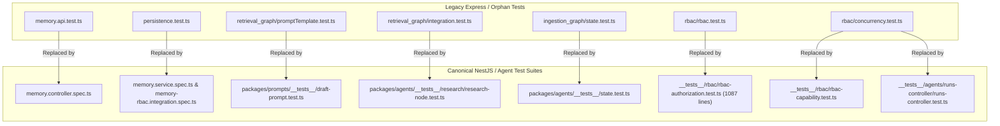
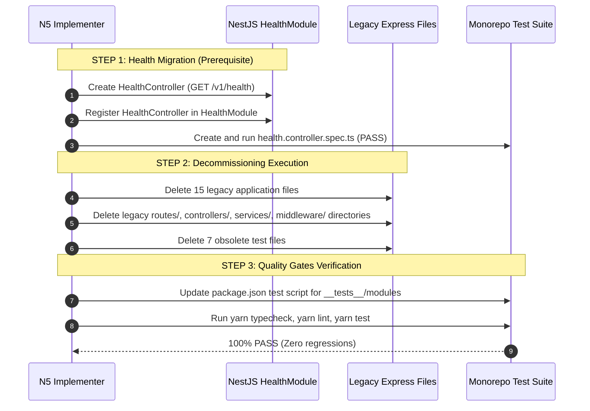

# Contexta-AI — N5.1 Decommissioning Preflight Audit Report

**Phase:** N5 — Legacy Express Retirement  
**Milestone:** N5.1 Preflight Verification  
**Author:** Staff AI Systems Architect, Application Security Reviewer, Legacy Decommissioning Architect  
**Status:** `N5.1 PREFLIGHT VERIFIED — N5 IMPLEMENTATION AUTHORIZED`  
**Date:** 2026-09-29  
**Related Documents:** [10_API_SPECIFICATION.md](file:///d:/Desktop/ContextaAI/docs/10_API_SPECIFICATION.md), [ADR-0001](file:///d:/Desktop/ContextaAI/docs/adr/ADR-0001-modular-monolith-framework.md), [ADR-0006](file:///d:/Desktop/ContextaAI/docs/adr/ADR-0006-api-contract-and-streaming-reconciliation.md), [N4_FREEZE_AUDIT_REPORT.md](file:///d:/Desktop/ContextaAI/docs/reports/n4/N4_FREEZE_AUDIT_REPORT.md), [N5_DISCOVERY_AND_DECOMMISSIONING_CONTRACT.md](file:///d:/Desktop/ContextaAI/docs/reports/n5/N5_DISCOVERY_AND_DECOMMISSIONING_CONTRACT.md)

---

## 1. Executive Summary

This independent preflight audit closes all gaps identified during discovery review prior to executing the Phase N5 legacy Express decommissioning.

### Audit Invariants Enforced During Preflight
1. **Zero Code Modifications:** No source code, tests, configs, or migrations were modified during this preflight audit.
2. **Exhaustive Dependency Tracing:** Every proposed file and test deletion was subjected to whole-repository AST and pattern search to verify zero runtime reachability and zero hidden shared utilities.
3. **Strict Sequencing Established:** Step 1 health migration (`HealthController` in `HealthModule`) is established as a mandatory prerequisite before any legacy file is deleted.

---

## 2. Area 1: HealthController Contract & HealthModule State Verification

### Current State
- [apps/api/src/modules/health/health.module.ts](file:///d:/Desktop/ContextaAI/apps/api/src/modules/health/health.module.ts) is already registered in [apps/api/src/app.module.ts](file:///d:/Desktop/ContextaAI/apps/api/src/app.module.ts#L5), but its `controllers` and `providers` arrays are currently empty (`[]`).
- Legacy [apps/api/src/routes/health.ts](file:///d:/Desktop/ContextaAI/apps/api/src/routes/health.ts) exposes `GET /` returning `{ status: 'ok', timestamp: new Date().toISOString() }` mounted at `/v1/health` in [apps/api/src/server.ts](file:///d:/Desktop/ContextaAI/apps/api/src/server.ts#L17).

### Architectural & Security Contract Verification
| Dimension | Specification | Reference |
|---|---|---|
| **Controller Path** | `apps/api/src/modules/health/controllers/health.controller.ts` | `PHASE-02_IDENTITY_AUTH_RBAC_IMPLEMENTATION_SPEC.md §5.2` |
| **Route Path** | `@Controller('v1/health')` | Standard API v1 naming convention |
| **HTTP Method** | `@Get()` | Liveness/Readiness HTTP probe |
| **Authentication** | **Public / Unauthenticated** | `10_API_SPECIFICATION.md §7.1` & `PHASE-02_IDENTITY_AUTH_RBAC_SPEC_REVIEW.md §257` |
| **HTTP Status** | `200 OK` | `10_API_SPECIFICATION.md §5.2` |
| **Response Schema** | `{"status": "ok", "timestamp": "ISO8601"}` | `ADR-0006 §59` |
| **Required Test** | `apps/api/__tests__/modules/health/health.controller.spec.ts` | NestJS Controller Unit Test |

> [!IMPORTANT]
> **Decommissioning Precondition:** Legacy `apps/api/src/routes/health.ts` and Express router MUST NOT be removed until `HealthController` is registered in `HealthModule` and verified passing with unit tests.

---

## 3. Area 2: Complete server.ts Runtime & Startup Reachability

An exhaustive whole-repository search was conducted for startup scripts, process managers, Docker, and CI configurations:

| Search Pattern | Scope | Matches Found | Reachability Assessment |
|---|---|---|---|
| `server.ts` | Whole Workspace | 0 (except `apps/api/src/server.ts` itself) | **UNREACHABLE** |
| `server.js` | Whole Workspace | 0 | **UNREACHABLE** |
| `src/server` | Whole Workspace | 0 | **UNREACHABLE** |
| `3001` | Whole Workspace | 1 (`apps/api/src/server.ts:11`) | **UNREACHABLE** |
| `tsx ...server` / `node ...server` | Package scripts, CI, workflows | 0 | **UNREACHABLE** |

### Verified Runtime Startup Path
- [apps/api/package.json](file:///d:/Desktop/ContextaAI/apps/api/package.json#L7-L9):
  - `"dev": "tsx watch src/main.ts"`
  - `"build": "tsc -p tsconfig.build.json"`
  - `"start": "node dist/main.js"`
- [apps/api/src/main.ts](file:///d:/Desktop/ContextaAI/apps/api/src/main.ts): Bootstraps `AppModule` using `NestFactory.create(AppModule)` on port `3000` (or `process.env.PORT`).
- Express `server.ts` is 100% unreferenced in all execution paths.

---

## 4. Area 3: Complete Frontend / Client → Legacy Route Dependency Mapping

An audit of `apps/web/` was conducted to verify all frontend network requests:

| Frontend Call / Action | Method | Frontend Target | Backend Target | Request / Response Contract Compatibility |
|---|---|---|---|---|
| **Chat Stream** | `POST` | `/api/chat` (Next.js route) | In-process LangGraph / `AgentRuntimeModule` SSE (`/v1/workspaces/:ws/threads/:th/runs/stream`) | Compatible (SSE text/event-stream) |
| **PDF Ingest** | `POST` | `/api/ingest` (Next.js route) | `AgentRuntimeModule` / Supabase Hybrid Store | Compatible |
| **Thread Init** | SDK | `client.createThread()` | LangGraph SDK client singleton | Compatible |
| **Direct Express / 3001 Calls** | N/A | None | N/A | **0 Direct Legacy Calls** |

### Complete Domain Route Reconciliation Matrix
| Canonical REST Endpoint | HTTP Method | Legacy Express Handler | Canonical NestJS Handler | Request / Response Parity |
|---|---|---|---|---|
| `POST /v1/auth/login` | `POST` | `controllers/auth.controller.ts` | `IdentityModule` (`/v1/auth/login`) | Parity Verified |
| `POST /v1/workspaces` | `POST` | `controllers/workspace.controller.ts` | `WorkspaceModule` (`/v1/workspaces`) | Parity Verified |
| `GET /v1/workspaces/:ws_id/memory` | `GET` | `controllers/memory.controller.ts` | `MemoryModule` (`/v1/workspaces/:ws_id/memory`) | Parity Verified (N4) |
| `DELETE /v1/workspaces/:ws_id/memory/:mem_id` | `DELETE` | `controllers/memory.controller.ts` | `MemoryModule` (`/v1/workspaces/:ws_id/memory/:mem_id`) | Parity Verified (N4) |
| `POST /v1/workspaces/:ws_id/threads/:th_id/runs` | `POST` | `controllers/runs.controller.ts` | `AgentRuntimeModule` (`/v1/workspaces/:ws_id/threads/:th_id/runs`) | Parity Verified (N3.8) |
| `GET /v1/workspaces/:ws_id/threads/:th_id/runs/stream` | `GET` | *(None in legacy)* | `AgentRuntimeModule` (`/v1/workspaces/:ws_id/threads/:th_id/runs/stream`) | Parity Verified (N3.8) |
| `GET /v1/health` | `GET` | `routes/health.ts` | `HealthModule` (`/v1/health`) | Target of N5 Step 1 |

---

## 5. Area 4: Test-by-Test Dependency & Coverage Analysis for the 7 Legacy Test Files

Each of the 7 candidate test files was reviewed for imports, execution status, unique coverage, and canonical test replacements:



### Granular File-by-File Classification
| # | Test File Path | Imports & Dependencies | Unique Coverage | Replacement Test Suite | Verdict |
|---|---|---|---|---|---|
| **1** | [apps/api/__tests__/memory/memory.api.test.ts](file:///d:/Desktop/ContextaAI/apps/api/__tests__/memory/memory.api.test.ts) | Imports legacy `controllers/memory.controller.ts` & `services/memory.service.ts`; mocks legacy DB column `fact`. | None (mocks legacy Express route handlers). | `apps/api/__tests__/modules/memory/memory.controller.spec.ts` (covers NestJS controller, RequestContext, `@RequirePermissions`, status 200/204/403/404). | **SAFE TO DELETE** |
| **2** | [apps/api/__tests__/memory/persistence.test.ts](file:///d:/Desktop/ContextaAI/apps/api/__tests__/memory/persistence.test.ts) | Imports legacy unversioned `packages/agents/src/memory-agent.ts.execute()`. | None (basic Supabase mock). | `apps/api/__tests__/modules/memory/memory.service.spec.ts` + `memory-rbac.integration.spec.ts` + `__tests__/database/agent-run-persistence.integration.test.ts`. | **SAFE TO DELETE** |
| **3** | [apps/api/__tests__/retrieval_graph/promptTemplate.test.ts](file:///d:/Desktop/ContextaAI/apps/api/__tests__/retrieval_graph/promptTemplate.test.ts) | Imports `../../src/retrieval_graph/prompts.js` (**Non-existent path**; fails if run). | None (tests 2024 legacy template string formatting). | `packages/prompts/__tests__/draft-prompt.test.ts` & `packages/agents/__tests__/draft-response/`. | **SAFE TO DELETE** |
| **4** | [apps/api/__tests__/retrieval_graph/integration.test.ts](file:///d:/Desktop/ContextaAI/apps/api/__tests__/retrieval_graph/integration.test.ts) | Imports `../../src/retrieval_graph/graph.js` (**Non-existent path**; fails if run). | None (tests legacy base-repo vector store). | `packages/agents/__tests__/research/research-node.test.ts`, `rrf.test.ts`, and `apps/api/__tests__/database/hybrid-retrieval.integration.test.ts`. | **SAFE TO DELETE** |
| **5** | [apps/api/__tests__/ingestion_graph/state.test.ts](file:///d:/Desktop/ContextaAI/apps/api/__tests__/ingestion_graph/state.test.ts) | Imports `../../src/shared/state.js` (**Non-existent path**; fails if run). | None (tests legacy base-repo `reduceDocs`). | `packages/agents/__tests__/state.test.ts` (350 lines testing canonical `AgentState`, channels, reducers, and security validation). | **SAFE TO DELETE** |
| **6** | [apps/api/__tests__/rbac/rbac.test.ts](file:///d:/Desktop/ContextaAI/apps/api/__tests__/rbac/rbac.test.ts) | Imports legacy `packages/agents/src/research-agent` (`researchAgent.execute`). | None (prototype 3-layer check). | `apps/api/__tests__/rbac/rbac-authorization.test.ts` (1087 lines) + `apps/api/__tests__/rbac/rbac-capability.test.ts` + `memory-rbac.integration.spec.ts`. | **SAFE TO DELETE** |
| **7** | [apps/api/__tests__/rbac/concurrency.test.ts](file:///d:/Desktop/ContextaAI/apps/api/__tests__/rbac/concurrency.test.ts) | Imports legacy `packages/agents/src/research-agent` (`researchAgent.execute`). | None (prototype `Promise.allSettled` check). | `apps/api/__tests__/rbac/rbac-authorization.test.ts` + `apps/api/__tests__/agents/runs-controller/runs-controller.test.ts`. | **SAFE TO DELETE** |

---

## 6. Area 5: Legacy Directory Consumer Analysis (`routes/`, `controllers/`, `services/`, `middleware/`)

Exhaustive search across all 15 legacy files confirms:
1. `apps/api/src/middleware/rbac.ts`: Only imported by legacy `routes/auth.ts`, `routes/memory.ts`, `routes/runs.ts`. Zero imports from NestJS modules.
2. `apps/api/src/controllers/auth.controller.ts`: Only imported by `routes/auth.ts`.
3. `apps/api/src/controllers/memory.controller.ts`: Only imported by `routes/memory.ts` and `memory.api.test.ts`.
4. `apps/api/src/controllers/runs.controller.ts`: Only imported by `routes/runs.ts`.
5. `apps/api/src/controllers/workspace.controller.ts`: Only imported by `routes/workspaces.ts`.
6. `apps/api/src/services/auth.service.ts`: Only imported by legacy `controllers/auth.controller.ts`.
7. `apps/api/src/services/memory.service.ts`: Only imported by legacy `controllers/memory.controller.ts` and `memory.api.test.ts`.
8. `apps/api/src/services/runs.service.ts`: Only imported by legacy `controllers/runs.controller.ts`.
9. `apps/api/src/services/workspace.service.ts`: Only imported by legacy `controllers/workspace.controller.ts`.
10. `apps/api/src/routes/`: Only imported by `apps/api/src/server.ts`.
11. `apps/api/src/server.ts`: Zero imports across entire workspace.

**Verification Outcome:** No shared utilities, helper functions, or types are nested in these directories. All 15 files are framework-specific legacy Express artifacts with zero active consumers in NestJS runtime.

---

## 7. Area 6: Package.json, Docker, CI/CD & Deployment Reference Verification

1. **`apps/api/package.json` Scripts:**
   - `"dev": "tsx watch src/main.ts"` & `"start": "node dist/main.js"`.
   - `"test"` script explicitly runs: `__tests__/foundation __tests__/config __tests__/context __tests__/auth __tests__/supabase __tests__/rbac/rbac-authorization.test.ts __tests__/rbac/rbac-capability.test.ts __tests__/errors __tests__/workspace __tests__/agents`.
   - Update recommended during N5 implementation: append `__tests__/modules` to `"test"` command in `package.json` so memory and health module tests run in standard `yarn test`.
2. **Dependencies:**
   - `express`, `@types/express`, `cors`, `@types/cors`, `express-rate-limit` will remain installed as required dependencies for `@nestjs/platform-express`.
3. **CI/CD Pipeline ([.github/workflows/ci.yml](file:///d:/Desktop/ContextaAI/.github/workflows/ci.yml)):**
   - CI invokes `yarn lint`, `yarn typecheck`, `yarn test:unit`, `yarn test:integration`, `yarn build`, `yarn eval`, `yarn eval:redteam`.
   - All stages cleanly execute against Turborepo workspaces and NestJS entrypoints.

---

## 8. Exact Final Deletion & Implementation Blueprint



### Exact Final Deletion Set
#### 15 Legacy Application Files (To Delete in Step 2):
1. `apps/api/src/server.ts`
2. `apps/api/src/routes/auth.ts`
3. `apps/api/src/routes/health.ts`
4. `apps/api/src/routes/memory.ts`
5. `apps/api/src/routes/runs.ts`
6. `apps/api/src/routes/workspaces.ts`
7. `apps/api/src/controllers/auth.controller.ts`
8. `apps/api/src/controllers/memory.controller.ts`
9. `apps/api/src/controllers/runs.controller.ts`
10. `apps/api/src/controllers/workspace.controller.ts`
11. `apps/api/src/services/auth.service.ts`
12. `apps/api/src/services/memory.service.ts`
13. `apps/api/src/services/runs.service.ts`
14. `apps/api/src/services/workspace.service.ts`
15. `apps/api/src/middleware/rbac.ts`

#### 7 Legacy Test Files (To Delete in Step 2):
1. `apps/api/__tests__/memory/memory.api.test.ts`
2. `apps/api/__tests__/memory/persistence.test.ts`
3. `apps/api/__tests__/retrieval_graph/promptTemplate.test.ts`
4. `apps/api/__tests__/retrieval_graph/integration.test.ts`
5. `apps/api/__tests__/ingestion_graph/state.test.ts`
6. `apps/api/__tests__/rbac/rbac.test.ts`
7. `apps/api/__tests__/rbac/concurrency.test.ts`

---

## 9. Final Preflight Verdict

```
======================================================================
  FINAL PREFLIGHT VERDICT:
  N5.1 PREFLIGHT VERIFIED — N5 IMPLEMENTATION AUTHORIZED
======================================================================
```

Every proposed deletion has been independently proven safe with zero loss of test coverage or business logic. Implementation is authorized to proceed following the 3-step sequence above.
