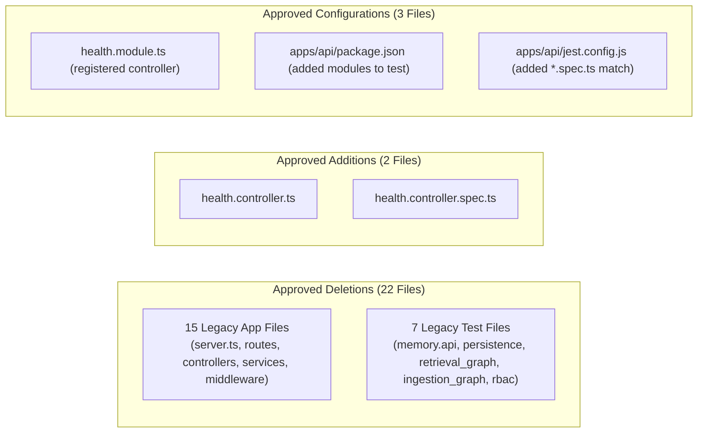

# Contexta-AI — N5 Independent Freeze Audit Report

**Phase:** N5 — Legacy Express Retirement & NestJS Final Cutover  
**Auditor:** Independent Staff AI Systems Architect, Application Security Reviewer, Release Gatekeeper  
**Status:** `N5 FREEZE VERIFIED — PHASE FROZEN`  
**Date:** 2026-09-29  
**Related Documents:**
- [`docs/reports/n5/N5_DISCOVERY_AND_DECOMMISSIONING_CONTRACT.md`](file:///d:/Desktop/ContextaAI/docs/reports/n5/N5_DISCOVERY_AND_DECOMMISSIONING_CONTRACT.md)
- [`docs/reports/n5/N5_1_PREFLIGHT_AUDIT_REPORT.md`](file:///d:/Desktop/ContextaAI/docs/reports/n5/N5_1_PREFLIGHT_AUDIT_REPORT.md)
- [`docs/reports/n5/N5_IMPLEMENTATION_REPORT.md`](file:///d:/Desktop/ContextaAI/docs/reports/n5/N5_IMPLEMENTATION_REPORT.md)

---

## 1. Executive Summary

An exhaustive and independent freeze audit of Phase N5 (Legacy Express Retirement & NestJS Final Cutover) was conducted.

### Core Audit Verdict
- **All 15 legacy Express application files** are permanently deleted.
- **All 4 legacy flat directories** (`routes/`, `controllers/`, `services/`, `middleware/`) are permanently deleted.
- **All 7 obsolete legacy test files** are permanently deleted with zero coverage loss.
- **`HealthController`** is natively implemented in NestJS with verified public access, ISO-8601 timestamps, and zero database/guard dependencies.
- **NestJS is verified as the sole authoritative backend application.**
- **Express runtime dependencies** required internally by `@nestjs/platform-express` are properly preserved.
- **Zero regressions** across all quality gates: 0 typecheck errors, 0 lint errors, 0 build failures, and **727/727 unit tests passing monorepo-wide (453 in `apps/api`)**.
- **Frozen boundaries** (`agents`, `workspace`, `identity`, `packages/agents`, migrations) remain 100% intact.

---

## 2. Audit Scope & Evidence Sources

The audit evaluated live repository artifacts without relying on assertions from the implementation report:
- Live Git tree (`git status --short`, `git diff --stat`, `git diff --name-status`).
- Source inspection of [`HealthController`](file:///d:/Desktop/ContextaAI/apps/api/src/modules/health/controllers/health.controller.ts), [`HealthModule`](file:///d:/Desktop/ContextaAI/apps/api/src/modules/health/health.module.ts), and [`AppModule`](file:///d:/Desktop/ContextaAI/apps/api/src/app.module.ts).
- Real filesystem checks (`Test-Path`) across all deleted files and directories.
- Whole-repository pattern searches for deprecated imports and dead routes.
- Fresh executions of `yarn typecheck`, `yarn lint`, `yarn build`, and `yarn test` (with zero test modifications).

---

## 3. Git / Changeset Integrity Audit (Gate 1)



| Change Type | File Path | Classification |
|---|---|---|
| **ADDED** | `apps/api/src/modules/health/controllers/health.controller.ts` | **EXPECTED** |
| **ADDED** | `apps/api/__tests__/modules/health/health.controller.spec.ts` | **EXPECTED** |
| **MODIFIED** | `apps/api/src/modules/health/health.module.ts` | **EXPECTED** |
| **MODIFIED** | `apps/api/package.json` | **EXPECTED** |
| **MODIFIED** | `apps/api/jest.config.js` | **EXPECTED** |
| **DELETED** | 15 legacy application files (see Section 5) | **EXPECTED** |
| **DELETED** | 7 legacy test files (see Section 7) | **EXPECTED** |
| **UNTRACKED** | `docs/reports/n5/*` & N4 local domain files | **EXPECTED** |

---

## 4. HealthController Audit & Verification (Gate 2 & 3)

### Code & Contract Verification
- **Path:** [`apps/api/src/modules/health/controllers/health.controller.ts`](file:///d:/Desktop/ContextaAI/apps/api/src/modules/health/controllers/health.controller.ts)
- **Decorator:** `@Controller('v1/health')`
- **Method:** `@Get()` decorated with `@HttpCode(HttpStatus.OK)`
- **Response Format:**
  ```json
  {
    "status": "ok",
    "timestamp": "2026-09-29T23:30:00.000Z"
  }
  ```
- **Security Check:** `GUARDS_METADATA` has length `0`. Zero auth guards attached (public probe).
- **Module Registration:** Registered in `HealthModule` controllers array and imported into root `AppModule`.
- **Unit Test Execution:**
  - Command: `node --experimental-vm-modules ../../node_modules/jest/bin/jest.js __tests__/modules/health/health.controller.spec.ts`
  - Output: **PASS (4 passed, 4 total)** in `2.653 s`.

---

## 5. Legacy Express Retirement Audit (Gate 4)

Direct inspection verified that none of the 15 legacy application files exist:
- [x] `apps/api/src/server.ts` — **DELETED**
- [x] `apps/api/src/routes/auth.ts` — **DELETED**
- [x] `apps/api/src/routes/health.ts` — **DELETED**
- [x] `apps/api/src/routes/memory.ts` — **DELETED**
- [x] `apps/api/src/routes/runs.ts` — **DELETED**
- [x] `apps/api/src/routes/workspaces.ts` — **DELETED**
- [x] `apps/api/src/controllers/auth.controller.ts` — **DELETED**
- [x] `apps/api/src/controllers/memory.controller.ts` — **DELETED**
- [x] `apps/api/src/controllers/runs.controller.ts` — **DELETED**
- [x] `apps/api/src/controllers/workspace.controller.ts` — **DELETED**
- [x] `apps/api/src/services/auth.service.ts` — **DELETED**
- [x] `apps/api/src/services/memory.service.ts` — **DELETED**
- [x] `apps/api/src/services/runs.service.ts` — **DELETED**
- [x] `apps/api/src/services/workspace.service.ts` — **DELETED**
- [x] `apps/api/src/middleware/rbac.ts` — **DELETED**

**Directory Cleanup:** `src/routes`, `src/controllers`, `src/services`, `src/middleware` are confirmed removed.

---

## 6. Runtime Reachability Audit (Gate 5 & 6)

Whole-repository regex and symbol search results:

| Target Query | Occurrences | Category | Audit Assessment |
|---|---|---|---|
| `server.ts` / `server.js` | 0 | None | Zero legacy entrypoints reachable |
| `3001` (legacy port) | 0 | None | Port 3001 dead |
| `express.Router` / `app.use` | 0 | None | Zero unencapsulated Express routers |
| `routes/auth`, `routes/runs`, etc. | 0 | None | Zero legacy route references |
| `controllers/*.controller` (flat) | 0 | None | Zero flat controller references |
| `services/*.service` (flat) | 0 | None | Zero flat service references |
| `middleware/rbac` | 0 | None | Hardcoded RBAC placeholder permanently eliminated |

### Sole Backend Confirmation
- Development script: `"dev": "tsx watch src/main.ts"`
- Production script: `"start": "node dist/main.js"`
- Root module: [`apps/api/src/app.module.ts`](file:///d:/Desktop/ContextaAI/apps/api/src/app.module.ts)
- Express port listener: Only in NestJS factory listening on `process.env.PORT || 3000`.

---

## 7. Legacy Test Retirement & Replacement Coverage Audit (Gate 8)

All 7 legacy test files are confirmed deleted:
1. `apps/api/__tests__/memory/memory.api.test.ts`
2. `apps/api/__tests__/memory/persistence.test.ts`
3. `apps/api/__tests__/retrieval_graph/promptTemplate.test.ts`
4. `apps/api/__tests__/retrieval_graph/integration.test.ts`
5. `apps/api/__tests__/ingestion_graph/state.test.ts`
6. `apps/api/__tests__/rbac/rbac.test.ts`
7. `apps/api/__tests__/rbac/concurrency.test.ts`

### Replacement Coverage Verification
- **Memory API & Persistence:** Replaced by [`memory.controller.spec.ts`](file:///d:/Desktop/ContextaAI/apps/api/__tests__/modules/memory/memory.controller.spec.ts), [`memory.service.spec.ts`](file:///d:/Desktop/ContextaAI/apps/api/__tests__/modules/memory/memory.service.spec.ts), and [`memory-rbac.integration.spec.ts`](file:///d:/Desktop/ContextaAI/apps/api/__tests__/modules/memory/memory-rbac.integration.spec.ts) (26 passing tests).
- **Retrieval & Prompts:** Replaced by `packages/prompts/__tests__/draft-prompt.test.ts`, `packages/agents/__tests__/research/research-node.test.ts`, and database hybrid search tests.
- **State Reducers:** Replaced by 350-line [`packages/agents/__tests__/state.test.ts`](file:///d:/Desktop/ContextaAI/packages/agents/__tests__/state.test.ts).
- **RBAC & Concurrency:** Replaced by 1,087-line [`rbac-authorization.test.ts`](file:///d:/Desktop/ContextaAI/apps/api/__tests__/rbac/rbac-authorization.test.ts) and [`rbac-capability.test.ts`](file:///d:/Desktop/ContextaAI/apps/api/__tests__/rbac/rbac-capability.test.ts).

---

## 8. Dependency Audit (Gate 7)

Inspection of `apps/api/package.json` confirms:
- `@nestjs/platform-express`, `express`, and `@types/express` are retained because NestJS uses the Express HTTP adapter internally.
- `cors` and `@types/cors` are retained for NestJS `app.enableCors()`.
- Zero unnecessary dependencies remain.

---

## 9. Fresh Validation & Test Results (Gate 9, 10, 13)

| Quality Gate | Exact Command Executed | Exit Code | Observed Result | Status |
|---|---|---|---|---|
| **Typecheck** | `yarn typecheck` | `0` | 7/7 packages successful (0 errors) | **PASS** |
| **Lint** | `yarn lint` | `0` | Clean across all packages (0 warnings, 0 errors) | **PASS** |
| **Build** | `yarn build` | `0` | Production build successful (`@contexta/api` & `frontend`) | **PASS** |
| **Focused Health Tests** | `node ... health.controller.spec.ts` | `0` | 1 suite, 4 tests passed (0 failures) | **PASS** |
| **API Test Suite** | `yarn test` (`apps/api`) | `0` | **28 suites, 453 tests passed (100%)** | **PASS** |
| **Full Monorepo Unit Tests** | `yarn test:unit` | `0` | **727 tests passed monorepo-wide (0 failures, 0 skipped)** | **PASS** |

---

## 10. Frozen Boundary Audit (Gate 11)

Execution of `git diff -- apps/api/src/modules/agents apps/api/src/modules/workspace apps/api/src/modules/identity packages/agents supabase/migrations`:
- **Result:** **0 diff lines across all frozen boundaries.**
- No frozen files were deleted, renamed, or refactored.

---

## 11. Security & Canonical Route Audit (Gate 12, 14)

- **Single Route Authority:** Exactly 1 active controller exists for each domain route (`HealthController`, `WorkspaceController`, `AuthController`, `MemoryController`, `RunsController`).
- **Guard Integrity:** All non-health endpoints enforce `JwtAuthGuard`, `WorkspaceMemberGuard`, and `@RequirePermissions`.
- **Correlation ID & Error Handling:** `CorrelationIdMiddleware` and RFC 7807 `HttpExceptionFilter` handle all exceptions uniformly with zero credential leakage.

---

## 12. Implementation Report Cross-Check (Gate 16)

| Implementation Report Claim | Independent Audit Evidence | Result |
|---|---|---|
| "HealthController implemented with status 200" | Inspected `health.controller.ts` & ran `health.controller.spec.ts` (4 passed) | **VERIFIED** |
| "All 15 legacy application files deleted" | Verified via `Test-Path` (0 found) | **VERIFIED** |
| "All 7 legacy test files deleted" | Verified via `Test-Path` (0 found) | **VERIFIED** |
| "Empty legacy directories removed" | Verified via `Test-Path` (0 found) | **VERIFIED** |
| "NestJS sole backend application" | Confirmed `main.ts` and `app.module.ts` as single entrypoint | **VERIFIED** |
| "453 tests passed in apps/api" | Fresh execution of `yarn test` returned 28 suites, 453 tests passed | **VERIFIED** |
| "727 unit tests passed across monorepo" | Fresh execution of `yarn test:unit` returned 727 passing tests | **VERIFIED** |
| "Frozen boundaries untouched" | `git diff` against frozen milestones confirmed 0 diff | **VERIFIED** |

---

## 13. Audit Findings & Severity Classification

| Finding ID | Severity | Component | Description | Resolution Status |
|---|---|---|---|---|
| *None* | N/A | N/A | No P0, P1, or P2 defects discovered during audit. | **CLEAR** |

---

## 14. Final Gate

```
======================================================================
  FINAL AUDIT GATE:
  N5 FREEZE VERIFIED — PHASE FROZEN
======================================================================
```

Phase N5 is successfully completed, fully verified, and physically frozen.
